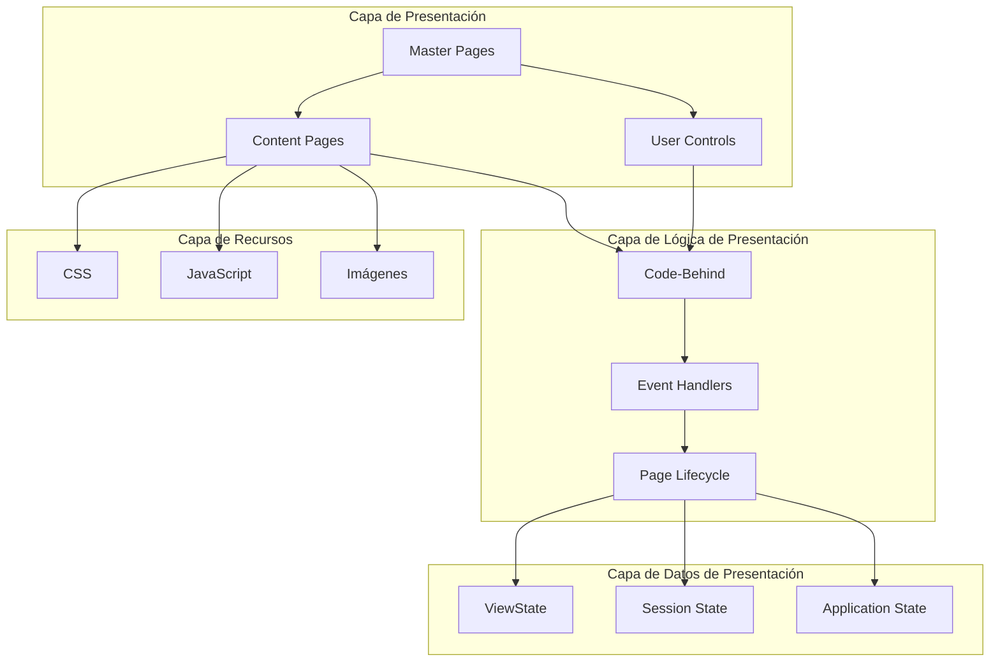
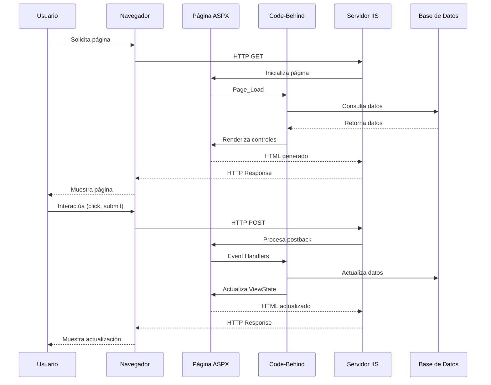
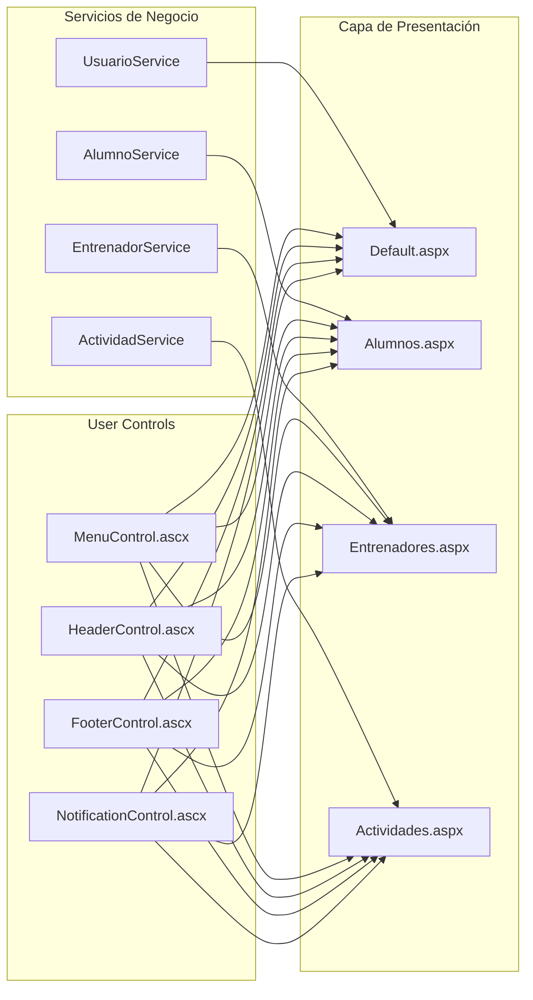
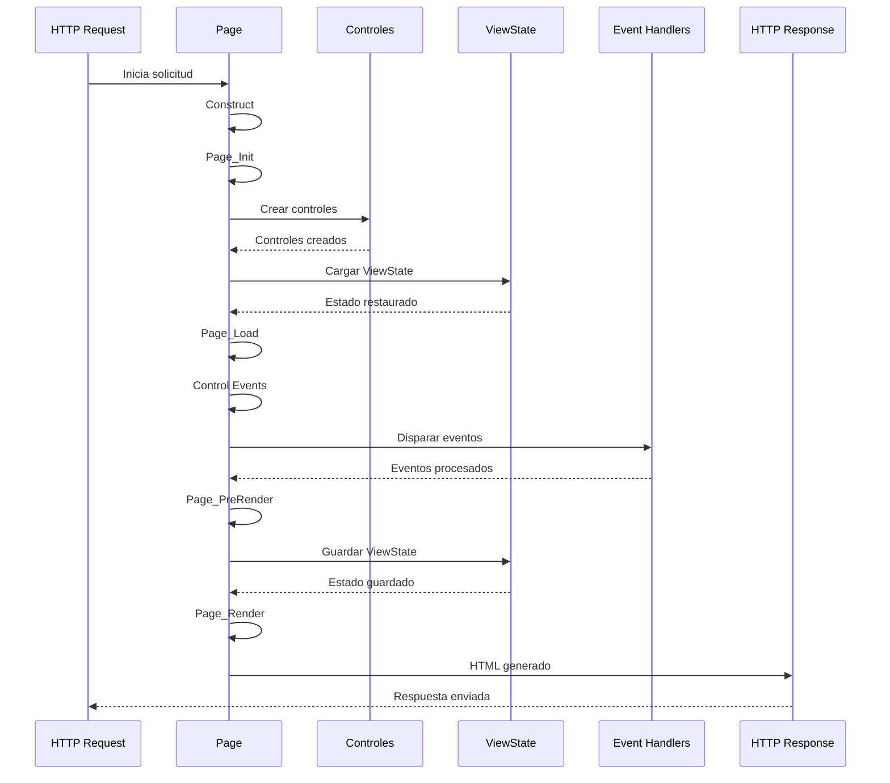
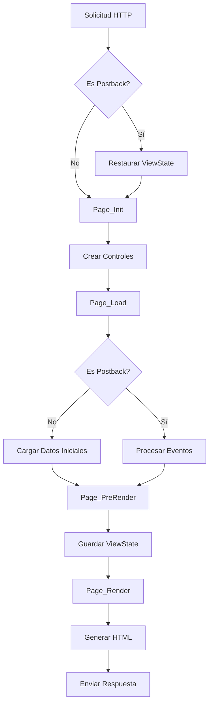
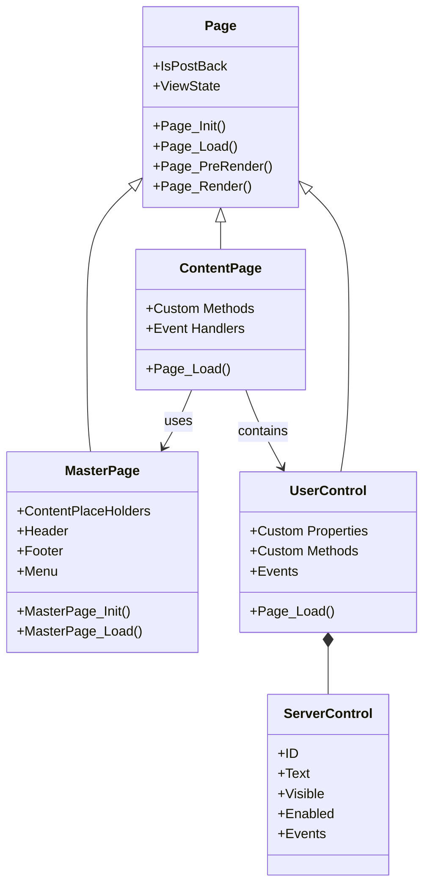
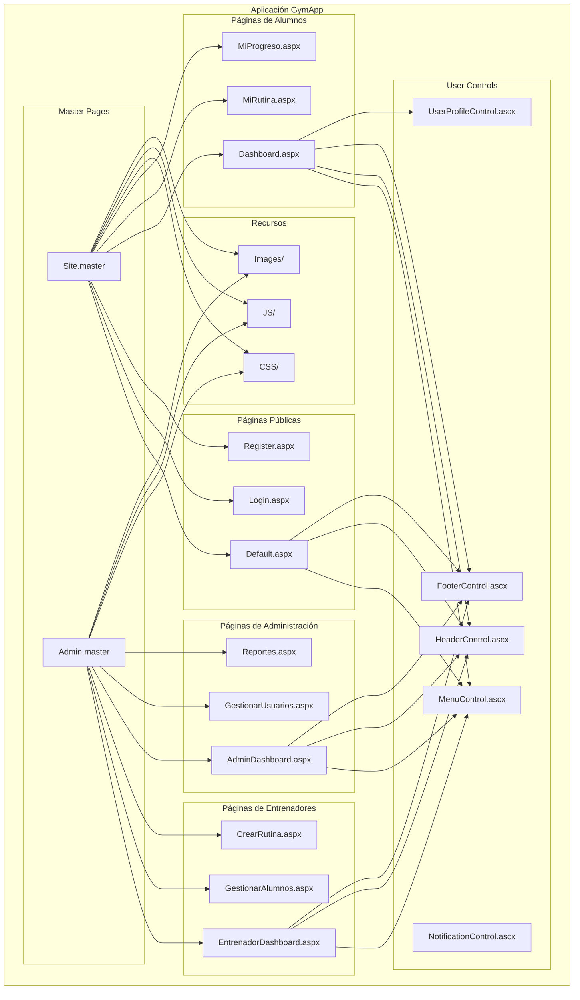

# Arquitectura del Frontend - GymApp

## Lo General

### Propósito

Este documento describe la arquitectura del frontend en ASP.NET Web Forms para el proyecto GymApp, proporcionando una visión completa de las capas, componentes y su interacción.

### Visión General

El frontend de GymApp sigue una arquitectura basada en **ASP.NET Web Forms**, que utiliza un modelo de programación basado en eventos y controles de servidor. La arquitectura se organiza en varias capas que trabajan juntas para proporcionar una experiencia de usuario cohesiva.

### Componentes Principales

1. **Master Pages (.master)**: Plantillas maestras que definen el layout consistente de la aplicación
2. **Content Pages (.aspx)**: Páginas de contenido que heredan de Master Pages
3. **User Controls (.ascx)**: Componentes reutilizables encapsulados
4. **Controles de Servidor**: Controles ASP.NET predefinidos y personalizados
5. **Code-Behind (.aspx.cs)**: Lógica del lado del servidor en C#
6. **Recursos Estáticos**: CSS, JavaScript, imágenes y otros assets

### Patrones de Diseño Utilizados

- **Master Page Pattern**: Herencia de layout para consistencia visual
- **User Control Pattern**: Reutilización de componentes
- **Code-Behind Pattern**: Separación entre marcado y lógica
- **ViewState Pattern**: Mantenimiento de estado entre postbacks
- **Event-Driven Programming**: Manejo de eventos del lado del servidor

### Stack Tecnológico

- **Framework**: ASP.NET Web Forms (.NET Framework 4.7.2)
- **Lenguaje**: C#
- **Marcado**: ASPX (HTML con controles de servidor)
- **Estilos**: CSS3
- **Scripts**: JavaScript / jQuery
- **Servidor**: IIS Express
- **IDE**: Visual Studio 2017+

## Comunicación de Capas

### Arquitectura de Capas

El frontend de GymApp se organiza en las siguientes capas:



### Flujo de Datos entre Capas



### Contratos de API e Interfaces

#### Master Page Interface

```csharp
// Interfaz implícita de Master Page
public interface IMasterPage
{
    string Title { get; set; }
    void ShowMessage(string message, MessageType type);
    void SetActiveMenu(string menuId);
}
```

#### Content Page Interface

```csharp
// Interfaz base para páginas de contenido
public interface IContentPage
{
    void InitializePage();
    void LoadData();
    void SaveData();
    void ValidateInput();
}
```

#### User Control Interface

```csharp
// Interfaz para User Controls
public interface IUserControl
{
    void LoadControlData(object data);
    object GetControlData();
    void ClearControl();
    event EventHandler DataChanged;
}
```

### Inyección de Dependencias y Relaciones de Servicios



## Diagramas UML

### Diagrama de Secuencia: Ciclo de Vida de Página



### Diagrama de Actividad: Proceso de Renderizado



### Diagrama de Proceso: Flujo de Desarrollo Frontend

```mermaid
graph LR
    A[Requisitos] --> B[Diseño UI/UX]
    B --> C[Crear Master Page]
    C --> D[Definir ContentPlaceholders]
    D --> E[Crear Content Pages]
    E --> F[Implementar Code-Behind]
    F --> G[Crear User Controls]
    G --> H[Agregar Estilos CSS]
    H --> I[Agregar Scripts JS]
    I --> J[Pruebas Unitarias]
    J --> K[Pruebas de Integración]
    K --> L[Despliegue]
```



### Diagrama de Clases: Jerarquía de Páginas



### Diagrama de Componentes: Estructura del Frontend



## Límites de Módulos e Interfaces

### Módulo de Autenticación

**Responsabilidades**:
- Gestión de login de usuarios
- Control de acceso basado en roles
- Manejo de sesiones

**Interfaces**:
- `IAuthenticationService`: Servicios de autenticación
- `IUserSession`: Gestión de sesión de usuario

**Dependencias**:
- Base de datos de usuarios
- Sistema de permisos

### Módulo de Gestión de Alumnos

**Responsabilidades**:
- Visualización de perfil de alumno
- Gestión de rutinas asignadas
- Seguimiento de progreso

**Interfaces**:
- `IAlumnoService`: Servicios de gestión de alumnos
- `IRutinaService`: Servicios de rutinas

**Dependencias**:
- Módulo de autenticación
- Base de datos de alumnos y rutinas

### Módulo de Gestión de Entrenadores

**Responsabilidades**:
- Gestión de alumnos asignados
- Creación y edición de rutinas
- Visualización de progreso de alumnos

**Interfaces**:
- `IEntrenadorService`: Servicios de gestión de entrenadores
- `IRutinaService`: Servicios de rutinas

**Dependencias**:
- Módulo de autenticación
- Base de datos de entrenadores y rutinas

### Módulo de Administración

**Responsabilidades**:
- Gestión de usuarios y permisos
- Configuración del sistema
- Generación de reportes

**Interfaces**:
- `IAdminService`: Servicios de administración
- `IReportService`: Servicios de reportes

**Dependencias**:
- Todos los módulos de negocio
- Base de datos completa

## Consideraciones de Diseño

### Separación de Responsabilidades

- **Presentación**: ASPX/ASCX files (marcado)
- **Lógica**: Code-Behind files (C#)
- **Estilos**: CSS files
- **Comportamiento**: JavaScript files

### Mantenimiento de Estado

- **ViewState**: Estado de controles entre postbacks
- **SessionState**: Datos de sesión del usuario
- **ApplicationState**: Datos globales de la aplicación
- **Cookies**: Datos persistentes en el cliente

### Seguridad

- Validación de entrada en servidor
- Protección contra CSRF
- Encriptación de datos sensibles
- Control de acceso basado en roles

### Performance

- Minimizar ViewState
- Usar caching apropiadamente
- Optimizar consultas a base de datos
- Comprimir recursos estáticos

---

**Última actualización**: 2026-04-19
**Versión**: 1.0