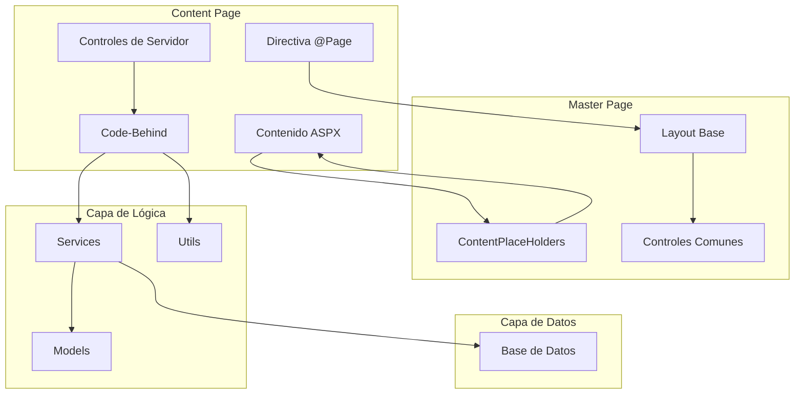
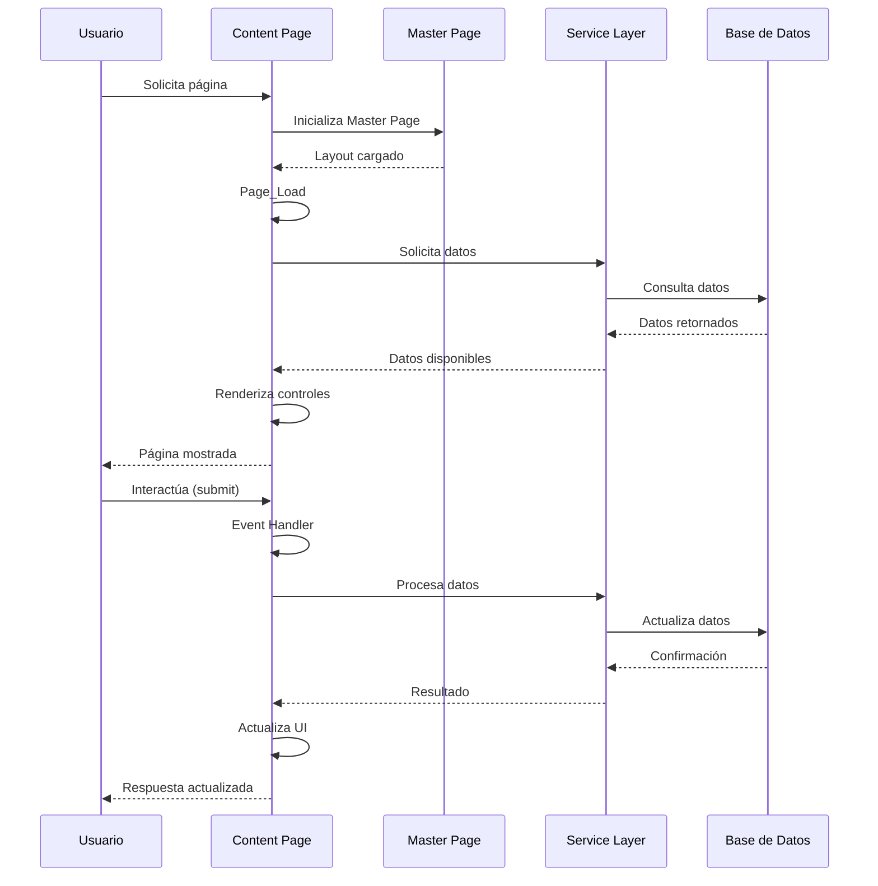
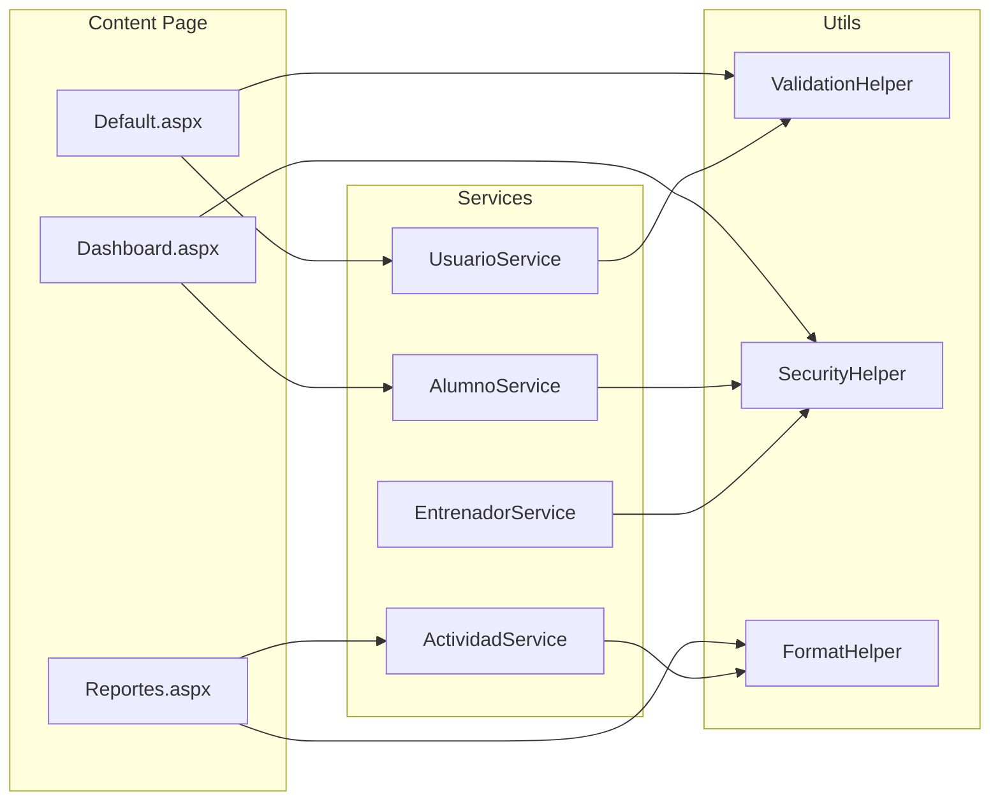
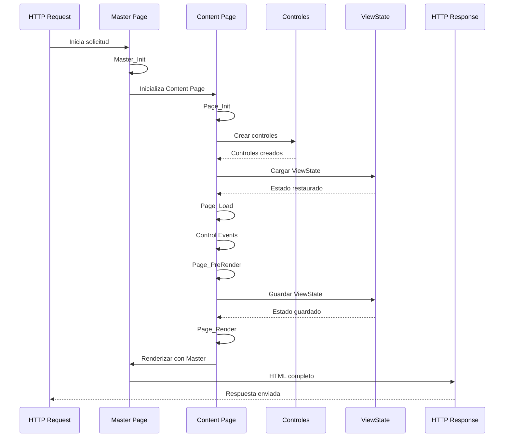
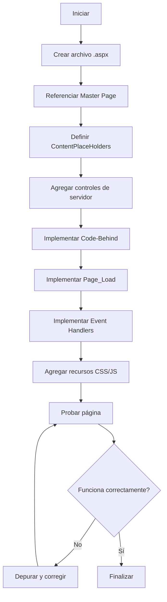
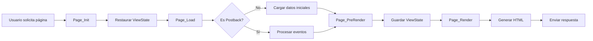
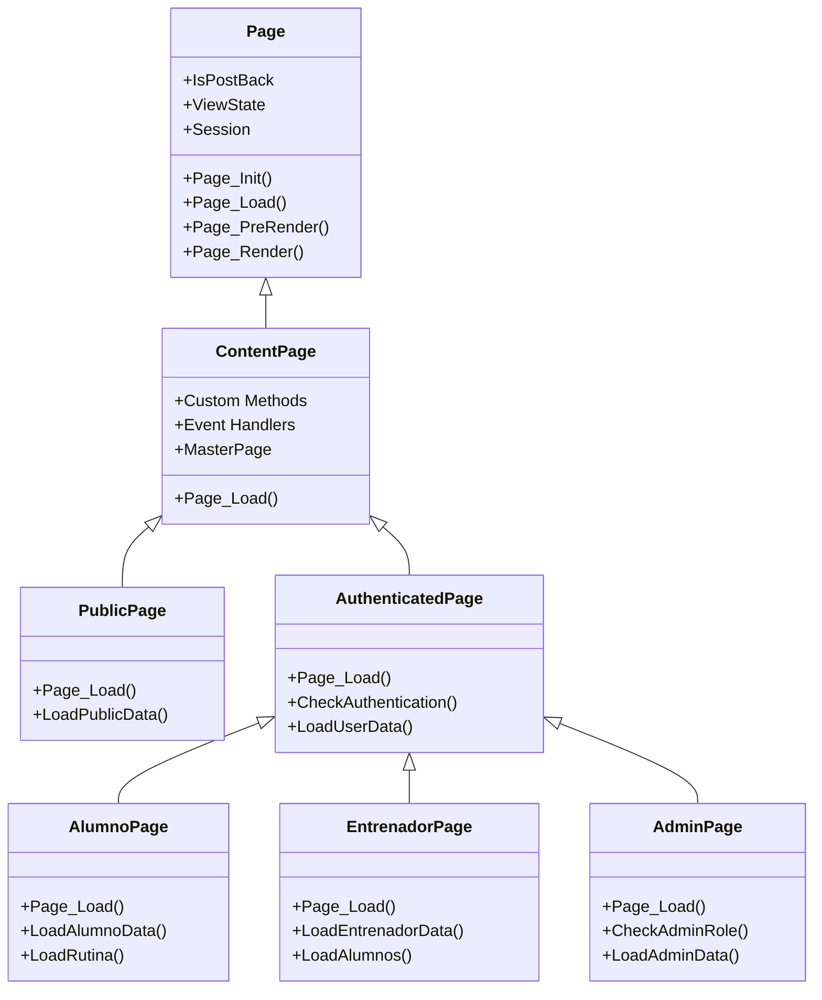

# Páginas de Contenido - GymApp

## Lo General

### Propósito

Este documento describe el proceso de creación y gestión de páginas de contenido (.aspx) en ASP.NET Web Forms para el proyecto GymApp, explicando cómo estructurar, implementar y mantener las páginas de la aplicación.

### ¿Qué son las Content Pages?

Las Content Pages son páginas ASP.NET que heredan su layout de una Master Page y proporcionan contenido específico para los ContentPlaceHolders definidos en la Master Page. Permiten:

- **Herencia de layout**: Mantener consistencia visual con la Master Page
- **Contenido específico**: Proporcionar contenido único para cada página
- **Lógica independiente**: Implementar lógica específica de cada página
- **Reutilización**: Compartir layout y componentes entre páginas

### Componentes de una Content Page

1. **Directiva @Page**: Configuración de la página
2. **Contenido ASPX**: Marcado HTML con controles de servidor
3. **ContentPlaceHolders**: Áreas donde se inserta contenido
4. **Code-Behind**: Lógica del lado del servidor
5. **Recursos específicos**: CSS y JavaScript específicos de la página

### Tipos de Páginas en GymApp

El proyecto GymApp incluye diferentes tipos de páginas:

- **Páginas públicas**: Accesibles sin autenticación
- **Páginas de autenticación**: Login, registro, recuperación de contraseña
- **Páginas de alumnos**: Dashboard, rutinas, progreso
- **Páginas de entrenadores**: Gestión de alumnos, creación de rutinas
- **Páginas de administración**: Gestión de usuarios, permisos, reportes

## Comunicación de Capas

### Arquitectura de Content Pages



### Flujo de Datos en Content Pages



### Interacción entre Content Page y Servicios



## Diagramas UML

### Diagrama de Secuencia: Ciclo de Vida de Content Page



### Diagrama de Actividad: Proceso de Creación de Content Page



### Diagrama de Proceso: Flujo de Trabajo de Página



### Diagrama de Clases: Jerarquía de Content Pages



### Diagrama de Componentes: Estructura de Content Page

```mermaid
graph TB
    subgraph "Default.aspx"
        subgraph "Directivas"
            D1[@Page]
            D2[@MasterType]
            D3[@Register]
        end

        subgraph "ContentPlaceHolders"
            C1[Head]
            C2[MainContent]
            C3[Scripts]
        end

        subgraph "Controles"
            CT1[asp:Label]
            CT2[asp:TextBox]
            CT3[asp:Button]
            CT4[asp:Repeater]
            CT5[asp:GridView]
        end

        subgraph "Code-Behind"
            CB1[Page_Load]
            CB2[Event Handlers]
            CB3[Custom Methods]
        end
    end

    D1 --> C1
    D1 --> C2
    D1 --> C3
    C2 --> CT1
    C2 --> CT2
    C2 --> CT3
    C2 --> CT4
    C2 --> CT5
    CT1 --> CB1
    CT2 --> CB1
    CT3 --> CB2
    CT4 --> CB1
    CT5 --> CB1
    CB1 --> CB3
    CB2 --> CB3
```

## Implementación

### Crear una Content Page Básica

#### 1. Archivo Default.aspx

```aspx
<%@ Page Title="Inicio" Language="C#"
    MasterPageFile="~/MasterPages/Site.master"
    AutoEventWireup="true"
    CodeBehind="Default.aspx.cs"
    Inherits="GymApp.Pages.Public.Default" %>

<%@ MasterType VirtualPath="~/MasterPages/Site.master" %>

<asp:Content ID="Content1" ContentPlaceHolderID="head" runat="server">
    <link href="~/Content/css/home.css" rel="stylesheet" />
</asp:Content>

<asp:Content ID="Content2" ContentPlaceHolderID="MainContent" runat="server">
    <div class="hero-section">
        <h1><asp:Label ID="lblTitle" runat="server" Text="Bienvenido a GymApp" /></h1>
        <p><asp:Label ID="lblSubtitle" runat="server" Text="Tu plataforma de gestión de gimnasio" /></p>
    </div>

    <div class="features-section">
        <asp:Repeater ID="rptFeatures" runat="server">
            <ItemTemplate>
                <div class="feature-card">
                    <h3><%# Eval("Title") %></h3>
                    <p><%# Eval("Description") %></p>
                </div>
            </ItemTemplate>
        </asp:Repeater>
    </div>

    <div class="cta-section">
        <asp:Button ID="btnRegister" runat="server"
            Text="Registrarse"
            CssClass="btn btn-primary"
            OnClick="btnRegister_Click" />
    </div>
</asp:Content>

<asp:Content ID="Content3" ContentPlaceHolderID="Scripts" runat="server">
    <script src="~/Content/js/home.js"></script>
</asp:Content>
```

#### 2. Code-Behind Default.aspx.cs

```csharp
using System;
using System.Web.UI;
using System.Collections.Generic;
using GymApp.Services;
using GymApp.Models;

namespace GymApp.Pages.Public
{
    public partial class Default : System.Web.UI.Page
    {
        // Servicios
        private UsuarioService _usuarioService;

        // Eventos de página
        protected void Page_Init(object sender, EventArgs e)
        {
            _usuarioService = new UsuarioService();
        }

        protected void Page_Load(object sender, EventArgs e)
        {
            if (!IsPostBack)
            {
                InitializePage();
                LoadFeatures();
            }
        }

        // Eventos de controles
        protected void btnRegister_Click(object sender, EventArgs e)
        {
            Response.Redirect("~/Pages/Authentication/Register.aspx");
        }

        // Métodos públicos
        public void InitializePage()
        {
            // Configurar título de página
            Master.PageTitle = "Inicio - GymApp";
            Master.SetActiveMenu("home");

            // Verificar si el usuario está autenticado
            if (Session["Usuario"] != null)
            {
                var usuario = (Usuario)Session["Usuario"];
                lblTitle.Text = $"Bienvenido, {usuario.Nombre}";
                btnRegister.Text = "Ir al Dashboard";
                btnRegister.Click -= btnRegister_Click;
                btnRegister.Click += btnDashboard_Click;
            }
        }

        // Métodos privados
        private void LoadFeatures()
        {
            var features = new List<Feature>
            {
                new Feature
                {
                    Title = "Gestión de Rutinas",
                    Description = "Crea y gestiona rutinas personalizadas"
                },
                new Feature
                {
                    Title = "Seguimiento de Progreso",
                    Description = "Monitorea tu avance en tiempo real"
                },
                new Feature
                {
                    Title = "Comunidad",
                    Description = "Conecta con otros usuarios"
                }
            };

            rptFeatures.DataSource = features;
            rptFeatures.DataBind();
        }

        private void btnDashboard_Click(object sender, EventArgs e)
        {
            Response.Redirect("~/Pages/Alumnos/Dashboard.aspx");
        }
    }

    // Modelo de datos
    public class Feature
    {
        public string Title { get; set; }
        public string Description { get; set; }
    }
}
```

### Crear una Página con Formulario

#### 1. Archivo Login.aspx

```aspx
<%@ Page Title="Iniciar Sesión" Language="C#"
    MasterPageFile="~/MasterPages/Public.master"
    AutoEventWireup="true"
    CodeBehind="Login.aspx.cs"
    Inherits="GymApp.Pages.Authentication.Login" %>

<asp:Content ID="Content1" ContentPlaceHolderID="head" runat="server">
    <link href="~/Content/css/auth.css" rel="stylesheet" />
</asp:Content>

<asp:Content ID="Content2" ContentPlaceHolderID="MainContent" runat="server">
    <div class="auth-container">
        <div class="auth-card">
            <h2>Iniciar Sesión</h2>

            <asp:Panel ID="pnlLogin" runat="server" DefaultButton="btnLogin">
                <div class="form-group">
                    <asp:Label ID="lblEmail" runat="server"
                        Text="Correo electrónico:"
                        AssociatedControlID="txtEmail" />
                    <asp:TextBox ID="txtEmail" runat="server"
                        CssClass="form-control"
                        TextMode="Email"
                        placeholder="correo@ejemplo.com" />
                    <asp:RequiredFieldValidator ID="rfvEmail" runat="server"
                        ControlToValidate="txtEmail"
                        ErrorMessage="El correo es requerido"
                        CssClass="error-message"
                        Display="Dynamic" />
                    <asp:RegularExpressionValidator ID="revEmail" runat="server"
                        ControlToValidate="txtEmail"
                        ErrorMessage="Formato de correo inválido"
                        CssClass="error-message"
                        Display="Dynamic"
                        ValidationExpression="\w+([-+.']\w+)*@\w+([-.]\w+)*\.\w+([-.]\w+)*" />
                </div>

                <div class="form-group">
                    <asp:Label ID="lblPassword" runat="server"
                        Text="Contraseña:"
                        AssociatedControlID="txtPassword" />
                    <asp:TextBox ID="txtPassword" runat="server"
                        CssClass="form-control"
                        TextMode="Password"
                        placeholder="••••••••" />
                    <asp:RequiredFieldValidator ID="rfvPassword" runat="server"
                        ControlToValidate="txtPassword"
                        ErrorMessage="La contraseña es requerida"
                        CssClass="error-message"
                        Display="Dynamic" />
                </div>

                <div class="form-group">
                    <asp:CheckBox ID="chkRememberMe" runat="server"
                        Text="Recordarme" />
                </div>

                <asp:Button ID="btnLogin" runat="server"
                    Text="Iniciar Sesión"
                    CssClass="btn btn-primary btn-block"
                    OnClick="btnLogin_Click" />

                <asp:Label ID="lblError" runat="server"
                    CssClass="error-message"
                    Visible="false" />
            </asp:Panel>

            <div class="auth-links">
                <asp:HyperLink ID="lnkForgotPassword" runat="server"
                    NavigateUrl="~/Pages/Authentication/ForgotPassword.aspx"
                    Text="¿Olvidaste tu contraseña?" />
                <asp:HyperLink ID="lnkRegister" runat="server"
                    NavigateUrl="~/Pages/Authentication/Register.aspx"
                    Text="¿No tienes cuenta? Regístrate" />
            </div>
        </div>
    </div>
</asp:Content>
```

#### 2. Code-Behind Login.aspx.cs

```csharp
using System;
using System.Web.UI;
using GymApp.Services;
using GymApp.Models;
using GymApp.Utils;

namespace GymApp.Pages.Authentication
{
    public partial class Login : System.Web.UI.Page
    {
        private UsuarioService _usuarioService;

        protected void Page_Init(object sender, EventArgs e)
        {
            _usuarioService = new UsuarioService();
        }

        protected void Page_Load(object sender, EventArgs e)
        {
            if (!IsPostBack)
            {
                // Verificar si ya está autenticado
                if (Session["Usuario"] != null)
                {
                    RedirectBasedOnRole();
                }

                Master.PageTitle = "Iniciar Sesión - GymApp";
            }
        }

        protected void btnLogin_Click(object sender, EventArgs e)
        {
            if (Page.IsValid)
            {
                try
                {
                    string email = txtEmail.Text.Trim();
                    string password = txtPassword.Text;
                    bool rememberMe = chkRememberMe.Checked;

                    // Autenticar usuario
                    Usuario usuario = _usuarioService.Autenticar(email, password);

                    if (usuario != null)
                    {
                        // Guardar usuario en sesión
                        Session["Usuario"] = usuario;
                        Session["UsuarioId"] = usuario.Id;
                        Session["UsuarioRol"] = usuario.Rol;

                        // Configurar cookie si se seleccionó "Recordarme"
                        if (rememberMe)
                        {
                            SecurityHelper.SetRememberMeCookie(usuario.Id);
                        }

                        // Redirigir según rol
                        RedirectBasedOnRole();
                    }
                    else
                    {
                        ShowError("Credenciales inválidas");
                    }
                }
                catch (Exception ex)
                {
                    LogHelper.LogError(ex, "Error en login");
                    ShowError("Error al iniciar sesión. Por favor, intente nuevamente.");
                }
            }
        }

        private void ShowError(string message)
        {
            lblError.Text = message;
            lblError.Visible = true;
        }

        private void RedirectBasedOnRole()
        {
            if (Session["UsuarioRol"] != null)
            {
                string rol = Session["UsuarioRol"].ToString();

                switch (rol.ToLower())
                {
                    case "alumno":
                        Response.Redirect("~/Pages/Alumnos/Dashboard.aspx");
                    case "entrenador":
                        Response.Redirect("~/Pages/Entrenadores/Dashboard.aspx");
                    case "admin":
                        Response.Redirect("~/Pages/Admin/Dashboard.aspx");
                    default:
                        Response.Redirect("~/Pages/Public/Default.aspx");
                }
            }
        }
    }
}
```

## Mejores Prácticas

### Estructura de Páginas

1. **Separación de responsabilidades**: Mantener marcado y lógica separados
2. **Nombres descriptivos**: Usar nombres claros para controles y métodos
3. **Organización de código**: Agrupar código relacionado
4. **Comentarios**: Documentar código complejo

### Gestión de Eventos

1. **Page_Load**: Usar para inicialización y carga de datos
2. **Event Handlers**: Implementar lógica específica de eventos
3. **Validación**: Validar datos antes de procesar
4. **Manejo de errores**: Implementar try-catch apropiado

### Performance

1. **ViewState**: Minimizar el uso de ViewState
2. **Caching**: Implementar caching cuando sea apropiado
3. **Consultas eficientes**: Optimizar consultas a base de datos
4. **Controles**: Usar solo controles necesarios

### Seguridad

1. **Validación**: Validar todas las entradas del usuario
2. **Autenticación**: Verificar autenticación en páginas protegidas
3. **Autorización**: Verificar permisos según rol
4. **SQL Injection**: Usar parámetros en consultas

### UX/UI

1. **Feedback**: Proporcionar feedback al usuario
2. **Validación**: Mostrar mensajes de error claros
3. **Loading**: Indicar carga cuando sea necesario
4. **Responsive**: Diseñar para diferentes dispositivos

## Troubleshooting

### Problemas Comunes

1. **Eventos no se disparan**
   - Verificar que `AutoEventWireup="true"`
   - Verificar que los eventos estén correctamente conectados

2. **ViewState no se mantiene**
   - Verificar que `EnableViewState="true"`
   - Verificar que los controles tengan IDs únicos

3. **Validación no funciona**
   - Verificar que los controles tengan `ValidationGroup` si es necesario
   - Verificar que `Page.IsValid` se verifique en el servidor

4. **Redirección no funciona**
   - Verificar que no se haya enviado respuesta antes
   - Usar `Response.Redirect` con `endResponse=false` si es necesario

---

**Última actualización**: 2026-04-19
**Versión**: 1.0