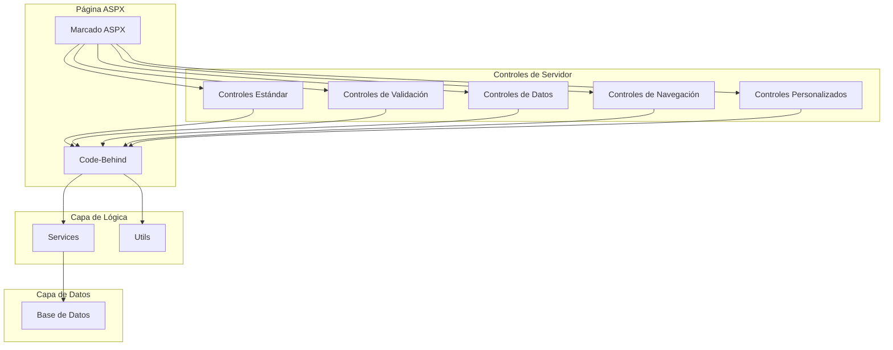
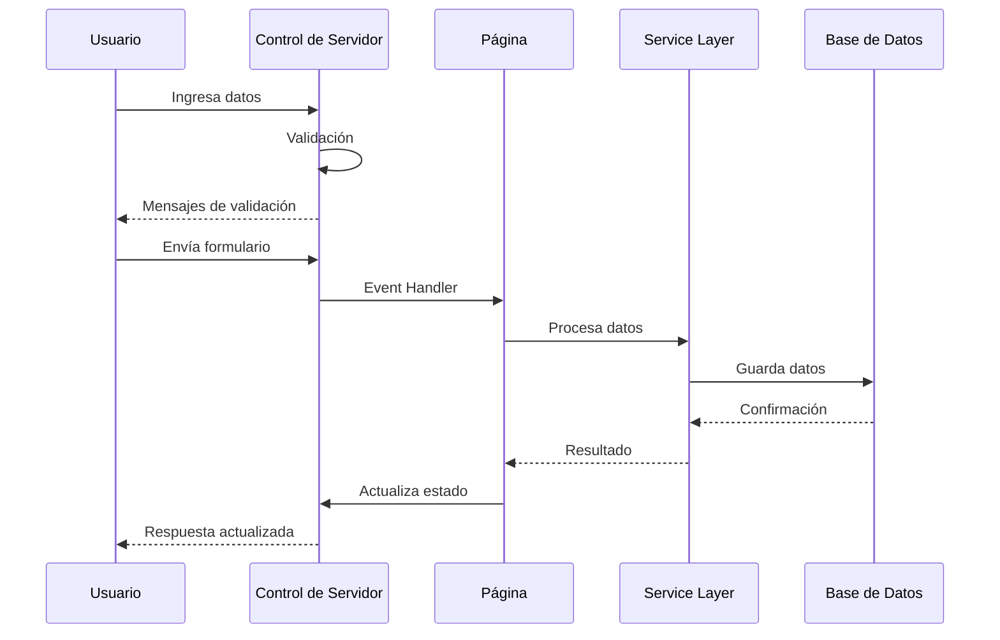
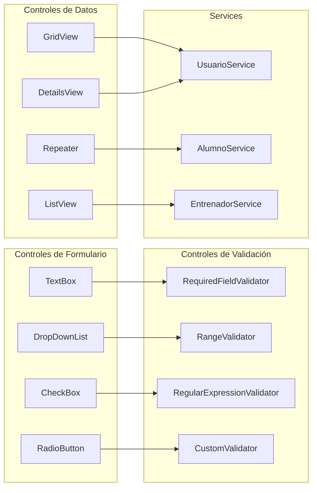
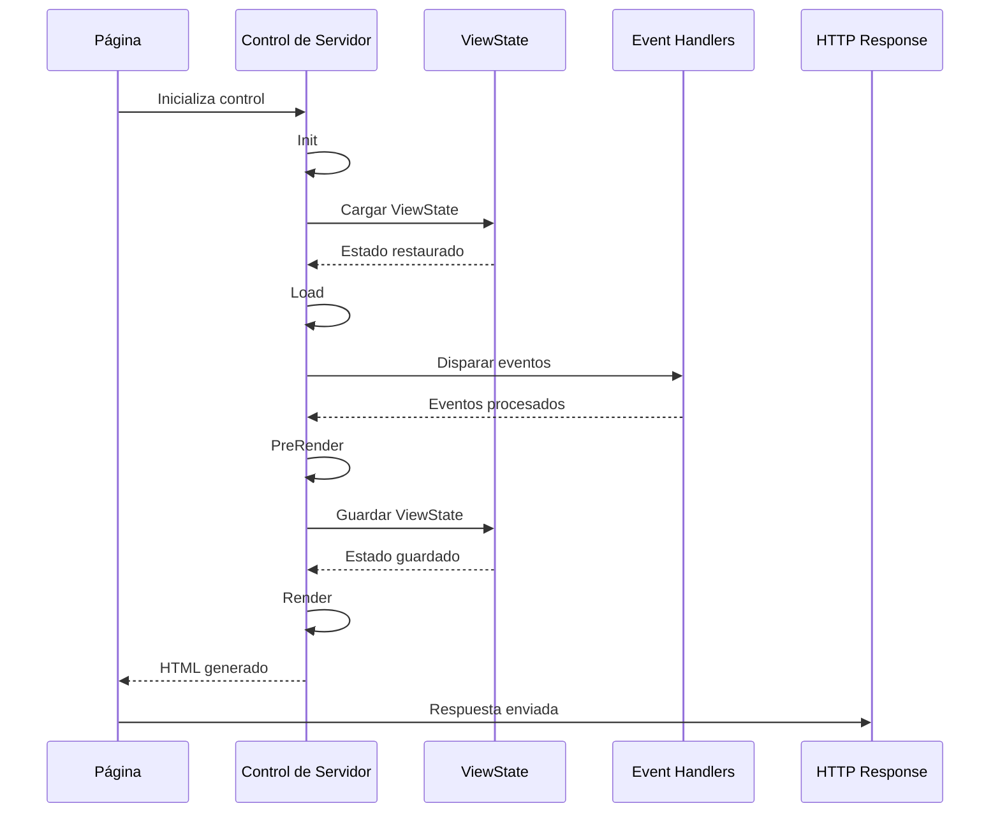
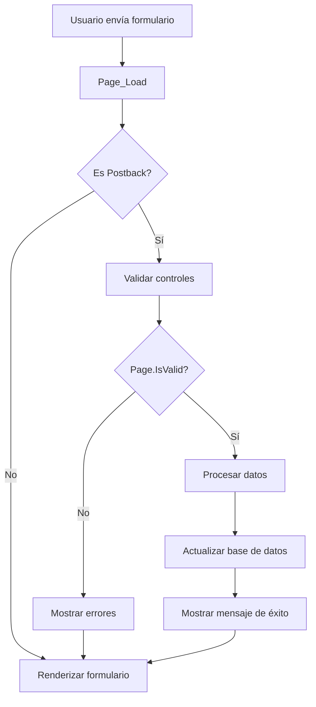
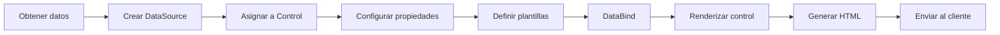
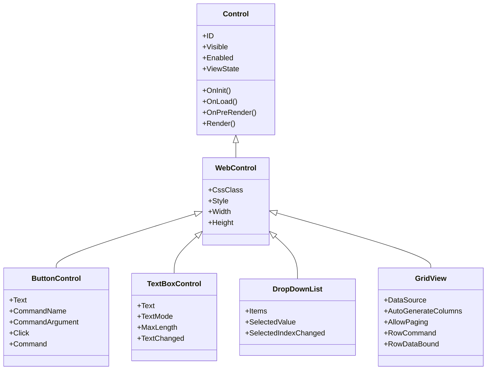
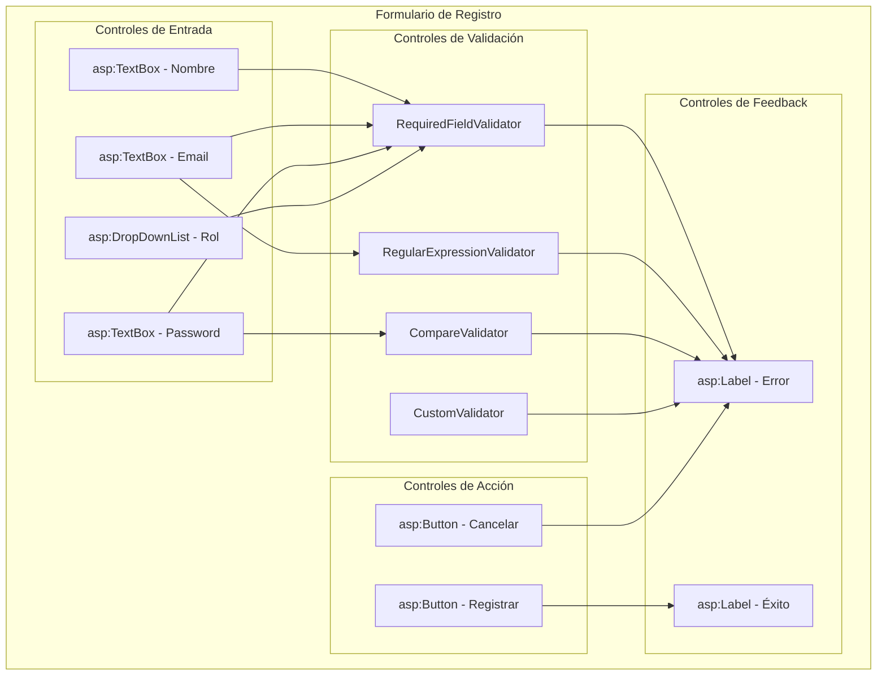

# Controles de Servidor - GymApp

## Lo General

### Propósito

Este documento describe el uso de controles de servidor ASP.NET en Web Forms para el proyecto GymApp, explicando cómo utilizar los controles estándar y crear controles personalizados.

### ¿Qué son los Controles de Servidor?

Los controles de servidor son componentes ASP.NET que se ejecutan en el servidor y generan HTML que se envía al cliente. Permiten:

- **Programación declarativa**: Definir controles en marcado ASPX
- **Mantenimiento de estado**: ViewState mantiene el estado entre postbacks
- **Eventos del lado del servidor**: Manejar eventos en el servidor
- **Validación**: Validar datos automáticamente
- **Data binding**: Vincular datos a controles fácilmente

### Tipos de Controles de Servidor

1. **Controles estándar**: Button, TextBox, Label, DropDownList, etc.
2. **Controles de validación**: RequiredFieldValidator, RangeValidator, etc.
3. **Controles de datos**: GridView, Repeater, ListView, DetailsView
4. **Controles de navegación**: Menu, TreeView, SiteMapPath
5. **Controles de login**: Login, LoginView, LoginStatus
6. **Controles personalizados**: Controles creados por el desarrollador

### Controles en GymApp

El proyecto GymApp utilizará controles de servidor para:

- **Formularios**: Captura y validación de datos
- **Visualización de datos**: Grillas, listas, detalles
- **Navegación**: Menús, breadcrumbs
- **Interacción**: Botones, enlaces, acciones
- **Validación**: Validación de entrada de usuario

## Comunicación de Capas

### Arquitectura de Controles de Servidor



### Flujo de Datos con Controles



### Interacción entre Controles y Servicios



## Diagramas UML

### Diagrama de Secuencia: Ciclo de Vida de Control



### Diagrama de Actividad: Proceso de Validación



### Diagrama de Proceso: Data Binding



### Diagrama de Clases: Jerarquía de Controles



### Diagrama de Componentes: Estructura de Formulario



## Implementación

### Controles Estándar

#### TextBox

```aspx
<asp:TextBox ID="txtNombre" runat="server"
    CssClass="form-control"
    TextMode="SingleLine"
    MaxLength="100"
    placeholder="Nombre completo" />

<asp:TextBox ID="txtEmail" runat="server"
    CssClass="form-control"
    TextMode="Email"
    placeholder="correo@ejemplo.com" />

<asp:TextBox ID="txtPassword" runat="server"
    CssClass="form-control"
    TextMode="Password"
    placeholder="••••••••" />

<asp:TextBox ID="txtDescripcion" runat="server"
    CssClass="form-control"
    TextMode="MultiLine"
    Rows="5"
    placeholder="Descripción" />
```

```csharp
// Code-Behind
protected void Page_Load(object sender, EventArgs e)
{
    if (!IsPostBack)
    {
        txtNombre.Text = "Valor inicial";
    }
}

protected void btnGuardar_Click(object sender, EventArgs e)
{
    string nombre = txtNombre.Text;
    string email = txtEmail.Text;
    string password = txtPassword.Text;
    string descripcion = txtDescripcion.Text;

    // Procesar datos
}
```

#### Button

```aspx
<asp:Button ID="btnGuardar" runat="server"
    Text="Guardar"
    CssClass="btn btn-primary"
    CommandName="Guardar"
    CommandArgument="1"
    OnClick="btnGuardar_Click"
    OnCommand="btn_Command" />

<asp:Button ID="btnCancelar" runat="server"
    Text="Cancelar"
    CssClass="btn btn-secondary"
    CausesValidation="false"
    OnClick="btnCancelar_Click" />

<asp:LinkButton ID="lnkEliminar" runat="server"
    Text="Eliminar"
    CssClass="btn btn-danger"
    CommandName="Eliminar"
    CommandArgument='<%# Eval("Id") %>'
    OnCommand="lnk_Command" />
```

```csharp
// Code-Behind
protected void btnGuardar_Click(object sender, EventArgs e)
{
    // Manejar click del botón
}

protected void btnCancelar_Click(object sender, EventArgs e)
{
    // Manejar click del botón cancelar
}

protected void btn_Command(object sender, CommandEventArgs e)
{
    if (e.CommandName == "Guardar")
    {
        int id = Convert.ToInt32(e.CommandArgument);
        // Procesar comando
    }
}

protected void lnk_Command(object sender, CommandEventArgs e)
{
    if (e.CommandName == "Eliminar")
    {
        int id = Convert.ToInt32(e.CommandArgument);
        // Eliminar registro
    }
}
```

#### DropDownList

```aspx
<asp:DropDownList ID="ddlRol" runat="server"
    CssClass="form-control"
    AutoPostBack="true"
    OnSelectedIndexChanged="ddlRol_SelectedIndexChanged">
    <asp:ListItem Text="Seleccione un rol" Value="" />
    <asp:ListItem Text="Alumno" Value="Alumno" />
    <asp:ListItem Text="Entrenador" Value="Entrenador" />
    <asp:ListItem Text="Administrador" Value="Admin" />
</asp:DropDownList>

<asp:DropDownList ID="ddlEntrenador" runat="server"
    CssClass="form-control"
    DataTextField="Nombre"
    DataValueField="Id" />
```

```csharp
// Code-Behind
protected void Page_Load(object sender, EventArgs e)
{
    if (!IsPostBack)
    {
        LoadEntrenadores();
    }
}

private void LoadEntrenadores()
{
    var entrenadores = _entrenadorService.ObtenerTodos();

    ddlEntrenador.DataSource = entrenadores;
    ddlEntrenador.DataTextField = "Nombre";
    ddlEntrenador.DataValueField = "Id";
    ddlEntrenador.DataBind();

    ddlEntrenador.Items.Insert(0, new ListItem("Seleccione un entrenador", ""));
}

protected void ddlRol_SelectedIndexChanged(object sender, EventArgs e)
{
    string rolSeleccionado = ddlRol.SelectedValue;

    // Cargar opciones basadas en el rol
    switch (rolSeleccionado)
    {
        case "Alumno":
            LoadOpcionesAlumno();
            break;
        case "Entrenador":
            LoadOpcionesEntrenador();
            break;
    }
}
```

### Controles de Validación

#### RequiredFieldValidator

```aspx
<asp:TextBox ID="txtNombre" runat="server"
    CssClass="form-control" />

<asp:RequiredFieldValidator ID="rfvNombre" runat="server"
    ControlToValidate="txtNombre"
    ErrorMessage="El nombre es requerido"
    CssClass="error-message"
    Display="Dynamic"
    SetFocusOnError="true" />
```

#### RegularExpressionValidator

```aspx
<asp:TextBox ID="txtEmail" runat="server"
    CssClass="form-control"
    TextMode="Email" />

<asp:RegularExpressionValidator ID="revEmail" runat="server"
    ControlToValidate="txtEmail"
    ErrorMessage="Formato de correo inválido"
    CssClass="error-message"
    Display="Dynamic"
    ValidationExpression="\w+([-+.']\w+)*@\w+([-.]\w+)*\.\w+([-.]\w+)*" />
```

#### RangeValidator

```aspx
<asp:TextBox ID="txtEdad" runat="server"
    CssClass="form-control"
    TextMode="Number" />

<asp:RangeValidator ID="rvEdad" runat="server"
    ControlToValidate="txtEdad"
    ErrorMessage="La edad debe estar entre 18 y 100"
    CssClass="error-message"
    Display="Dynamic"
    MinimumValue="18"
    MaximumValue="100"
    Type="Integer" />
```

#### CompareValidator

```aspx
<asp:TextBox ID="txtPassword" runat="server"
    CssClass="form-control"
    TextMode="Password" />

<asp:TextBox ID="txtConfirmPassword" runat="server"
    CssClass="form-control"
    TextMode="Password" />

<asp:CompareValidator ID="cvPassword" runat="server"
    ControlToValidate="txtConfirmPassword"
    ControlToCompare="txtPassword"
    ErrorMessage="Las contraseñas no coinciden"
    CssClass="error-message"
    Display="Dynamic" />
```

#### CustomValidator

```aspx
<asp:TextBox ID="txtUsername" runat="server"
    CssClass="form-control" />

<asp:CustomValidator ID="cvUsername" runat="server"
    ControlToValidate="txtUsername"
    ErrorMessage="El nombre de usuario ya existe"
    CssClass="error-message"
    Display="Dynamic"
    OnServerValidate="cvUsername_ServerValidate" />
```

```csharp
// Code-Behind
protected void cvUsername_ServerValidate(object source, ServerValidateEventArgs args)
{
    string username = args.Value;

    // Validar si el username ya existe
    bool existe = _usuarioService.ExisteUsuario(username);

    args.IsValid = !existe;
}

protected void btnRegistrar_Click(object sender, EventArgs e)
{
    if (Page.IsValid)
    {
        // Procesar registro
    }
}
```

### Controles de Datos

#### GridView

```aspx
<asp:GridView ID="gvAlumnos" runat="server"
    AutoGenerateColumns="false"
    AllowPaging="true"
    PageSize="10"
    AllowSorting="true"
    CssClass="table table-striped"
    OnRowCommand="gvAlumnos_RowCommand"
    OnRowDataBound="gvAlumnos_RowDataBound"
    OnPageIndexChanging="gvAlumnos_PageIndexChanging"
    OnSorting="gvAlumnos_Sorting">
    <Columns>
        <asp:BoundField DataField="Id" HeaderText="ID"
            SortExpression="Id" ReadOnly="true" />
        <asp:BoundField DataField="Nombre" HeaderText="Nombre"
            SortExpression="Nombre" />
        <asp:BoundField DataField="Email" HeaderText="Email"
            SortExpression="Email" />
        <asp:BoundField DataField="FechaRegistro" HeaderText="Fecha Registro"
            SortExpression="FechaRegistro" DataFormatString="{0:dd/MM/yyyy}" />
        <asp:TemplateField HeaderText="Acciones">
            <ItemTemplate>
                <asp:LinkButton ID="lnkEditar" runat="server"
                    Text="Editar"
                    CommandName="Editar"
                    CommandArgument='<%# Eval("Id") %>'
                    CssClass="btn btn-sm btn-primary" />
                <asp:LinkButton ID="lnkEliminar" runat="server"
                    Text="Eliminar"
                    CommandName="Eliminar"
                    CommandArgument='<%# Eval("Id") %>'
                    CssClass="btn btn-sm btn-danger"
                    OnClientClick="return confirm('¿Está seguro de eliminar?');" />
            </ItemTemplate>
        </asp:TemplateField>
    </Columns>
    <PagerStyle CssClass="pagination" />
</asp:GridView>
```

```csharp
// Code-Behind
protected void Page_Load(object sender, EventArgs e)
{
    if (!IsPostBack)
    {
        LoadAlumnos();
    }
}

private void LoadAlumnos()
{
    var alumnos = _alumnoService.ObtenerTodos();

    gvAlumnos.DataSource = alumnos;
    gvAlumnos.DataBind();
}

protected void gvAlumnos_RowCommand(object sender, GridViewCommandEventArgs e)
{
    if (e.CommandName == "Editar")
    {
        int id = Convert.ToInt32(e.CommandArgument);
        EditarAlumno(id);
    }
    else if (e.CommandName == "Eliminar")
    {
        int id = Convert.ToInt32(e.CommandArgument);
        EliminarAlumno(id);
        LoadAlumnos();
    }
}

protected void gvAlumnos_RowDataBound(object sender, GridViewRowEventArgs e)
{
    if (e.Row.RowType == DataControlRowType.DataRow)
    {
        var alumno = (Alumno)e.Row.DataItem;

        // Personalizar fila basado en datos
        if (alumno.Activo)
        {
            e.Row.CssClass += " active-row";
        }
    }
}

protected void gvAlumnos_PageIndexChanging(object sender, GridViewPageEventArgs e)
{
    gvAlumnos.PageIndex = e.NewPageIndex;
    LoadAlumnos();
}

protected void gvAlumnos_Sorting(object sender, GridViewSortEventArgs e)
{
    // Implementar ordenamiento
    LoadAlumnosOrdenados(e.SortExpression, e.SortDirection);
}
```

#### Repeater

```aspx
<asp:Repeater ID="rptActividades" runat="server"
    OnItemCommand="rptActividades_ItemCommand"
    OnItemDataBound="rptActividades_ItemDataBound">
    <HeaderTemplate>
        <div class="actividades-list">
    </HeaderTemplate>
    <ItemTemplate>
        <div class="actividad-card">
            <h3><%# Eval("Nombre") %></h3>
            <p><%# Eval("Descripcion") %></p>
            <p class="precio">$<%# Eval("Costo", "{0:N2}") %></p>

            <asp:LinkButton ID="lnkInscribirse" runat="server"
                Text="Inscribirse"
                CommandName="Inscribirse"
                CommandArgument='<%# Eval("Id") %>'
                CssClass="btn btn-primary" />
        </div>
    </ItemTemplate>
    <AlternatingItemTemplate>
        <div class="actividad-card alternate">
            <h3><%# Eval("Nombre") %></h3>
            <p><%# Eval("Descripcion") %></p>
            <p class="precio">$<%# Eval("Costo", "{0:N2}") %></p>

            <asp:LinkButton ID="lnkInscribirse" runat="server"
                Text="Inscribirse"
                CommandName="Inscribirse"
                CommandArgument='<%# Eval("Id") %>'
                CssClass="btn btn-primary" />
        </div>
    </AlternatingItemTemplate>
    <FooterTemplate>
        </div>
    </FooterTemplate>
</asp:Repeater>
```

```csharp
// Code-Behind
private void LoadActividades()
{
    var actividades = _actividadService.ObtenerActividadesDisponibles();

    rptActividades.DataSource = actividades;
    rptActividades.DataBind();
}

protected void rptActividades_ItemCommand(object source, RepeaterCommandEventArgs e)
{
    if (e.CommandName == "Inscribirse")
    {
        int id = Convert.ToInt32(e.CommandArgument);
        InscribirActividad(id);
    }
}

protected void rptActividades_ItemDataBound(object sender, RepeaterItemEventArgs e)
{
    if (e.Item.ItemType == ListItemType.Item ||
        e.Item.ItemType == ListItemType.AlternatingItem)
    {
        var actividad = (Actividad)e.Item.DataItem;
        var lnkInscribirse = (LinkButton)e.Item.FindControl("lnkInscribirse");

        // Deshabilitar si ya está inscrito
        if (_alumnoService.EstaInscrito(actividad.Id))
        {
            lnkInscribirse.Text = "Ya inscrito";
            lnkInscribirse.Enabled = false;
        }
    }
}
```

## Mejores Prácticas

### Uso de Controles

1. **IDs descriptivos**: Usar nombres claros para controles
2. **Validación**: Siempre validar entrada del usuario
3. **ViewState**: Minimizar el uso de ViewState
4. **Eventos**: Manejar eventos apropiadamente

### Data Binding

1. **DataSource**: Usar objetos fuertemente tipados
2. **DataBind**: Llamar DataBind solo cuando sea necesario
3. **Plantillas**: Usar plantillas para personalizar visualización
4. **Performance**: Optimizar consultas a base de datos

### Validación

1. **Validación del cliente**: Habilitar validación del cliente
2. **Validación del servidor**: Siempre validar en el servidor
3. **Mensajes claros**: Proporcionar mensajes de error claros
4. **ValidationGroup**: Usar ValidationGroup para múltiples formularios

### Seguridad

1. **Sanitización**: Sanitizar datos antes de mostrar
2. **SQL Injection**: Usar parámetros en consultas
3. **XSS**: Escapar datos al mostrar en HTML
4. **CSRF**: Implementar protección CSRF

## Troubleshooting

### Problemas Comunes

1. **Eventos no se disparan**
   - Verificar que `AutoEventWireup="true"`
   - Verificar que los eventos estén correctamente conectados

2. **Data binding no funciona**
   - Verificar que DataSource no sea null
   - Verificar que se llame a DataBind()

3. **Validación no funciona**
   - Verificar que los controles tengan ValidationGroup
   - Verificar que Page.IsValid se verifique

4. **ViewState no se mantiene**
   - Verificar que EnableViewState="true"
   - Verificar que los controles tengan IDs únicos

---

**Última actualización**: 2026-04-19
**Versión**: 1.0