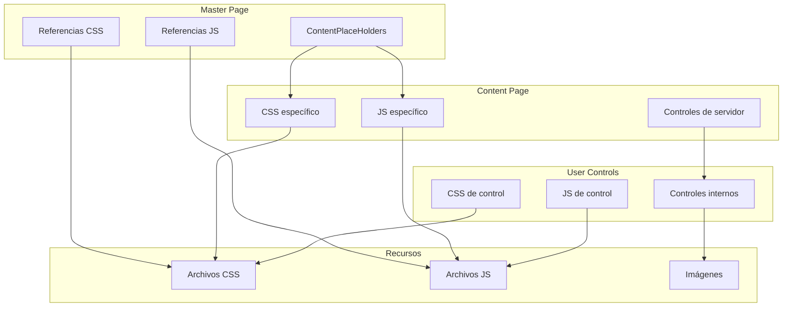
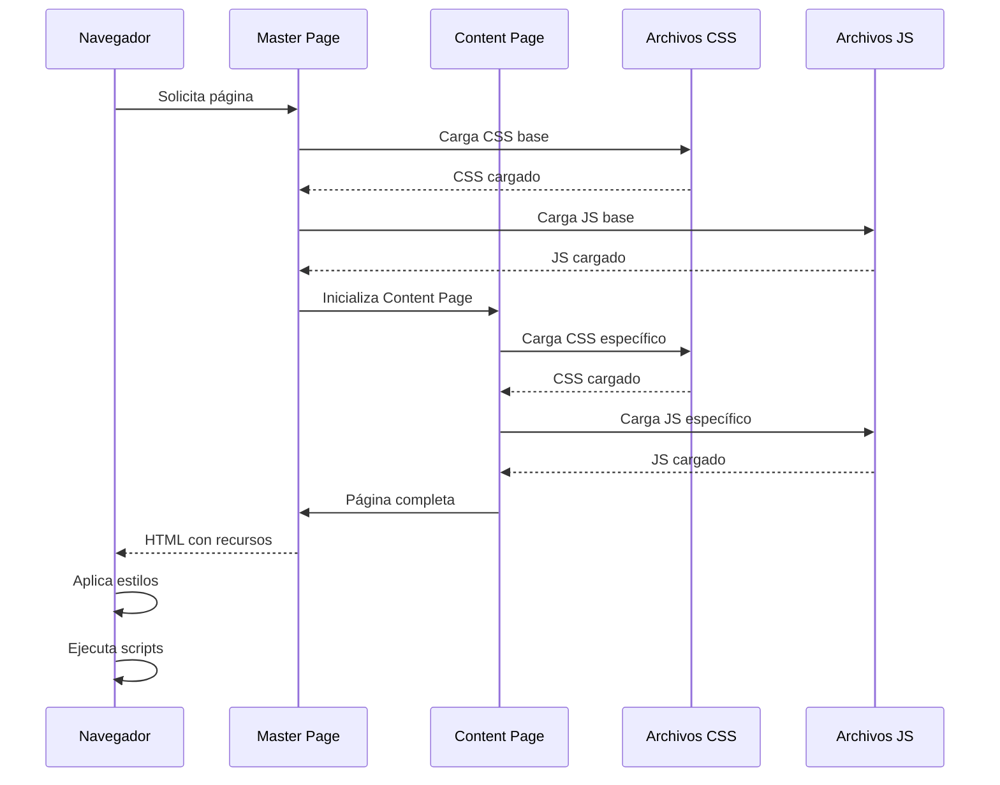
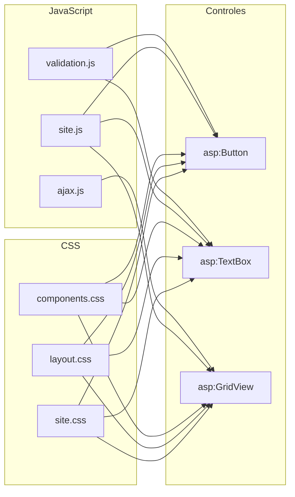
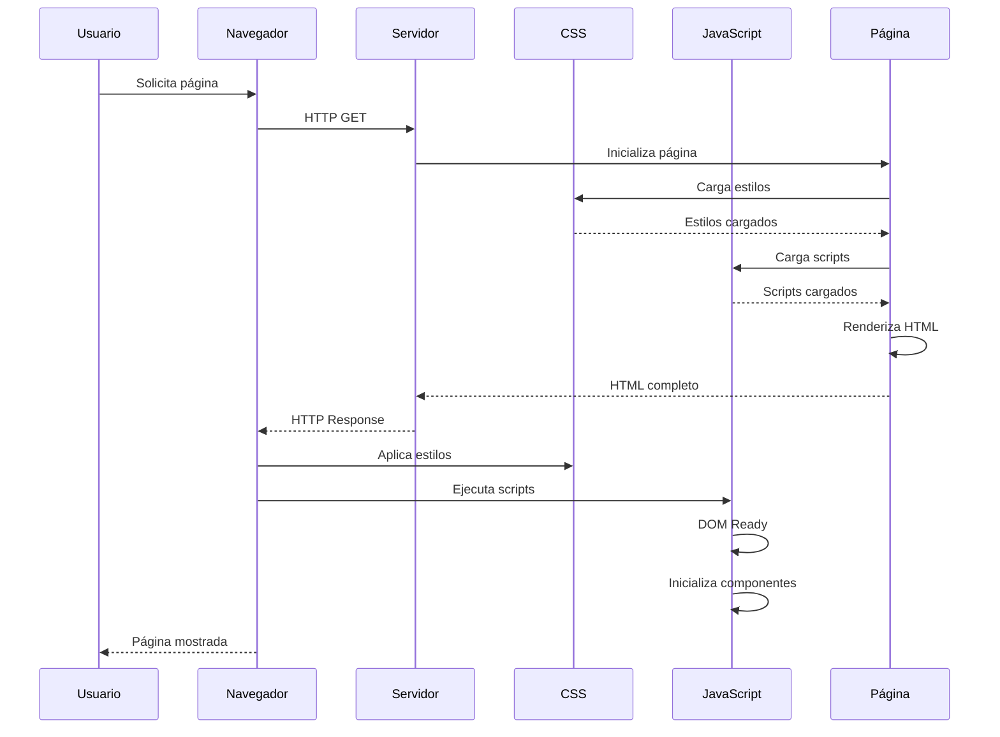
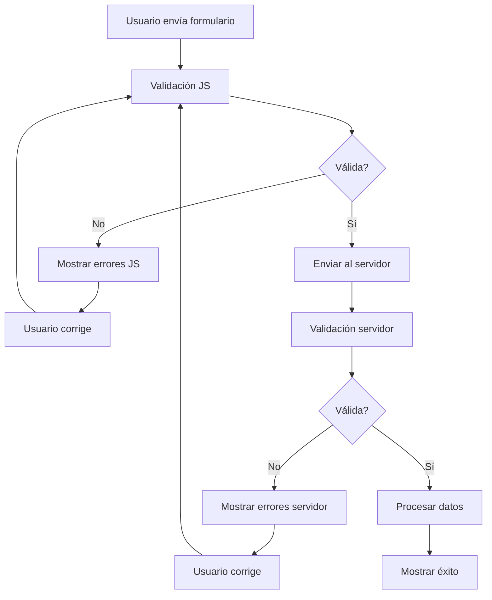
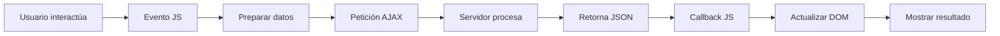
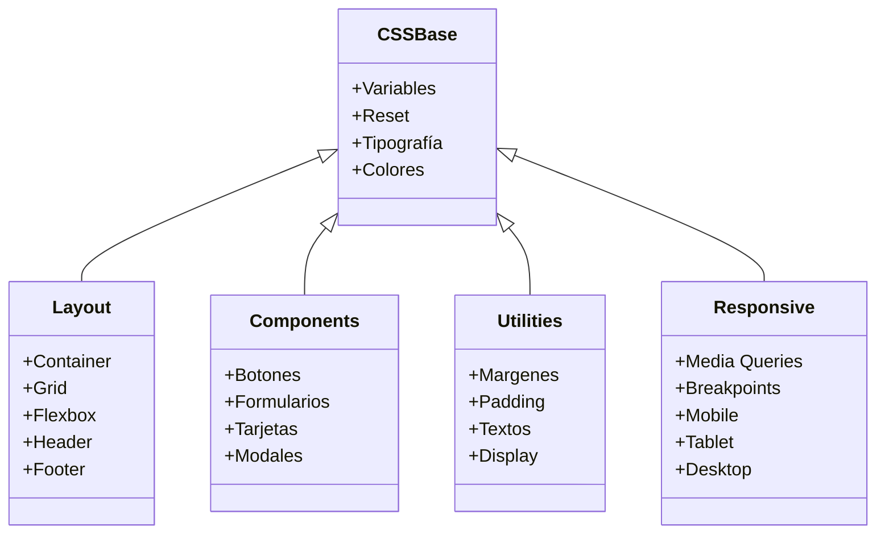
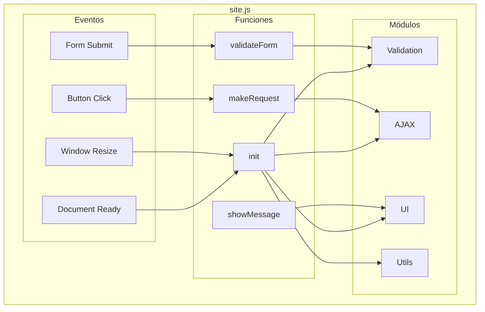

# Estilos y Scripts - GymApp

## Lo General

### Propósito

Este documento describe la integración de CSS y JavaScript en ASP.NET Web Forms para el proyecto GymApp, explicando cómo organizar, implementar y mantener estilos y scripts.

### CSS (Cascading Style Sheets)

CSS se utiliza para definir la apariencia visual de la aplicación, incluyendo:

- **Layout**: Estructura y posicionamiento de elementos
- **Tipografía**: Fuentes, tamaños, pesos
- **Colores**: Paleta de colores de la aplicación
- **Espaciado**: Márgenes, padding, bordes
- **Responsive**: Adaptación a diferentes dispositivos
- **Animaciones**: Transiciones y animaciones

### JavaScript

JavaScript se utiliza para agregar interactividad a la aplicación, incluyendo:

- **Validación**: Validación del lado del cliente
- **AJAX**: Comunicación asíncrona con el servidor
- **Manipulación DOM**: Modificación dinámica del DOM
- **Eventos**: Manejo de eventos del usuario
- **Animaciones**: Animaciones y transiciones
- **Librerías**: jQuery, Bootstrap, etc.

### Organización en GymApp

El proyecto GymApp organizará estilos y scripts de la siguiente manera:

```
Content/
├── css/
│   ├── site.css              # Estilos principales
│   ├── layout.css            # Layout y estructura
│   ├── components.css        # Componentes reutilizables
│   ├── forms.css             # Formularios
│   ├── tables.css            # Tablas y grillas
│   └── responsive.css         # Estilos responsive
├── js/
│   ├── site.js               # Scripts principales
│   ├── validation.js         # Validación
│   ├── ajax.js               # Funciones AJAX
│   └── lib/                  # Librerías externas
│       ├── jquery.min.js
│       └── bootstrap.min.js
└── images/
    ├── icons/
    ├── logos/
    └── backgrounds/
```

## Comunicación de Capas

### Arquitectura de Estilos y Scripts



### Flujo de Carga de Recursos



### Interacción entre CSS, JS y Controles



## Diagramas UML

### Diagrama de Secuencia: Carga de Página con Recursos



### Diagrama de Actividad: Proceso de Validación



### Diagrama de Proceso: Flujo de AJAX



### Diagrama de Clases: Estructura de Estilos



### Diagrama de Componentes: Estructura de Scripts



## Implementación

### CSS

#### site.css (Estilos principales)

```css
/* ===================================
   Variables CSS
   =================================== */
:root {
    /* Colores principales */
    --color-primary: #007bff;
    --color-secondary: #6c757d;
    --color-success: #28a745;
    --color-danger: #dc3545;
    --color-warning: #ffc107;
    --color-info: #17a2b8;
    --color-light: #f8f9fa;
    --color-dark: #343a40;

    /* Colores de texto */
    --color-text-primary: #212529;
    --color-text-secondary: #6c757d;
    --color-text-muted: #868e96;

    /* Colores de fondo */
    --color-bg-primary: #ffffff;
    --color-bg-secondary: #f8f9fa;
    --color-bg-dark: #343a40;

    /* Tipografía */
    --font-family-base: 'Segoe UI', Tahoma, Geneva, Verdana, sans-serif;
    --font-size-base: 16px;
    --font-size-sm: 14px;
    --font-size-lg: 18px;
    --font-size-xl: 20px;

    /* Espaciado */
    --spacing-xs: 0.25rem;
    --spacing-sm: 0.5rem;
    --spacing-md: 1rem;
    --spacing-lg: 1.5rem;
    --spacing-xl: 2rem;

    /* Bordes */
    --border-radius-sm: 0.25rem;
    --border-radius: 0.375rem;
    --border-radius-lg: 0.5rem;
    --border-radius-circle: 50%;

    /* Sombras */
    --shadow-sm: 0 0.125rem 0.25rem rgba(0, 0, 0, 0.075);
    --shadow: 0 0.5rem 1rem rgba(0, 0, 0, 0.15);
    --shadow-lg: 0 1rem 3rem rgba(0, 0, 0, 0.175);

    /* Transiciones */
    --transition-base: all 0.3s ease;
}

/* ===================================
   Reset y Base
   =================================== */
* {
    margin: 0;
    padding: 0;
    box-sizing: border-box;
}

html {
    font-size: var(--font-size-base);
    scroll-behavior: smooth;
}

body {
    font-family: var(--font-family-base);
    font-size: var(--font-size-base);
    line-height: 1.5;
    color: var(--color-text-primary);
    background-color: var(--color-bg-secondary);
}

/* ===================================
   Tipografía
   =================================== */
h1, h2, h3, h4, h5, h6 {
    margin-bottom: var(--spacing-md);
    font-weight: 600;
    line-height: 1.2;
}

h1 { font-size: 2.5rem; }
h2 { font-size: 2rem; }
h3 { font-size: 1.75rem; }
h4 { font-size: 1.5rem; }
h5 { font-size: 1.25rem; }
h6 { font-size: 1rem; }

p {
    margin-bottom: var(--spacing-md);
}

a {
    color: var(--color-primary);
    text-decoration: none;
    transition: var(--transition-base);
}

a:hover {
    color: var(--color-primary);
    text-decoration: underline;
}

/* ===================================
   Utilidades
   =================================== */
.container {
    width: 100%;
    max-width: 1200px;
    margin: 0 auto;
    padding: 0 var(--spacing-md);
}

.row {
    display: flex;
    flex-wrap: wrap;
    margin: 0 calc(var(--spacing-md) * -0.5);
}

.col {
    flex: 1;
    padding: 0 calc(var(--spacing-md) * 0.5);
}

.text-center { text-align: center; }
.text-left { text-align: left; }
.text-right { text-align: right; }

.mt-1 { margin-top: var(--spacing-sm); }
.mt-2 { margin-top: var(--spacing-md); }
.mt-3 { margin-top: var(--spacing-lg); }
.mt-4 { margin-top: var(--spacing-xl); }

.mb-1 { margin-bottom: var(--spacing-sm); }
.mb-2 { margin-bottom: var(--spacing-md); }
.mb-3 { margin-bottom: var(--spacing-lg); }
.mb-4 { margin-bottom: var(--spacing-xl); }

.p-1 { padding: var(--spacing-sm); }
.p-2 { padding: var(--spacing-md); }
.p-3 { padding: var(--spacing-lg); }
.p-4 { padding: var(--spacing-xl); }

.d-none { display: none; }
.d-block { display: block; }
.d-inline { display: inline; }
.d-inline-block { display: inline-block; }
.d-flex { display: flex; }

/* ===================================
   Componentes
   =================================== */
.btn {
    display: inline-block;
    padding: var(--spacing-sm) var(--spacing-md);
    font-size: var(--font-size-base);
    font-weight: 500;
    line-height: 1.5;
    text-align: center;
    text-decoration: none;
    vertical-align: middle;
    cursor: pointer;
    border: 1px solid transparent;
    border-radius: var(--border-radius);
    transition: var(--transition-base);
}

.btn-primary {
    color: #fff;
    background-color: var(--color-primary);
    border-color: var(--color-primary);
}

.btn-primary:hover {
    background-color: #0069d9;
    border-color: #0062cc;
}

.btn-secondary {
    color: #fff;
    background-color: var(--color-secondary);
    border-color: var(--color-secondary);
}

.btn-secondary:hover {
    background-color: #5a6268;
    border-color: #545b62;
}

.btn-success {
    color: #fff;
    background-color: var(--color-success);
    border-color: var(--color-success);
}

.btn-success:hover {
    background-color: #218838;
    border-color: #1e7e34;
}

.btn-danger {
    color: #fff;
    background-color: var(--color-danger);
    border-color: var(--color-danger);
}

.btn-danger:hover {
    background-color: #c82333;
    border-color: #bd2130;
}

.btn-block {
    display: block;
    width: 100%;
}

.card {
    background-color: var(--color-bg-primary);
    border: 1px solid rgba(0, 0, 0, 0.125);
    border-radius: var(--border-radius);
    box-shadow: var(--shadow-sm);
    margin-bottom: var(--spacing-md);
}

.card-header {
    padding: var(--spacing-md);
    background-color: rgba(0, 0, 0, 0.03);
    border-bottom: 1px solid rgba(0, 0, 0, 0.125);
    border-top-left-radius: calc(var(--border-radius) - 1px);
    border-top-right-radius: calc(var(--border-radius) - 1px);
}

.card-body {
    padding: var(--spacing-md);
}

.card-footer {
    padding: var(--spacing-md);
    background-color: rgba(0, 0, 0, 0.03);
    border-top: 1px solid rgba(0, 0, 0, 0.125);
    border-bottom-left-radius: calc(var(--border-radius) - 1px);
    border-bottom-right-radius: calc(var(--border-radius) - 1px);
}

.alert {
    padding: var(--spacing-md);
    margin-bottom: var(--spacing-md);
    border: 1px solid transparent;
    border-radius: var(--border-radius);
}

.alert-success {
    color: #155724;
    background-color: #d4edda;
    border-color: #c3e6cb;
}

.alert-danger {
    color: #721c24;
    background-color: #f8d7da;
    border-color: #f5c6cb;
}

.alert-warning {
    color: #856404;
    background-color: #fff3cd;
    border-color: #ffeeba;
}

.alert-info {
    color: #0c5460;
    background-color: #d1ecf1;
    border-color: #bee5eb;
}

/* ===================================
   Formularios
   =================================== */
.form-group {
    margin-bottom: var(--spacing-md);
}

.form-control {
    display: block;
    width: 100%;
    padding: var(--spacing-sm) var(--spacing-md);
    font-size: var(--font-size-base);
    line-height: 1.5;
    color: var(--color-text-primary);
    background-color: var(--color-bg-primary);
    border: 1px solid #ced4da;
    border-radius: var(--border-radius);
    transition: var(--transition-base);
}

.form-control:focus {
    border-color: var(--color-primary);
    outline: 0;
    box-shadow: 0 0 0 0.2rem rgba(0, 123, 255, 0.25);
}

.form-control::placeholder {
    color: var(--color-text-muted);
    opacity: 1;
}

.error-message {
    color: var(--color-danger);
    font-size: var(--font-size-sm);
    margin-top: var(--spacing-xs);
}

/* ===================================
   Tablas
   =================================== */
.table {
    width: 100%;
    margin-bottom: var(--spacing-md);
    border-collapse: collapse;
}

.table th,
.table td {
    padding: var(--spacing-sm) var(--spacing-md);
    vertical-align: top;
    border-top: 1px solid #dee2e6;
}

.table thead th {
    vertical-align: bottom;
    border-bottom: 2px solid #dee2e6;
}

.table tbody tr:nth-of-type(odd) {
    background-color: rgba(0, 0, 0, 0.02);
}

.table-striped tbody tr:nth-of-type(odd) {
    background-color: rgba(0, 0, 0, 0.05);
}

.table-hover tbody tr:hover {
    background-color: rgba(0, 0, 0, 0.075);
}

/* ===================================
   Responsive
   =================================== */
@media (max-width: 768px) {
    .container {
        padding: 0 var(--spacing-sm);
    }

    h1 { font-size: 2rem; }
    h2 { font-size: 1.75rem; }
    h3 { font-size: 1.5rem; }

    .btn {
        width: 100%;
        margin-bottom: var(--spacing-sm);
    }
}
```

#### responsive.css (Estilos responsive)

```css
/* ===================================
   Breakpoints
   =================================== */
/* Extra small devices (phones, less than 576px) */
@media (max-width: 575.98px) {
    .container {
        max-width: 100%;
        padding: 0 var(--spacing-sm);
    }

    .row {
        margin: 0;
    }

    .col {
        padding: 0;
        flex: 0 0 100%;
        max-width: 100%;
    }

    .card {
        border-radius: 0;
    }

    .table-responsive {
        display: block;
        width: 100%;
        overflow-x: auto;
    }
}

/* Small devices (landscape phones, 576px and up) */
@media (min-width: 576px) and (max-width: 767.98px) {
    .container {
        max-width: 540px;
    }
}

/* Medium devices (tablets, 768px and up) */
@media (min-width: 768px) and (max-width: 991.98px) {
    .container {
        max-width: 720px;
    }

    .col-md-6 {
        flex: 0 0 50%;
        max-width: 50%;
    }
}

/* Large devices (desktops, 992px and up) */
@media (min-width: 992px) and (max-width: 1199.98px) {
    .container {
        max-width: 960px;
    }

    .col-lg-4 {
        flex: 0 0 33.333333%;
        max-width: 33.333333%;
    }

    .col-lg-8 {
        flex: 0 0 66.666667%;
        max-width: 66.666667%;
    }
}

/* Extra large devices (large desktops, 1200px and up) */
@media (min-width: 1200px) {
    .container {
        max-width: 1140px;
    }
}
```

### JavaScript

#### site.js (Scripts principales)

```javascript
// ===================================
// GymApp - JavaScript Principal
// ===================================

(function($) {
    'use strict';

    // Namespace principal
    var GymApp = {
        // Configuración
        config: {
            apiBaseUrl: '/api/',
            debug: true
        },

        // Inicialización
        init: function() {
            this.log('GymApp inicializado');
            this.setupEventListeners();
            this.initializeComponents();
        },

        // Configurar event listeners
        setupEventListeners: function() {
            // Document ready
            $(document).ready(function() {
                GymApp.log('Document ready');
            });

            // Window resize
            $(window).on('resize', function() {
                GymApp.handleResize();
            });

            // Form submit
            $('form').on('submit', function(e) {
                return GymApp.handleFormSubmit(e, this);
            });

            // Button click
            $('.btn').on('click', function(e) {
                GymApp.handleButtonClick(e, this);
            });
        },

        // Inicializar componentes
        initializeComponents: function() {
            this.initializeValidation();
            this.initializeTooltips();
            this.initializeModals();
        },

        // Manejar resize
        handleResize: function() {
            this.log('Window resized');
            // Lógica de resize
        },

        // Manejar submit de formulario
        handleFormSubmit: function(e, form) {
            this.log('Form submit');

            // Validar formulario
            if (!this.validateForm(form)) {
                e.preventDefault();
                return false;
            }

            return true;
        },

        // Manejar click de botón
        handleButtonClick: function(e, button) {
            this.log('Button click');

            // Verificar si el botón tiene confirmación
            var confirmMessage = $(button).data('confirm');
            if (confirmMessage && !confirm(confirmMessage)) {
                e.preventDefault();
                return false;
            }

            return true;
        },

        // Validar formulario
        validateForm: function(form) {
            var isValid = true;
            var $form = $(form);

            // Validar campos requeridos
            $form.find('[required]').each(function() {
                var $field = $(this);
                var value = $field.val();

                if (!value || value.trim() === '') {
                    isValid = false;
                    $field.addClass('is-invalid');
                    GymApp.showError($field, 'Este campo es requerido');
                } else {
                    $field.removeClass('is-invalid');
                }
            });

            // Validar email
            $form.find('[type="email"]').each(function() {
                var $field = $(this);
                var value = $field.val();

                if (value && !GymApp.Validation.isValidEmail(value)) {
                    isValid = false;
                    $field.addClass('is-invalid');
                    GymApp.showError($field, 'Email inválido');
                }
            });

            return isValid;
        },

        // Mostrar error
        showError: function($field, message) {
            var $error = $field.next('.error-message');
            if ($error.length === 0) {
                $error = $('<div class="error-message"></div>');
                $field.after($error);
            }
            $error.text(message);
        },

        // Inicializar validación
        initializeValidation: function() {
            this.log('Validation initialized');
        },

        // Inicializar tooltips
        initializeTooltips: function() {
            this.log('Tooltips initialized');
        },

        // Inicializar modales
        initializeModals: function() {
            this.log('Modals initialized');
        },

        // Logging
        log: function(message) {
            if (this.config.debug) {
                console.log('[GymApp]', message);
            }
        }
    };

    // Módulo de Validación
    GymApp.Validation = {
        isValidEmail: function(email) {
            var regex = /^[^\s@]+@[^\s@]+\.[^\s@]+$/;
            return regex.test(email);
        },

        isValidPhone: function(phone) {
            var regex = /^\d{10}$/;
            return regex.test(phone);
        },

        isValidDate: function(date) {
            return !isNaN(Date.parse(date));
        },

        isValidNumber: function(value, min, max) {
            var num = parseFloat(value);
            return !isNaN(num) && num >= min && num <= max;
        }
    };

    // Módulo de AJAX
    GymApp.AJAX = {
        get: function(url, data, success, error) {
            GymApp.log('GET request: ' + url);

            $.ajax({
                url: url,
                type: 'GET',
                data: data,
                dataType: 'json',
                success: function(response) {
                    GymApp.log('GET success');
                    if (success) success(response);
                },
                error: function(xhr, status, err) {
                    GymApp.log('GET error: ' + err);
                    if (error) error(xhr, status, err);
                }
            });
        },

        post: function(url, data, success, error) {
            GymApp.log('POST request: ' + url);

            $.ajax({
                url: url,
                type: 'POST',
                data: JSON.stringify(data),
                contentType: 'application/json',
                dataType: 'json',
                success: function(response) {
                    GymApp.log('POST success');
                    if (success) success(response);
                },
                error: function(xhr, status, err) {
                    GymApp.log('POST error: ' + err);
                    if (error) error(xhr, status, err);
                }
            });
        },

        put: function(url, data, success, error) {
            GymApp.log('PUT request: ' + url);

            $.ajax({
                url: url,
                type: 'PUT',
                data: JSON.stringify(data),
                contentType: 'application/json',
                dataType: 'json',
                success: function(response) {
                    GymApp.log('PUT success');
                    if (success) success(response);
                },
                error: function(xhr, status, err) {
                    GymApp.log('PUT error: ' + err);
                    if (error) error(xhr, status, err);
                }
            });
        },

        delete: function(url, success, error) {
            GymApp.log('DELETE request: ' + url);

            $.ajax({
                url: url,
                type: 'DELETE',
                dataType: 'json',
                success: function(response) {
                    GymApp.log('DELETE success');
                    if (success) success(response);
                },
                error: function(xhr, status, err) {
                    GymApp.log('DELETE error: ' + err);
                    if (error) error(xhr, status, err);
                }
            });
        }
    };

    // Módulo de UI
    GymApp.UI = {
        showMessage: function(message, type) {
            type = type || 'info';

            var $alert = $('<div class="alert alert-' + type + '">' +
                '<button type="button" class="close" data-dismiss="alert">&times;</button>' +
                message +
                '</div>');

            $('.container').prepend($alert);

            setTimeout(function() {
                $alert.fadeOut(function() {
                    $(this).remove();
                });
            }, 5000);
        },

        showLoading: function() {
            var $loading = $('<div class="loading-overlay">' +
                '<div class="loading-spinner"></div>' +
                '</div>');

            $('body').append($loading);
        },

        hideLoading: function() {
            $('.loading-overlay').remove();
        },

        showModal: function(title, content, buttons) {
            // Implementar modal
        },

        hideModal: function() {
            // Ocultar modal
        }
    };

    // Módulo de Utilidades
    GymApp.Utils = {
        formatDate: function(date) {
            var d = new Date(date);
            return d.toLocaleDateString('es-ES');
        },

        formatCurrency: function(amount) {
            return '$' + amount.toFixed(2);
        },

        formatNumber: function(number) {
            return number.toLocaleString('es-ES');
        },

        debounce: function(func, wait) {
            var timeout;
            return function() {
                var context = this;
                var args = arguments;
                clearTimeout(timeout);
                timeout = setTimeout(function() {
                    func.apply(context, args);
                }, wait);
            };
        },

        throttle: function(func, limit) {
            var inThrottle;
            return function() {
                var context = this;
                var args = arguments;
                if (!inThrottle) {
                    func.apply(context, args);
                    inThrottle = true;
                    setTimeout(function() {
                        inThrottle = false;
                    }, limit);
                }
            };
        }
    };

    // Exponer al scope global
    window.GymApp = GymApp;

    // Inicializar cuando el DOM esté listo
    $(document).ready(function() {
        GymApp.init();
    });

})(jQuery);
```

#### validation.js (Validación)

```javascript
// ===================================
// GymApp - Validación
// ===================================

(function($) {
    'use strict';

    var Validation = {
        // Reglas de validación
        rules: {
            required: function(value) {
                return value && value.trim() !== '';
            },

            email: function(value) {
                var regex = /^[^\s@]+@[^\s@]+\.[^\s@]+$/;
                return regex.test(value);
            },

            phone: function(value) {
                var regex = /^\d{10}$/;
                return regex.test(value);
            },

            minLength: function(value, min) {
                return value && value.length >= min;
            },

            maxLength: function(value, max) {
                return value && value.length <= max;
            },

            numeric: function(value) {
                return !isNaN(parseFloat(value)) && isFinite(value);
            },

            integer: function(value) {
                return Number.isInteger(parseFloat(value));
            },

            min: function(value, min) {
                var num = parseFloat(value);
                return !isNaN(num) && num >= min;
            },

            max: function(value, max) {
                var num = parseFloat(value);
                return !isNaN(num) && num <= max;
            },

            pattern: function(value, pattern) {
                var regex = new RegExp(pattern);
                return regex.test(value);
            }
        },

        // Validar campo
        validateField: function($field, rules) {
            var value = $field.val();
            var isValid = true;
            var errorMessage = '';

            for (var rule in rules) {
                var params = rules[rule];

                if (!this.rules[rule](value, params)) {
                    isValid = false;
                    errorMessage = this.getErrorMessage(rule, params);
                    break;
                }
            }

            if (!isValid) {
                $field.addClass('is-invalid');
                this.showError($field, errorMessage);
            } else {
                $field.removeClass('is-invalid');
                this.clearError($field);
            }

            return isValid;
        },

        // Validar formulario
        validateForm: function($form) {
            var isValid = true;
            var self = this;

            $form.find('[data-validate]').each(function() {
                var $field = $(this);
                var rules = $field.data('validate');

                if (!self.validateField($field, rules)) {
                    isValid = false;
                }
            });

            return isValid;
        },

        // Mostrar error
        showError: function($field, message) {
            var $error = $field.next('.error-message');
            if ($error.length === 0) {
                $error = $('<div class="error-message"></div>');
                $field.after($error);
            }
            $error.text(message);
        },

        // Limpiar error
        clearError: function($field) {
            $field.next('.error-message').remove();
        },

        // Obtener mensaje de error
        getErrorMessage: function(rule, params) {
            var messages = {
                required: 'Este campo es requerido',
                email: 'Email inválido',
                phone: 'Teléfono inválido',
                minLength: 'Mínimo ' + params + ' caracteres',
                maxLength: 'Máximo ' + params + ' caracteres',
                numeric: 'Debe ser un número',
                integer: 'Debe ser un entero',
                min: 'Debe ser mayor o igual a ' + params,
                max: 'Debe ser menor o igual a ' + params,
                pattern: 'Formato inválido'
            };

            return messages[rule] || 'Valor inválido';
        }
    };

    // Exponer al scope global
    window.Validation = Validation;

})(jQuery);
```

## Mejores Prácticas

### CSS

1. **Organización**: Mantener CSS organizado en archivos separados
2. **Variables**: Usar variables CSS para consistencia
3. **Clases reutilizables**: Crear clases utilitarias
4. **Responsive**: Diseñar mobile-first
5. **Performance**: Minimizar y comprimir CSS en producción

### JavaScript

1. **Modularidad**: Organizar código en módulos
2. **Namespace**: Usar namespaces para evitar conflictos
3. **Event delegation**: Usar delegación de eventos
4. **Performance**: Minimizar y comprimir JS en producción
5. **Error handling**: Implementar manejo de errores

### Integración

1. **Carga asíncrona**: Cargar scripts asíncronamente cuando sea posible
2. **CDN**: Usar CDNs para librerías externas
3. **Fallback**: Proporcionar fallbacks para librerías
4. **Compatibilidad**: Verificar compatibilidad con navegadores

## Troubleshooting

### Problemas Comunes

1. **Estilos no se aplican**
   - Verificar que los archivos CSS estén correctamente referenciados
   - Verificar que las rutas sean correctas
   - Verificar que no haya conflictos de especificidad

2. **Scripts no se ejecutan**
   - Verificar que los archivos JS estén correctamente referenciados
   - Verificar que jQuery esté cargado antes de usarlo
   - Verificar que no haya errores de JavaScript en la consola

3. **Responsive no funciona**
   - Verificar que el viewport meta tag esté presente
   - Verificar que las media queries estén correctamente definidas
   - Verificar que no haya estilos que sobrescriban los responsive

---

**Última actualización**: 2026-04-19
**Versión**: 1.0