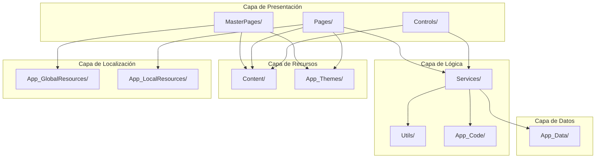
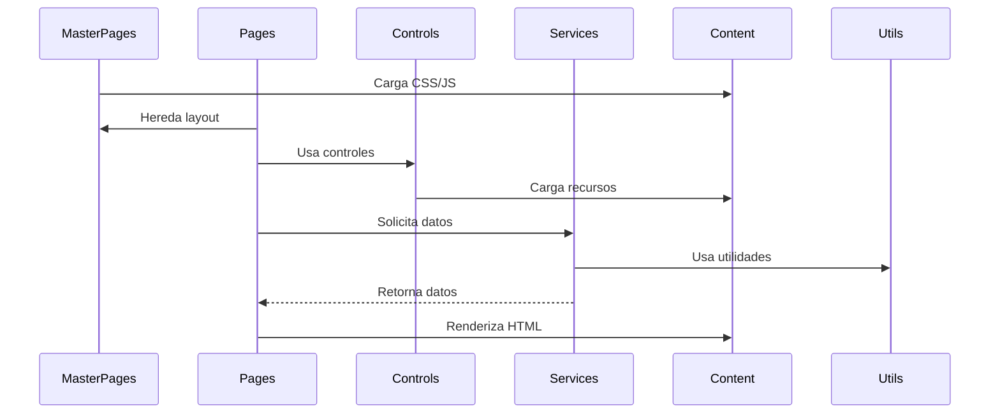
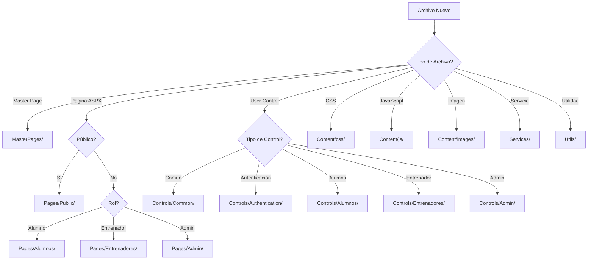
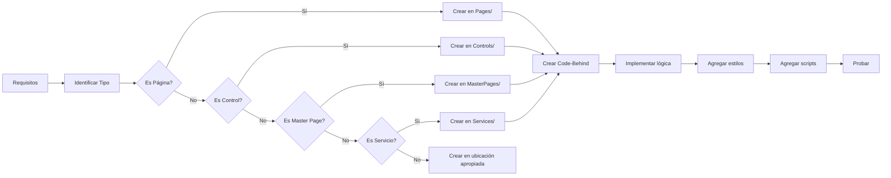
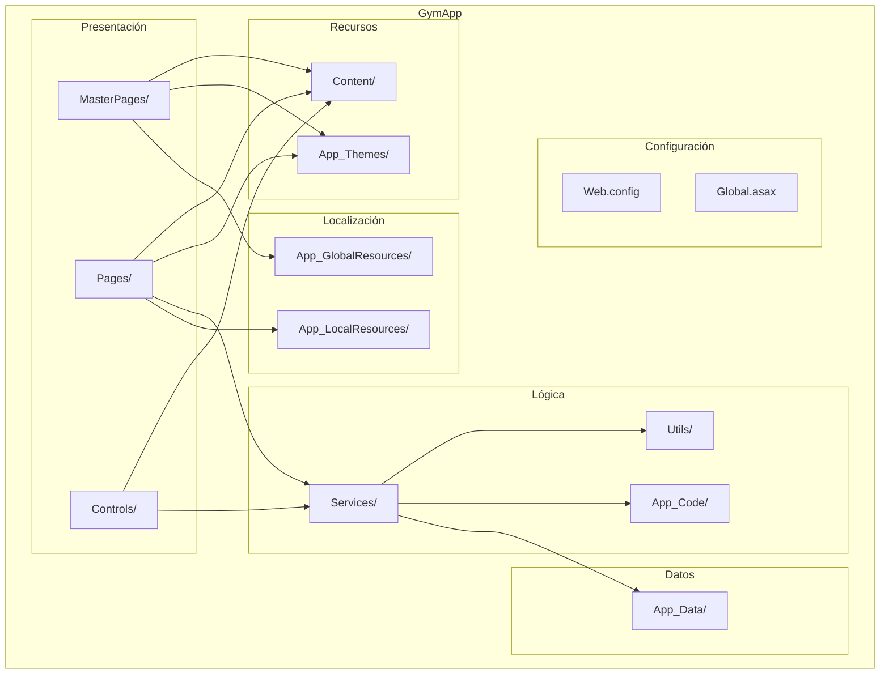

# Estructura de Carpetas - GymApp

## Lo General

### Propósito

Este documento define la estructura recomendada de carpetas para organizar el frontend del proyecto GymApp en ASP.NET Web Forms, facilitando el mantenimiento, escalabilidad y colaboración en el desarrollo.

### Principios de Organización

1. **Separación de responsabilidades**: Cada carpeta tiene un propósito claro y definido
2. **Escalabilidad**: La estructura soporta el crecimiento del proyecto
3. **Mantenibilidad**: Fácil localización y modificación de archivos
4. **Colaboración**: Facilita el trabajo en equipo
5. **Convenciones**: Nombres descriptivos y consistentes

### Estructura Recomendada

```
GymApp/
├── App_Code/                    # Código compartido y utilidades
│   ├── Helpers/                 # Clases helper
│   ├── Extensions/              # Extension methods
│   └── Models/                  # Modelos de datos
│
├── App_Data/                    # Datos de la aplicación
│   └── Database/                # Archivos de base de datos local
│
├── App_GlobalResources/         # Recursos globales (localización)
│   └── Resources.resx
│
├── App_LocalResources/          # Recursos locales por página
│   ├── Default.aspx.resx
│   └── Login.aspx.resx
│
├── App_Themes/                   # Temas de la aplicación
│   └── Default/
│       ├── Default.skin
│       └── Default.css
│
├── Content/                      # Recursos estáticos
│   ├── css/                     # Hojas de estilo
│   │   ├── site.css
│   │   ├── layout.css
│   │   ├── components.css
│   │   └── responsive.css
│   │
│   ├── js/                      # Scripts JavaScript
│   │   ├── site.js
│   │   ├── validation.js
│   │   ├── ajax.js
│   │   └── lib/                 # Librerías externas
│   │       ├── jquery.min.js
│   │       └── bootstrap.min.js
│   │
│   ├── images/                  # Imágenes
│   │   ├── icons/
│   │   ├── logos/
│   │   └── backgrounds/
│   │
│   └── fonts/                   # Fuentes personalizadas
│       └── custom-fonts/
│
├── Controls/                     # User Controls reutilizables
│   ├── Common/                  # Controles comunes
│   │   ├── HeaderControl.ascx
│   │   ├── FooterControl.ascx
│   │   ├── MenuControl.ascx
│   │   └── NotificationControl.ascx
│   │
│   ├── Authentication/          # Controles de autenticación
│   │   ├── LoginForm.ascx
│   │   └── RegisterForm.ascx
│   │
│   ├── Alumnos/                 # Controles específicos de alumnos
│   │   ├── AlumnoProfile.ascx
│   │   ├── RutinaDisplay.ascx
│   │   └── ProgresoChart.ascx
│   │
│   ├── Entrenadores/            # Controles específicos de entrenadores
│   │   ├── AlumnoList.ascx
│   │   ├── RutinaEditor.ascx
│   │   └── ProgresoViewer.ascx
│   │
│   └── Admin/                   # Controles de administración
│       ├── UserGrid.ascx
│       ├── PermissionEditor.ascx
│       └── ReportViewer.ascx
│
├── MasterPages/                  # Master Pages
│   ├── Site.master              # Master page principal
│   ├── Site.master.cs           # Code-behind
│   ├── Admin.master             # Master page de administración
│   ├── Admin.master.cs
│   ├── Public.master            # Master page pública
│   └── Public.master.cs
│
├── Pages/                        # Páginas de contenido
│   ├── Public/                  # Páginas públicas
│   │   ├── Default.aspx
│   │   ├── Default.aspx.cs
│   │   ├── About.aspx
│   │   ├── About.aspx.cs
│   │   ├── Contact.aspx
│   │   └── Contact.aspx.cs
│   │
│   ├── Authentication/          # Páginas de autenticación
│   │   ├── Login.aspx
│   │   ├── Login.aspx.cs
│   │   ├── Register.aspx
│   │   ├── Register.aspx.cs
│   │   ├── ForgotPassword.aspx
│   │   └── ForgotPassword.aspx.cs
│   │
│   ├── Alumnos/                 # Páginas de alumnos
│   │   ├── Dashboard.aspx
│   │   ├── Dashboard.aspx.cs
│   │   ├── MiRutina.aspx
│   │   ├── MiRutina.aspx.cs
│   │   ├── MiProgreso.aspx
│   │   └── MiProgreso.aspx.cs
│   │
│   ├── Entrenadores/            # Páginas de entrenadores
│   │   ├── Dashboard.aspx
│   │   ├── Dashboard.aspx.cs
│   │   ├── GestionarAlumnos.aspx
│   │   ├── GestionarAlumnos.aspx.cs
│   │   ├── CrearRutina.aspx
│   │   ├── CrearRutina.aspx.cs
│   │   ├── EditarRutina.aspx
│   │   └── EditarRutina.aspx.cs
│   │
│   └── Admin/                   # Páginas de administración
│       ├── Dashboard.aspx
│       ├── Dashboard.aspx.cs
│       ├── GestionarUsuarios.aspx
│       ├── GestionarUsuarios.aspx.cs
│       ├── GestionarPermisos.aspx
│       ├── GestionarPermisos.aspx.cs
│       ├── Reportes.aspx
│       └── Reportes.aspx.cs
│
├── Services/                     # Servicios y lógica de negocio
│   ├── UsuarioService.cs
│   ├── AlumnoService.cs
│   ├── EntrenadorService.cs
│   ├── ActividadService.cs
│   └── RutinaService.cs
│
├── Utils/                        # Utilidades y helpers
│   ├── SecurityHelper.cs
│   ├── ValidationHelper.cs
│   ├── FormatHelper.cs
│   └── LogHelper.cs
│
├── Web.config                    # Configuración de la aplicación
├── Global.asax                   # Eventos globales de la aplicación
└── Default.aspx                  # Página por defecto (legacy)
```

## Comunicación de Capas

### Relación entre Carpetas y Capas



### Flujo de Archivos entre Carpetas



## Diagramas UML

### Diagrama de Actividad: Organización de Archivos



### Diagrama de Proceso: Flujo de Desarrollo



### Diagrama de Componentes: Estructura de Carpetas



## Convenciones de Nomenclatura

### Archivos

- **Master Pages**: PascalCase con extensión `.master`
  - Ejemplo: `Site.master`, `Admin.master`

- **Páginas ASPX**: PascalCase con extensión `.aspx`
  - Ejemplo: `Default.aspx`, `Dashboard.aspx`

- **Code-Behind**: Mismo nombre que la página con extensión `.aspx.cs`
  - Ejemplo: `Default.aspx.cs`, `Dashboard.aspx.cs`

- **User Controls**: PascalCase con extensión `.ascx`
  - Ejemplo: `HeaderControl.ascx`, `MenuControl.ascx`

- **CSS**: kebab-case con extensión `.css`
  - Ejemplo: `site.css`, `main-layout.css`

- **JavaScript**: kebab-case con extensión `.js`
  - Ejemplo: `site.js`, `validation.js`

- **Imágenes**: kebab-case con extensión apropiada
  - Ejemplo: `logo.png`, `background-image.jpg`

- **Clases C#**: PascalCase
  - Ejemplo: `UsuarioService`, `ValidationHelper`

### Carpetas

- **Carpetas principales**: PascalCase
  - Ejemplo: `MasterPages`, `Controls`, `Services`

- **Subcarpetas**: PascalCase
  - Ejemplo: `Authentication`, `Alumnos`, `Entrenadores`

- **Recursos estáticos**: minúsculas
  - Ejemplo: `css`, `js`, `images`, `fonts`

## Consideraciones Especiales

### Separación por Rol

Las páginas y controles están organizados por rol de usuario:
- **Public**: Páginas accesibles sin autenticación
- **Authentication**: Páginas de login y registro
- **Alumnos**: Páginas específicas para alumnos
- **Entrenadores**: Páginas específicas para entrenadores
- **Admin**: Páginas de administración

### Reutilización de Componentes

Los User Controls se organizan por funcionalidad:
- **Common**: Controles usados en múltiples secciones
- **Authentication**: Controles de autenticación
- **Alumnos**: Controles específicos de alumnos
- **Entrenadores**: Controles específicos de entrenadores
- **Admin**: Controles de administración

### Gestión de Recursos

Los recursos estáticos se organizan por tipo:
- **css**: Hojas de estilo
- **js**: Scripts JavaScript
- **images**: Imágenes
- **fonts**: Fuentes personalizadas

### Localización

Los recursos de localización se organizan por alcance:
- **App_GlobalResources**: Recursos compartidos globalmente
- **App_LocalResources**: Recursos específicos por página

## Mejores Prácticas

### Organización de Archivos

1. **Mantener archivos relacionados juntos**: Code-behind junto con su archivo .aspx
2. **Usar subcarpetas lógicas**: Agrupar archivos por funcionalidad
3. **Limitar profundidad de carpetas**: Máximo 3-4 niveles de profundidad
4. **Nombres descriptivos**: Usar nombres que indiquen claramente el propósito

### Gestión de Dependencias

1. **Minimizar dependencias circulares**: Evitar que módulos dependan entre sí
2. **Usar interfaces**: Definir contratos claros entre componentes
3. **Separar capas**: Mantener presentación, lógica y datos separados

### Mantenimiento

1. **Documentar estructura**: Mantener documentación actualizada
2. **Revisar periódicamente**: Reorganizar si la estructura deja de ser óptima
3. **Eliminar archivos no usados**: Mantener el proyecto limpio
4. **Versionar recursos**: Usar control de versiones para todos los archivos

---

**Última actualización**: 2026-04-19
**Versión**: 1.0