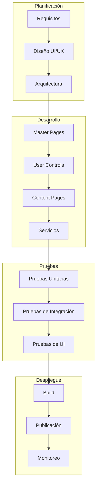
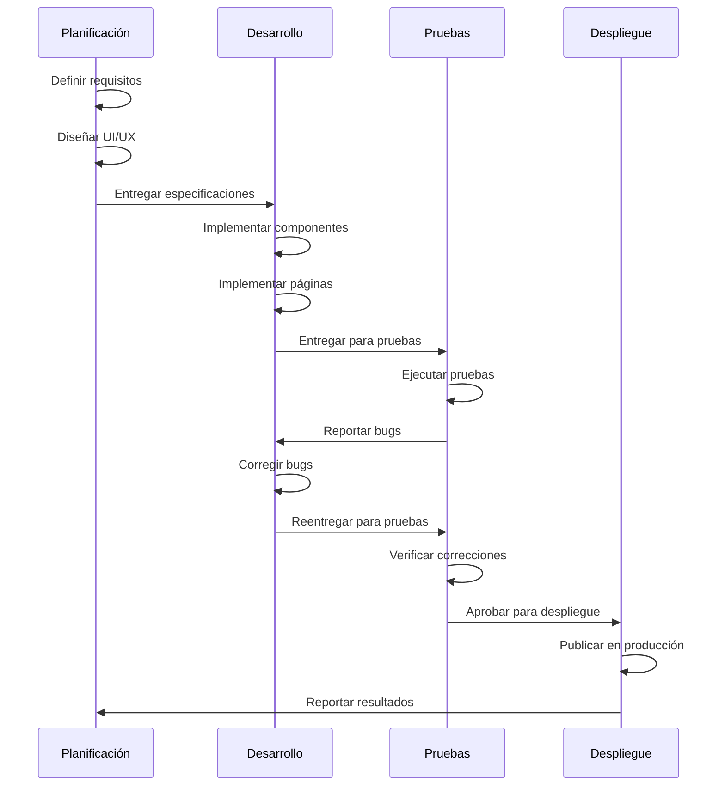
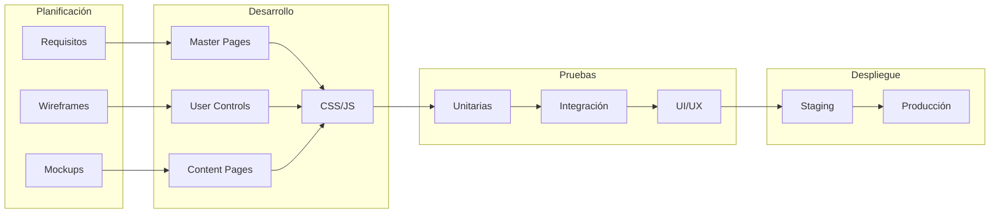
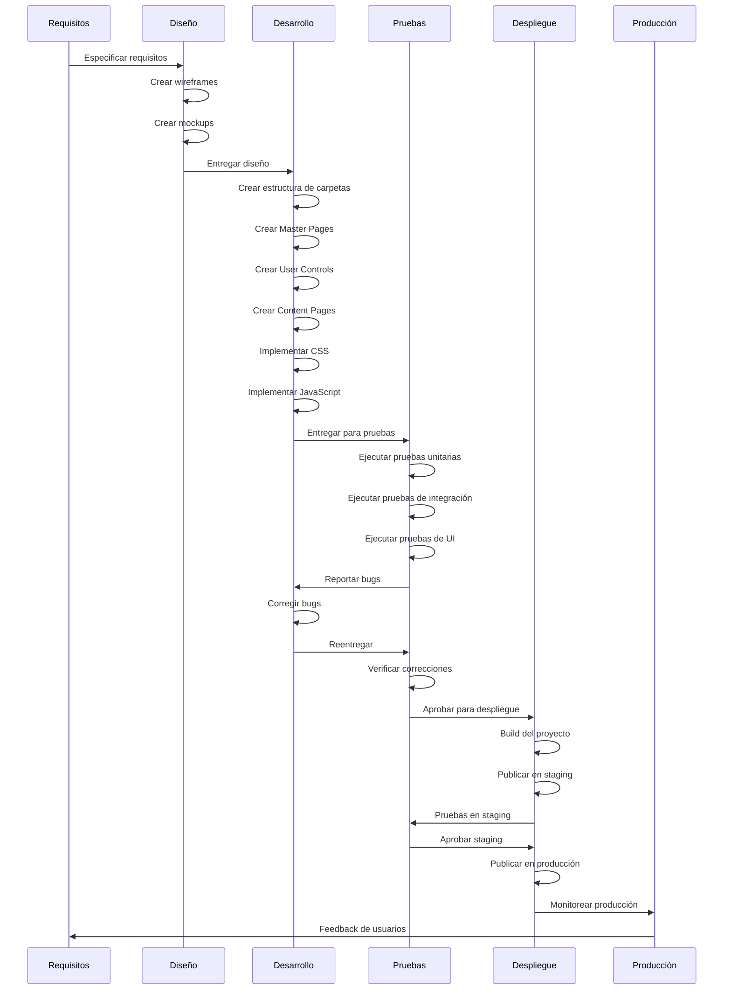
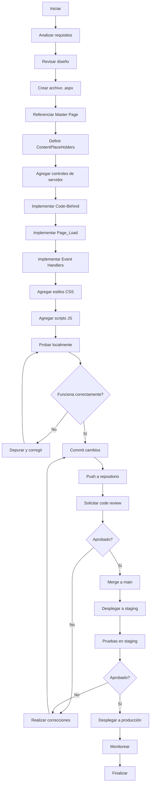
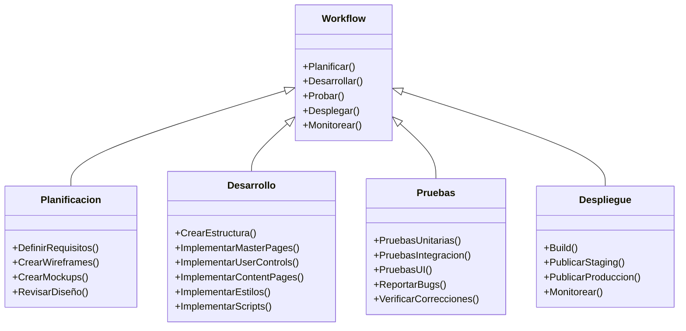
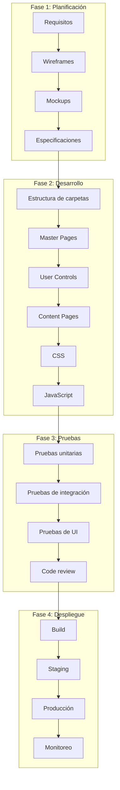

# Flujo de Trabajo - GymApp

## Lo General

### Propósito

Este documento describe el flujo de trabajo completo para el desarrollo frontend en ASP.NET Web Forms para el proyecto GymApp, proporcionando una guía paso a paso desde la creación hasta el despliegue.

### Visión General del Flujo de Trabajo

El desarrollo frontend en GymApp sigue un proceso estructurado que incluye:

1. **Planificación**: Definición de requisitos y diseño
2. **Configuración**: Preparación del entorno de desarrollo
3. **Desarrollo**: Implementación de componentes y páginas
4. **Pruebas**: Verificación de funcionalidad y calidad
5. **Despliegue**: Publicación en entorno de producción

### Roles y Responsabilidades

- **Desarrollador Frontend**: Implementación de páginas y componentes
- **Desarrollador Backend**: Implementación de servicios y lógica de negocio
- **Diseñador UI/UX**: Diseño de interfaces y experiencia de usuario
- **QA Tester**: Pruebas de funcionalidad y calidad
- **Administrador de Sistema**: Gestión de servidores y despliegue

## Comunicación de Capas

### Flujo de Trabajo por Capas



### Interacción entre Fases



### Relación entre Componentes



## Diagramas UML

### Diagrama de Secuencia: Flujo de Desarrollo Completo



### Diagrama de Actividad: Proceso de Desarrollo de Página



### Diagrama de Proceso: Flujo de Trabajo de Master Page

```mermaid
graph LR
    A[Requisitos de layout] --> B[Crear Master Page]
    B --> C[Definir estructura HTML]
    C --> D[Agregar ContentPlaceHolders]
    D --> E[Implementar Code-Behind]
    E --> F[Definir propiedades públicas]
    F --> G[Definir métodos públicos]
    G --> H[Agregar User Controls]
    H --> I[Referenciar CSS base]
    I --> J[Referenciar JS base]
    J --> K[Probar Master Page]
    K --> L[Crear Content Pages]
    L --> M[Probar integración]
    M --> N[Documentar uso]
    N --> O[Finalizar]
```



### Diagrama de Clases: Flujo de Trabajo



### Diagrama de Componentes: Estructura del Flujo de Trabajo



## Guía Paso a Paso

### Paso 1: Planificación

#### 1.1 Definir Requisitos

- **Funcionales**: Qué debe hacer la página
- **No funcionales**: Performance, seguridad, accesibilidad
- **De usuario**: Experiencia de usuario esperada
- **Técnicos**: Tecnologías y frameworks a usar

#### 1.2 Crear Wireframes

- **Estructura**: Layout general de la página
- **Componentes**: Componentes principales
- **Navegación**: Flujo de navegación
- **Contenido**: Tipo y cantidad de contenido

#### 1.3 Crear Mockups

- **Diseño visual**: Colores, tipografía, espaciado
- **Estados**: Estados de componentes (hover, active, disabled)
- **Responsive**: Diseño para diferentes dispositivos
- **Animaciones**: Transiciones y animaciones

### Paso 2: Configuración

#### 2.1 Crear Estructura de Carpetas

```bash
# Crear estructura de carpetas
mkdir -p Content/css
mkdir -p Content/js
mkdir -p Content/images
mkdir -p Controls/Common
mkdir -p Controls/Authentication
mkdir -p Controls/Alumnos
mkdir -p Controls/Entrenadores
mkdir -p Controls/Admin
mkdir -p MasterPages
mkdir -p Pages/Public
mkdir -p Pages/Authentication
mkdir -p Pages/Alumnos
mkdir -p Pages/Entrenadores
mkdir -p Pages/Admin
```

#### 2.2 Configurar Web.config

```xml
<configuration>
  <system.web>
    <compilation debug="true" targetFramework="4.7.2" />
    <httpRuntime targetFramework="4.7.2" />
  </system.web>

  <system.webServer>
    <staticContent>
      <mimeMap fileExtension=".json" mimeType="application/json" />
    </staticContent>
  </system.webServer>
</configuration>
```

### Paso 3: Desarrollo

#### 3.1 Crear Master Page

1. **Crear archivo Site.master**
2. **Definir layout HTML**
3. **Agregar ContentPlaceHolders**
4. **Implementar Code-Behind**
5. **Agregar User Controls**
6. **Referenciar CSS y JS**

#### 3.2 Crear User Controls

1. **Identificar componentes reutilizables**
2. **Crear archivo .ascx**
3. **Definir marcado HTML**
4. **Implementar propiedades públicas**
5. **Implementar eventos**
6. **Implementar Code-Behind**

#### 3.3 Crear Content Page

1. **Crear archivo .aspx**
2. **Referenciar Master Page**
3. **Definir contenido en ContentPlaceHolders**
4. **Agregar controles de servidor**
5. **Implementar Code-Behind**
6. **Agregar estilos y scripts específicos**

#### 3.4 Implementar Estilos

1. **Crear archivo site.css**
2. **Definir variables CSS**
3. **Implementar estilos base**
4. **Implementar estilos de componentes**
5. **Implementar estilos responsive**

#### 3.5 Implementar Scripts

1. **Crear archivo site.js**
2. **Definir namespace principal**
3. **Implementar módulos**
4. **Implementar validación**
5. **Implementar AJAX**

### Paso 4: Pruebas

#### 4.1 Pruebas Unitarias

- **Pruebas de componentes**: Verificar funcionalidad de componentes
- **Pruebas de servicios**: Verificar lógica de negocio
- **Pruebas de utilidades**: Verificar funciones helper

#### 4.2 Pruebas de Integración

- **Integración con Master Page**: Verificar integración con layout
- **Integración con User Controls**: Verificar uso de controles
- **Integración con servicios**: Verificar comunicación con backend

#### 4.3 Pruebas de UI

- **Pruebas visuales**: Verificar apariencia correcta
- **Pruebas de interacción**: Verificar comportamiento de controles
- **Pruebas responsive**: Verificar adaptación a dispositivos

#### 4.4 Code Review

- **Revisión de código**: Verificar calidad del código
- **Revisión de arquitectura**: Verificar cumplimiento de patrones
- **Revisión de seguridad**: Verificar vulnerabilidades

### Paso 5: Despliegue

#### 5.1 Build del Proyecto

```bash
# Build del proyecto
msbuild GymApp.sln /p:Configuration=Release
```

#### 5.2 Publicación en Staging

```bash
# Publicar en staging
msbuild GymApp.csproj /p:Configuration=Release /p:PublishProfile=Staging
```

#### 5.3 Pruebas en Staging

- **Verificar funcionalidad**: Probar todas las funcionalidades
- **Verificar performance**: Medir tiempos de carga
- **Verificar seguridad**: Realizar pruebas de seguridad

#### 5.4 Publicación en Producción

```bash
# Publicar en producción
msbuild GymApp.csproj /p:Configuration=Release /p:PublishProfile=Production
```

#### 5.5 Monitoreo

- **Monitorear errores**: Revisar logs de errores
- **Monitorear performance**: Medir tiempos de respuesta
- **Monitorear uso**: Analizar métricas de uso

## Mejores Prácticas

### Desarrollo

1. **Version control**: Usar Git para control de versiones
2. **Branching**: Usar branches para features y fixes
3. **Commits**: Hacer commits frecuentes y descriptivos
4. **Code review**: Realizar code review antes de merge

### Calidad

1. **Testing**: Escribir pruebas para todo el código
2. **Linting**: Usar linters para CSS y JavaScript
3. **Documentación**: Documentar código complejo
4. **Refactoring**: Refactorizar código regularmente

### Performance

1. **Optimización**: Optimizar CSS y JavaScript
2. **Minificación**: Minificar recursos en producción
3. **Caching**: Implementar caching apropiado
4. **CDN**: Usar CDNs para librerías externas

### Seguridad

1. **Validación**: Validar todas las entradas
2. **Sanitización**: Sanitizar datos antes de mostrar
3. **HTTPS**: Usar HTTPS en producción
4. **Autenticación**: Implementar autenticación robusta

## Troubleshooting

### Problemas Comunes

1. **Build falla**
   - Verificar que todas las dependencias estén instaladas
   - Verificar que no haya errores de sintaxis
   - Limpiar y rebuild del proyecto

2. **Despliegue falla**
   - Verificar configuración de publicación
   - Verificar permisos en servidor
   - Revisar logs de errores

3. **Performance pobre**
   - Optimizar CSS y JavaScript
   - Implementar caching
   - Usar CDNs

4. **Errores en producción**
   - Revisar logs de errores
   - Verificar configuración de producción
   - Implementar manejo de errores

## Herramientas Recomendadas

### Desarrollo

- **IDE**: Visual Studio 2017+
- **Editor**: Visual Studio Code
- **Browser**: Chrome DevTools
- **Version Control**: Git

### Pruebas

- **Unit Testing**: NUnit, xUnit
- **UI Testing**: Selenium
- **Performance**: Lighthouse, WebPageTest

### Despliegue

- **Build**: MSBuild
- **CI/CD**: Azure DevOps, GitHub Actions
- **Hosting**: IIS, Azure App Service

### Monitoreo

- **Logs**: ELK Stack, Azure Monitor
- **Performance**: Application Insights
- **Error Tracking**: Sentry, Bugsnag

---

**Última actualización**: 2026-04-19
**Versión**: 1.0