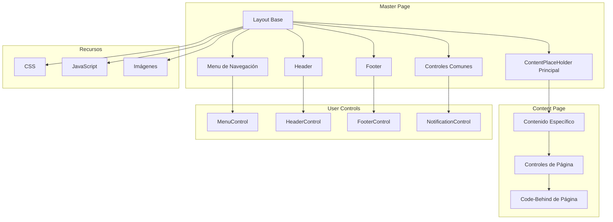
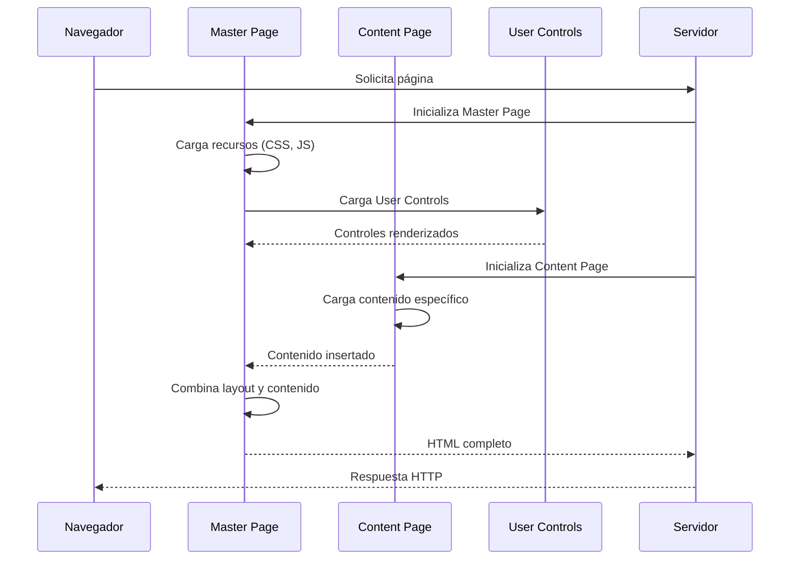
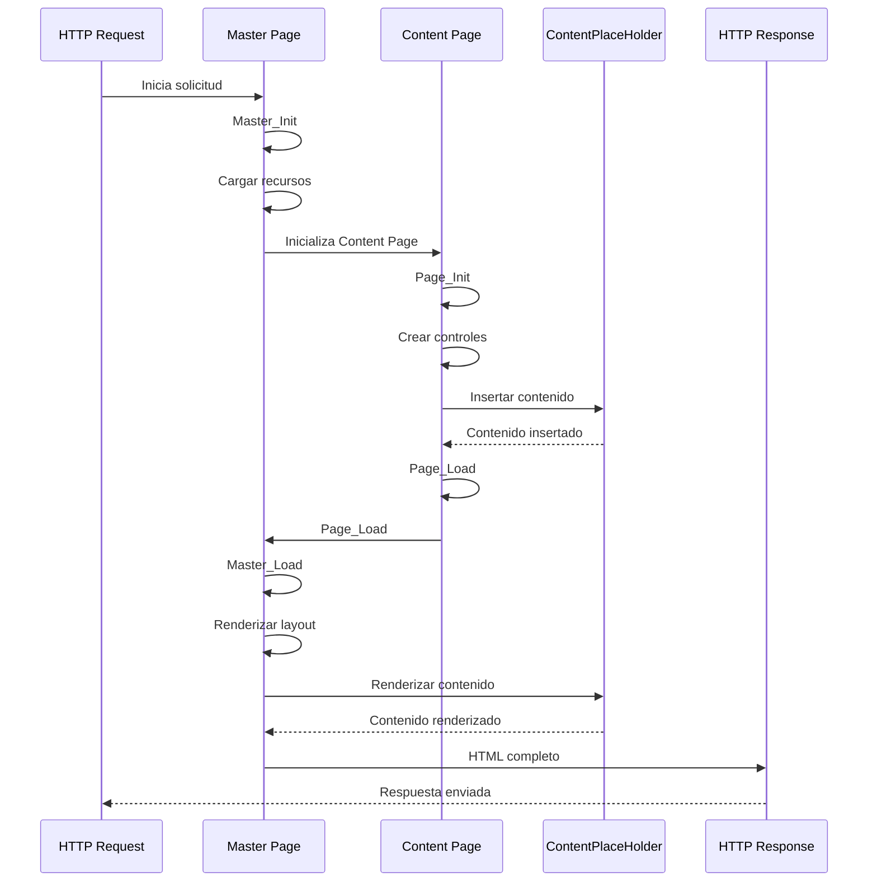
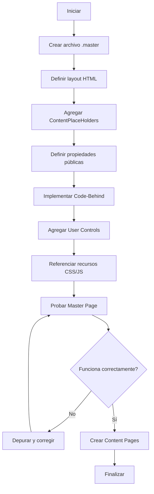
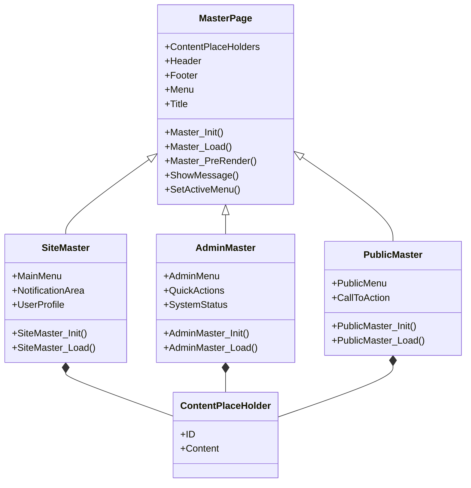
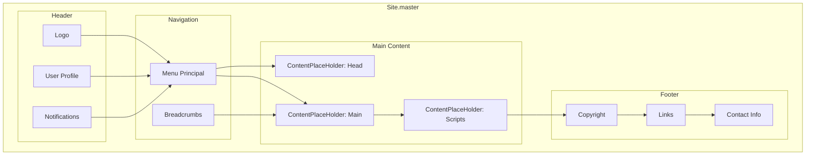

# Master Pages - GymApp

## Lo General

### Propósito

Este documento describe el uso de Master Pages en ASP.NET Web Forms para el proyecto GymApp, explicando cómo crear, implementar y utilizar Master Pages para mantener un layout consistente en toda la aplicación.

### ¿Qué son las Master Pages?

Las Master Pages son plantillas que definen el layout y la estructura común de múltiples páginas en una aplicación ASP.NET Web Forms. Permiten:

- **Consistencia visual**: Mantener el mismo diseño en todas las páginas
- **Centralización de cambios**: Modificar el layout en un solo lugar
- **Herencia de contenido**: Las páginas heredan el layout de la Master Page
- **Contenido dinámico**: Definir áreas donde las páginas pueden insertar contenido específico

### Componentes de una Master Page

1. **Layout base**: Estructura HTML común (header, footer, menú)
2. **ContentPlaceHolders**: Áreas donde las páginas insertan contenido
3. **Controles de servidor**: Menús, navegación, notificaciones
4. **Recursos compartidos**: CSS, JavaScript, imágenes
5. **Code-Behind**: Lógica compartida entre páginas

### Master Pages en GymApp

El proyecto GymApp utilizará múltiples Master Pages para diferentes secciones:

- **Site.master**: Master page principal para la aplicación
- **Admin.master**: Master page para el panel de administración
- **Public.master**: Master page para páginas públicas

## Comunicación de Capas

### Arquitectura de Master Pages



### Flujo de Renderizado con Master Pages



### Interacción entre Master Page y Content Pages

```mermaid
graph LR
    subgraph "Master Page"
        A[Site.master]
        B[Propiedades Públicas]
        C[Métodos Públicos]
        D[Eventos]
    end

    subgraph "Content Pages"
        E[Default.aspx]
        F[Dashboard.aspx]
        G[Reportes.aspx]
    end

    subgraph "Acceso"
        H[Master.Property]
        I[Master.Method()]
        J[Master.Event]
    end

    A --> E
    A --> F
    A --> G
    E --> H
    E --> I
    E --> J
    F --> H
    F --> I
    F --> J
    G --> H
    G --> I
    G --> J
```

## Diagramas UML

### Diagrama de Secuencia: Ciclo de Vida con Master Page



### Diagrama de Actividad: Proceso de Creación de Master Page



### Diagrama de Proceso: Flujo de Trabajo con Master Pages

```mermaid
graph LR
    A[Requisitos de Layout] --> B[Crear Master Page]
    B --> C[Definir ContentPlaceHolders]
    C --> D[Implementar Code-Behind]
    D --> E[Crear Content Page]
    E --> F[Referenciar Master Page]
    F --> G[Agregar contenido a ContentPlaceHolders]
    G --> H[Implementar lógica de página]
    H --> I[Probar integración]
    I --> J[Desplegar]
```



### Diagrama de Clases: Jerarquía de Master Pages



### Diagrama de Componentes: Estructura de Master Page



## Implementación

### Crear una Master Page

#### 1. Archivo Site.master

```aspx
<%@ Master Language="C#" AutoEventWireup="true"
    CodeBehind="Site.master.cs" Inherits="GymApp.MasterPages.Site" %>

<!DOCTYPE html>
<html>
<head runat="server">
    <title>GymApp</title>
    <asp:ContentPlaceHolder ID="head" runat="server">
    </asp:ContentPlaceHolder>
    <link href="~/Content/css/site.css" rel="stylesheet" />
    <script src="~/Content/js/site.js"></script>
</head>
<body>
    <form id="form1" runat="server">
        <div class="header">
            <uc:HeaderControl ID="HeaderControl" runat="server" />
        </div>

        <div class="navigation">
            <uc:MenuControl ID="MenuControl" runat="server" />
        </div>

        <div class="main-content">
            <asp:ContentPlaceHolder ID="MainContent" runat="server">
            </asp:ContentPlaceHolder>
        </div>

        <div class="footer">
            <uc:FooterControl ID="FooterControl" runat="server" />
        </div>

        <asp:ContentPlaceHolder ID="Scripts" runat="server">
        </asp:ContentPlaceHolder>
    </form>
</body>
</html>
```

#### 2. Code-Behind Site.master.cs

```csharp
using System;
using System.Web.UI;

namespace GymApp.MasterPages
{
    public partial class Site : System.Web.UI.MasterPage
    {
        // Propiedades públicas
        public string PageTitle
        {
            get { return Page.Title; }
            set { Page.Title = value; }
        }

        public string CurrentUser
        {
            get
            {
                if (Session["Usuario"] != null)
                    return Session["Usuario"].ToString();
                return "Invitado";
            }
        }

        // Eventos
        protected void Page_Init(object sender, EventArgs e)
        {
            // Inicialización de Master Page
        }

        protected void Page_Load(object sender, EventArgs e)
        {
            if (!IsPostBack)
            {
                LoadUserData();
                LoadNotifications();
            }
        }

        // Métodos públicos
        public void ShowMessage(string message, string type = "info")
        {
            // Implementar lógica para mostrar mensajes
        }

        public void SetActiveMenu(string menuId)
        {
            // Implementar lógica para activar menú
        }

        // Métodos privados
        private void LoadUserData()
        {
            // Cargar datos del usuario
        }

        private void LoadNotifications()
        {
            // Cargar notificaciones
        }
    }
}
```

### Crear una Content Page

#### 1. Archivo Default.aspx

```aspx
<%@ Page Title="Inicio" Language="C#"
    MasterPageFile="~/MasterPages/Site.master"
    AutoEventWireup="true"
    CodeBehind="Default.aspx.cs"
    Inherits="GymApp.Pages.Public.Default" %>

<asp:Content ID="Content1" ContentPlaceHolderID="head" runat="server">
    <link href="~/Content/css/home.css" rel="stylesheet" />
</asp:Content>

<asp:Content ID="Content2" ContentPlaceHolderID="MainContent" runat="server">
    <div class="hero-section">
        <h1>Bienvenido a GymApp</h1>
        <p>Tu plataforma de gestión de gimnasio</p>
    </div>

    <div class="features-section">
        <asp:Repeater ID="rptFeatures" runat="server">
            <ItemTemplate>
                <div class="feature-card">
                    <h3><%# Eval("Title") %></h3>
                    <p><%# Eval("Description") %></p>
                </div>
            </ItemTemplate>
        </asp:Repeater>
    </div>
</asp:Content>

<asp:Content ID="Content3" ContentPlaceHolderID="Scripts" runat="server">
    <script src="~/Content/js/home.js"></script>
</asp:Content>
```

#### 2. Code-Behind Default.aspx.cs

```csharp
using System;
using System.Web.UI;
using GymApp.MasterPages;

namespace GymApp.Pages.Public
{
    public partial class Default : System.Web.UI.Page
    {
        protected void Page_Load(object sender, EventArgs e)
        {
            if (!IsPostBack)
            {
                // Acceder a la Master Page
                Site master = (Site)Master;
                master.PageTitle = "Inicio - GymApp";
                master.SetActiveMenu("home");

                LoadFeatures();
            }
        }

        private void LoadFeatures()
        {
            // Cargar características
            var features = new[]
            {
                new { Title = "Gestión de Rutinas", Description = "Crea y gestiona rutinas personalizadas" },
                new { Title = "Seguimiento de Progreso", Description = "Monitorea tu avance en tiempo real" },
                new { Title = "Comunidad", Description = "Conecta con otros usuarios" }
            };

            rptFeatures.DataSource = features;
            rptFeatures.DataBind();
        }
    }
}
```

### Acceder a la Master Page desde Content Page

```csharp
// Método 1: Usando la propiedad Master
Site master = (Site)Master;
master.ShowMessage("Bienvenido", "success");
master.SetActiveMenu("dashboard");

// Método 2: Usando directiva MasterType
// En el archivo .aspx:
<%@ MasterType VirtualPath="~/MasterPages/Site.master" %>

// En el code-behind:
Master.ShowMessage("Bienvenido", "success");
Master.SetActiveMenu("dashboard");
```

## Mejores Prácticas

### Diseño de Master Pages

1. **Múltiples ContentPlaceHolders**: Usar ContentPlaceHolders separados para diferentes secciones
   - `head`: Para estilos y scripts específicos de página
   - `MainContent`: Para el contenido principal
   - `Scripts`: Para scripts específicos de página

2. **Propiedades públicas**: Exponer propiedades y métodos que las páginas puedan usar
   - `PageTitle`: Para establecer el título de la página
   - `ShowMessage()`: Para mostrar notificaciones
   - `SetActiveMenu()`: Para activar el menú correspondiente

3. **User Controls**: Usar User Controls para componentes reutilizables
   - Header, Footer, Menú, Notificaciones

4. **Recursos compartidos**: Referenciar CSS y JavaScript en la Master Page
   - Estilos base
   - Scripts comunes

### Gestión de Estado

1. **ViewState**: Minimizar el uso de ViewState en Master Pages
2. **Session**: Usar Session para datos de usuario compartidos
3. **Application**: Usar Application para datos globales

### Performance

1. **Caching**: Implementar caching apropiado
2. **Minimizar controles**: Usar solo controles necesarios
3. **Optimizar recursos**: Comprimir y minificar CSS y JavaScript

### Seguridad

1. **Validación**: Validar todas las entradas
2. **Autenticación**: Verificar autenticación en Master Page
3. **Autorización**: Verificar permisos en Content Pages

## Troubleshooting

### Problemas Comunes

1. **ContentPlaceHolder no encontrado**
   - Verificar que el ID del ContentPlaceHolder coincida
   - Verificar que la Master Page esté correctamente referenciada

2. **No se puede acceder a la Master Page**
   - Usar la directiva `MasterType` para tipado fuerte
   - Verificar que el casting sea correcto

3. **Eventos no se disparan**
   - Verificar el orden de los eventos en el ciclo de vida
   - Asegurarse de que `AutoEventWireup="true"`

4. **Estilos no se aplican**
   - Verificar las rutas de los archivos CSS
   - Usar rutas relativas con `~/`

---

**Última actualización**: 2026-04-19
**Versión**: 1.0