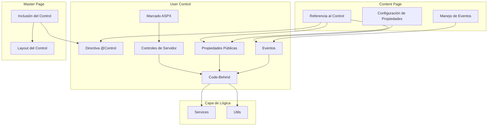
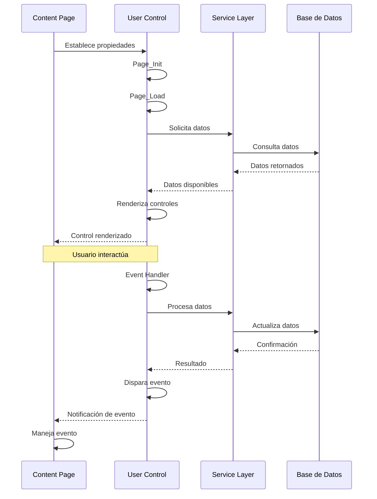
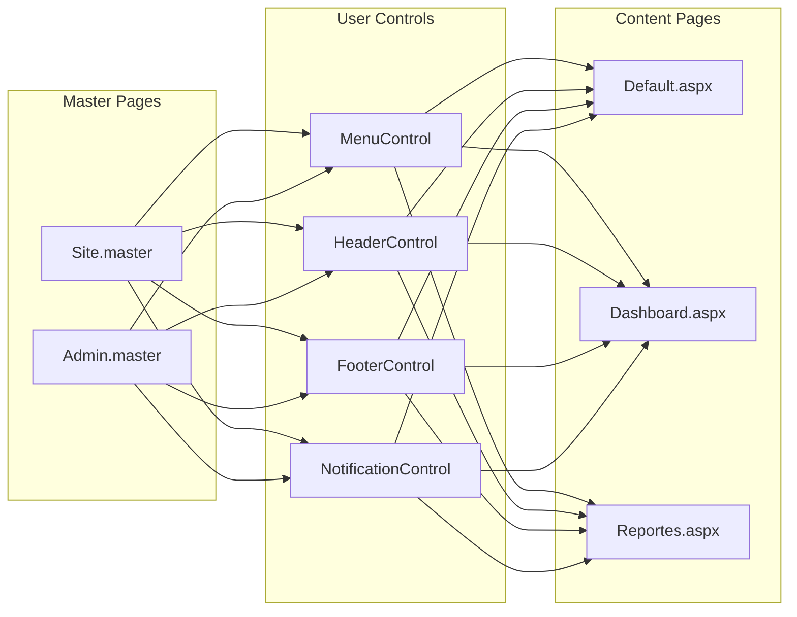
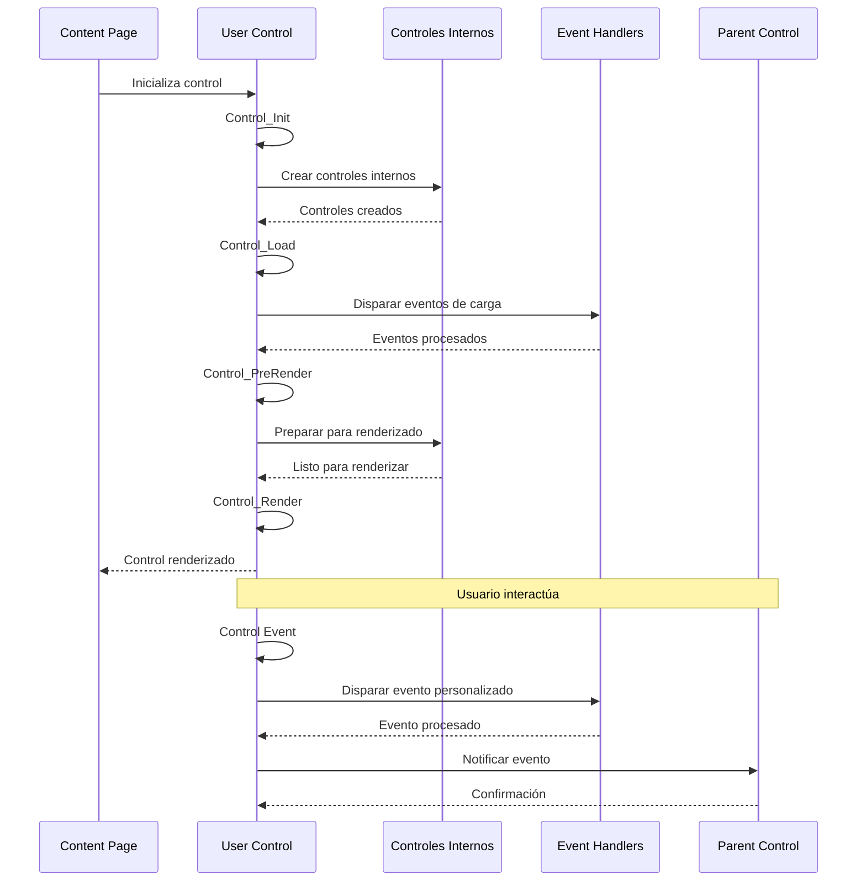
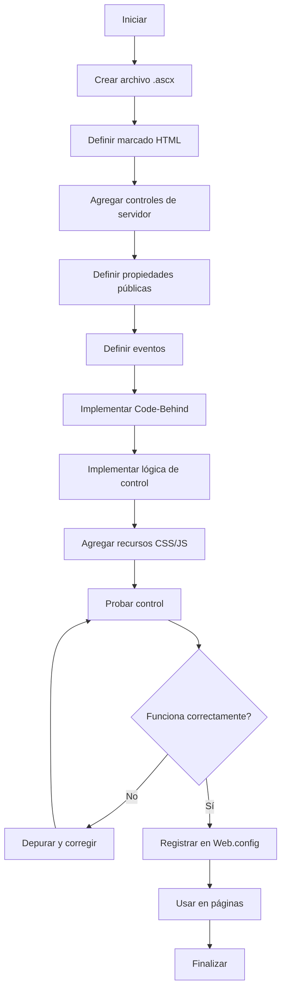
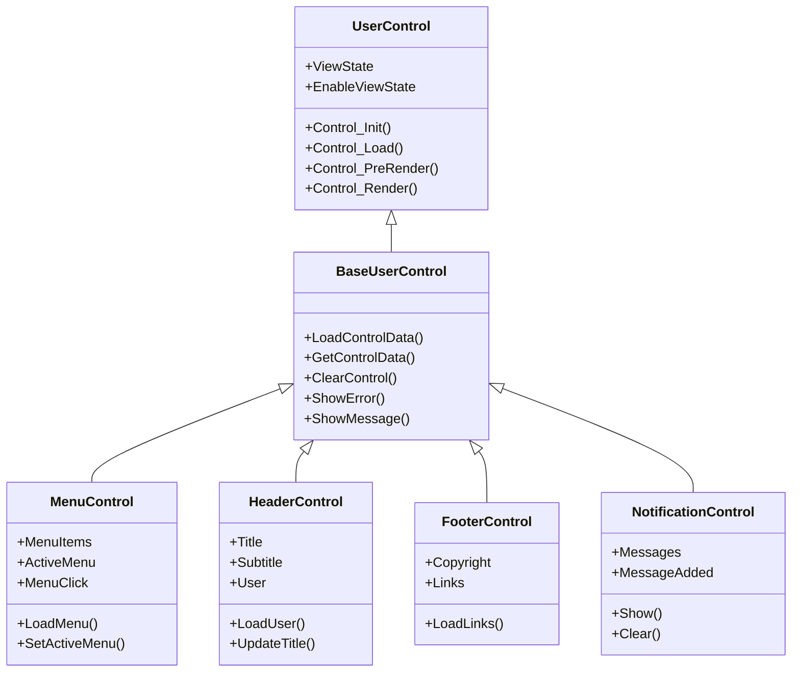

# User Controls - GymApp

## Lo General

### Propósito

Este documento describe el uso de User Controls (.ascx) en ASP.NET Web Forms para el proyecto GymApp, explicando cómo crear, implementar y utilizar componentes reutilizables encapsulados.

### ¿Qué son los User Controls?

Los User Controls son controles personalizados reutilizables que encapsulan marcado HTML, controles de servidor y lógica de negocio en un solo componente. Permiten:

- **Reutilización**: Usar el mismo control en múltiples páginas
- **Encapsulamiento**: Ocultar la complejidad de implementación
- **Mantenibilidad**: Modificar el control en un solo lugar
- **Consistencia**: Mantener consistencia en toda la aplicación

### Componentes de un User Control

1. **Directiva @Control**: Configuración del control
2. **Marcado ASPX**: HTML con controles de servidor
3. **Propiedades públicas**: Interfaz para interactuar con el control
4. **Eventos**: Notificaciones de cambios en el control
5. **Code-Behind**: Lógica del lado del servidor
6. **Recursos**: CSS y JavaScript específicos del control

### User Controls en GymApp

El proyecto GymApp utilizará User Controls para:

- **Componentes comunes**: Header, Footer, Menú, Notificaciones
- **Formularios**: Login, Registro, Búsqueda
- **Visualización de datos**: Grillas, Listas, Cards
- **Componentes específicos**: Perfil de usuario, Editor de rutinas

## Comunicación de Capas

### Arquitectura de User Controls



### Flujo de Datos en User Controls



### Interacción entre User Controls y Páginas



## Diagramas UML

### Diagrama de Secuencia: Ciclo de Vida de User Control



### Diagrama de Actividad: Proceso de Creación de User Control



### Diagrama de Proceso: Flujo de Trabajo con User Controls

```mermaid
graph LR
    A[Identificar componente reutilizable] --> B[Crear User Control]
    B --> C[Definir interfaz pública]
    C --> D[Implementar funcionalidad]
    D --> E[Probar independientemente]
    E --> F[Registrar en Web.config]
    F --> G[Usar en Content Pages]
    G --> H[Usar en Master Pages]
    H --> I[Probar integración]
    I --> J[Documentar uso]
    J --> K[Desplegar]
```



### Diagrama de Clases: Jerarquía de User Controls



### Diagrama de Componentes: Estructura de User Control

```mermaid
graph TB
    subgraph "MenuControl.ascx"
        subgraph "Directivas"
            D1[@Control]
            D2[@Register]
        end

        subgraph "Propiedades Públicas"
            P1[MenuItems]
            P2[ActiveMenu]
            P3[Orientation]
        end

        subgraph "Eventos"
            E1[MenuClick]
            E2[MenuItemHover]
        end

        subgraph "Controles"
            C1[asp:Repeater]
            C2[asp:HyperLink]
            C3[asp:Panel]
        end

        subgraph "Code-Behind"
            CB1[Control_Load]
            CB2[LoadMenu]
            CB3[SetActiveMenu]
            CB4[OnMenuClick]
        end
    end

    D1 --> P1
    D1 --> P2
    D1 --> P3
    D1 --> E1
    D1 --> E2
    P1 --> CB2
    P2 --> CB3
    E1 --> CB4
    C1 --> CB1
    C2 --> CB1
    C3 --> CB1
    CB1 --> CB2
    CB1 --> CB3
    CB1 --> CB4
```

## Implementación

### Crear un User Control Básico

#### 1. Archivo MenuControl.ascx

```aspx
<%@ Control Language="C#"
    AutoEventWireup="true"
    CodeBehind="MenuControl.ascx.cs"
    Inherits="GymApp.Controls.Common.MenuControl" %>

<div class="menu-container">
    <asp:Repeater ID="rptMenu" runat="server"
        OnItemCommand="rptMenu_ItemCommand">
        <HeaderTemplate>
            <nav class="main-menu">
                <ul class="menu-list">
        </HeaderTemplate>
        <ItemTemplate>
            <li class='<%# GetMenuItemClass(Container.DataItem) %>'>
                <asp:LinkButton ID="lnkMenuItem" runat="server"
                    CommandName="Navigate"
                    CommandArgument='<%# Eval("Url") %>'
                    Text='<%# Eval("Text") %>'
                    CssClass="menu-link" />
            </li>
        </ItemTemplate>
        <FooterTemplate>
                </ul>
            </nav>
        </FooterTemplate>
    </asp:Repeater>
</div>
```

#### 2. Code-Behind MenuControl.ascx.cs

```csharp
using System;
using System.Collections.Generic;
using System.Web.UI;
using System.Web.UI.WebControls;

namespace GymApp.Controls.Common
{
    public partial class MenuControl : System.Web.UI.UserControl
    {
        // Propiedades públicas
        public List<MenuItem> MenuItems { get; set; }
        public string ActiveMenu { get; set; }
        public MenuOrientation Orientation { get; set; }

        // Eventos
        public event EventHandler<MenuClickEventArgs> MenuClick;

        // Enumeración
        public enum MenuOrientation
        {
            Horizontal,
            Vertical
        }

        protected void Page_Init(object sender, EventArgs e)
        {
            // Inicialización del control
            Orientation = MenuOrientation.Horizontal;
        }

        protected void Page_Load(object sender, EventArgs e)
        {
            if (!IsPostBack)
            {
                LoadMenu();
            }
        }

        // Métodos públicos
        public void LoadMenu()
        {
            if (MenuItems != null && MenuItems.Count > 0)
            {
                rptMenu.DataSource = MenuItems;
                rptMenu.DataBind();
            }
        }

        public void SetActiveMenu(string menuId)
        {
            ActiveMenu = menuId;
            LoadMenu();
        }

        public void AddMenuItem(MenuItem item)
        {
            if (MenuItems == null)
            {
                MenuItems = new List<MenuItem>();
            }

            MenuItems.Add(item);
            LoadMenu();
        }

        // Métodos protegidos
        protected string GetMenuItemClass(object dataItem)
        {
            var item = (MenuItem)dataItem;
            string cssClass = "menu-item";

            if (!string.IsNullOrEmpty(ActiveMenu) &&
                item.Id == ActiveMenu)
            {
                cssClass += " active";
            }

            if (item.HasSubItems)
            {
                cssClass += " has-submenu";
            }

            return cssClass;
        }

        // Event handlers
        protected void rptMenu_ItemCommand(object source, RepeaterCommandEventArgs e)
        {
            if (e.CommandName == "Navigate")
            {
                string url = e.CommandArgument.ToString();

                // Disparar evento
                OnMenuClick(new MenuClickEventArgs
                {
                    Url = url,
                    MenuId = GetMenuIdFromUrl(url)
                });
            }
        }

        // Métodos privados
        private void OnMenuClick(MenuClickEventArgs e)
        {
            MenuClick?.Invoke(this, e);
        }

        private string GetMenuIdFromUrl(string url)
        {
            // Lógica para obtener el ID del menú desde la URL
            return url?.Replace("~/", "").Replace("/", "-").ToLower();
        }
    }

    // Clases de soporte
    public class MenuItem
    {
        public string Id { get; set; }
        public string Text { get; set; }
        public string Url { get; set; }
        public bool HasSubItems { get; set; }
        public List<MenuItem> SubItems { get; set; }
    }

    public class MenuClickEventArgs : EventArgs
    {
        public string Url { get; set; }
        public string MenuId { get; set; }
    }
}
```

### Crear un User Control con Formulario

#### 1. Archivo LoginForm.ascx

```aspx
<%@ Control Language="C#"
    AutoEventWireup="true"
    CodeBehind="LoginForm.ascx.cs"
    Inherits="GymApp.Controls.Authentication.LoginForm" %>

<div class="login-form-container">
    <asp:Panel ID="pnlLogin" runat="server" DefaultButton="btnLogin">
        <div class="form-group">
            <asp:Label ID="lblEmail" runat="server"
                Text="Correo electrónico:"
                AssociatedControlID="txtEmail" />
            <asp:TextBox ID="txtEmail" runat="server"
                CssClass="form-control"
                TextMode="Email"
                placeholder="correo@ejemplo.com" />
            <asp:RequiredFieldValidator ID="rfvEmail" runat="server"
                ControlToValidate="txtEmail"
                ErrorMessage="El correo es requerido"
                CssClass="error-message"
                Display="Dynamic" />
        </div>

        <div class="form-group">
            <asp:Label ID="lblPassword" runat="server"
                Text="Contraseña:"
                AssociatedControlID="txtPassword" />
            <asp:TextBox ID="txtPassword" runat="server"
                CssClass="form-control"
                TextMode="Password"
                placeholder="••••••••" />
            <asp:RequiredFieldValidator ID="rfvPassword" runat="server"
                ControlToValidate="txtPassword"
                ErrorMessage="La contraseña es requerida"
                CssClass="error-message"
                Display="Dynamic" />
        </div>

        <div class="form-group">
            <asp:CheckBox ID="chkRememberMe" runat="server"
                Text="Recordarme" />
        </div>

        <asp:Button ID="btnLogin" runat="server"
            Text="Iniciar Sesión"
            CssClass="btn btn-primary btn-block"
            OnClick="btnLogin_Click" />

        <asp:Label ID="lblError" runat="server"
            CssClass="error-message"
            Visible="false" />
    </asp:Panel>
</div>
```

#### 2. Code-Behind LoginForm.ascx.cs

```csharp
using System;
using System.Web.UI;
using GymApp.Services;
using GymApp.Models;
using GymApp.Utils;

namespace GymApp.Controls.Authentication
{
    public partial class LoginForm : System.Web.UI.UserControl
    {
        private UsuarioService _usuarioService;

        // Propiedades públicas
        public string RedirectUrl { get; set; }
        public bool ShowRememberMe { get; set; }

        // Eventos
        public event EventHandler<LoginEventArgs> LoginSuccess;
        public event EventHandler<LoginErrorEventArgs> LoginError;

        protected void Page_Init(object sender, EventArgs e)
        {
            _usuarioService = new UsuarioService();
            ShowRememberMe = true;
        }

        protected void Page_Load(object sender, EventArgs e)
        {
            if (!IsPostBack)
            {
                chkRememberMe.Visible = ShowRememberMe;
            }
        }

        // Métodos públicos
        public void ClearForm()
        {
            txtEmail.Text = string.Empty;
            txtPassword.Text = string.Empty;
            chkRememberMe.Checked = false;
            lblError.Visible = false;
        }

        public void SetEmail(string email)
        {
            txtEmail.Text = email;
        }

        // Event handlers
        protected void btnLogin_Click(object sender, EventArgs e)
        {
            if (Page.IsValid)
            {
                try
                {
                    string email = txtEmail.Text.Trim();
                    string password = txtPassword.Text;
                    bool rememberMe = chkRememberMe.Checked;

                    // Autenticar usuario
                    Usuario usuario = _usuarioService.Autenticar(email, password);

                    if (usuario != null)
                    {
                        // Guardar usuario en sesión
                        Session["Usuario"] = usuario;
                        Session["UsuarioId"] = usuario.Id;
                        Session["UsuarioRol"] = usuario.Rol;

                        // Configurar cookie si se seleccionó "Recordarme"
                        if (rememberMe)
                        {
                            SecurityHelper.SetRememberMeCookie(usuario.Id);
                        }

                        // Disparar evento de éxito
                        OnLoginSuccess(new LoginEventArgs
                        {
                            Usuario = usuario,
                            RememberMe = rememberMe
                        });

                        // Redirigir si se especificó URL
                        if (!string.IsNullOrEmpty(RedirectUrl))
                        {
                            Response.Redirect(RedirectUrl);
                        }
                    }
                    else
                    {
                        ShowError("Credenciales inválidas");
                        OnLoginError(new LoginErrorEventArgs
                        {
                            Message = "Credenciales inválidas",
                            Email = email
                        });
                    }
                }
                catch (Exception ex)
                {
                    LogHelper.LogError(ex, "Error en login");
                    ShowError("Error al iniciar sesión");
                    OnLoginError(new LoginErrorEventArgs
                    {
                        Message = "Error al iniciar sesión",
                        Email = txtEmail.Text,
                        Exception = ex
                    });
                }
            }
        }

        // Métodos protegidos
        protected void OnLoginSuccess(LoginEventArgs e)
        {
            LoginSuccess?.Invoke(this, e);
        }

        protected void OnLoginError(LoginErrorEventArgs e)
        {
            LoginError?.Invoke(this, e);
        }

        // Métodos privados
        private void ShowError(string message)
        {
            lblError.Text = message;
            lblError.Visible = true;
        }
    }

    // Clases de soporte
    public class LoginEventArgs : EventArgs
    {
        public Usuario Usuario { get; set; }
        public bool RememberMe { get; set; }
    }

    public class LoginErrorEventArgs : EventArgs
    {
        public string Message { get; set; }
        public string Email { get; set; }
        public Exception Exception { get; set; }
    }
}
```

### Usar User Control en una Página

```aspx
<%@ Page Title="Iniciar Sesión" Language="C#"
    MasterPageFile="~/MasterPages/Public.master"
    AutoEventWireup="true"
    CodeBehind="Login.aspx.cs"
    Inherits="GymApp.Pages.Authentication.Login" %>

<%@ Register TagPrefix="uc" TagName="LoginForm"
    Src="~/Controls/Authentication/LoginForm.ascx" %>

<asp:Content ID="Content1" ContentPlaceHolderID="MainContent" runat="server">
    <div class="auth-container">
        <div class="auth-card">
            <h2>Iniciar Sesión</h2>

            <uc:LoginForm ID="ucLoginForm" runat="server"
                RedirectUrl="~/Pages/Alumnos/Dashboard.aspx"
                OnLoginSuccess="ucLoginForm_LoginSuccess"
                OnLoginError="ucLoginForm_LoginError" />
        </div>
    </div>
</asp:Content>
```

```csharp
// Code-Behind Login.aspx.cs
protected void ucLoginForm_LoginSuccess(object sender, LoginEventArgs e)
{
    // Manejar éxito de login
    Master.ShowMessage($"Bienvenido, {e.Usuario.Nombre}", "success");
}

protected void ucLoginForm_LoginError(object sender, LoginErrorEventArgs e)
{
    // Manejar error de login
    LogHelper.LogWarning($"Intento de login fallido: {e.Email}");
}
```

## Mejores Prácticas

### Diseño de User Controls

1. **Encapsulamiento**: Ocultar detalles de implementación
2. **Interfaz clara**: Definir propiedades y eventos públicos
3. **Independencia**: El control debe funcionar independientemente
4. **Reutilización**: Diseñar para ser usado en múltiples contextos

### Gestión de Estado

1. **ViewState**: Usar ViewState para mantener estado del control
2. **Propiedades**: Exponer propiedades para configuración externa
3. **Eventos**: Disparar eventos para notificar cambios
4. **Session**: Evitar usar Session dentro del control

### Performance

1. **ViewState**: Minimizar el uso de ViewState
2. **Caching**: Implementar caching cuando sea apropiado
3. **Controles**: Usar solo controles necesarios
4. **Recursos**: Optimizar CSS y JavaScript del control

### Seguridad

1. **Validación**: Validar todas las entradas
2. **Sanitización**: Sanitizar datos antes de mostrar
3. **Autenticación**: Verificar autenticación si es necesario
4. **Autorización**: Verificar permisos si es necesario

### Mantenibilidad

1. **Documentación**: Documentar propiedades, métodos y eventos
2. **Nombres**: Usar nombres descriptivos
3. **Organización**: Mantener código organizado
4. **Testing**: Probar el control independientemente

## Troubleshooting

### Problemas Comunes

1. **Eventos no se disparan**
   - Verificar que los eventos estén correctamente conectados
   - Verificar que `AutoEventWireup="true"`

2. **ViewState no se mantiene**
   - Verificar que `EnableViewState="true"`
   - Verificar que los controles tengan IDs únicos

3. **Propiedades no se actualizan**
   - Verificar que las propiedades sean públicas
   - Verificar que se estén estableciendo en el momento correcto

4. **Control no se renderiza**
   - Verificar que el control esté registrado correctamente
   - Verificar que el archivo .ascx exista

---

**Última actualización**: 2026-04-19
**Versión**: 1.0