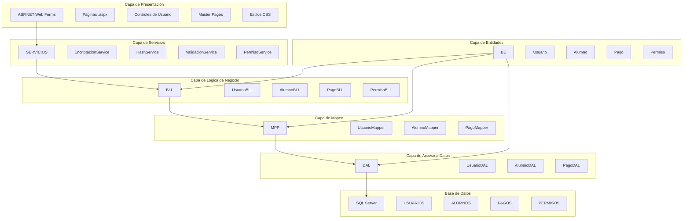
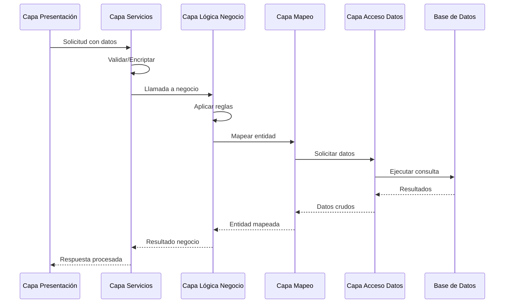

# Arquitectura General - Sportio

## Visión General

Sportio es una aplicación web de gestión integral para gimnasios desarrollada con ASP.NET Web Forms (.NET Framework 4.7.2). La arquitectura sigue un patrón de capas (Layered Architecture) que separa claramente las responsabilidades y facilita el mantenimiento y escalabilidad del sistema.

## Propósito del Sistema

Sportio permite gestionar todos los aspectos operativos de un gimnasio, incluyendo:

- **Gestión de Asociación y Abono Mensual:** Digitalización del proceso de inscripción y pago de membresías
- **Sistema de Seguridad:** Autenticación, autorización y control de acceso
- **Gestión de Usuarios:** Administración de alumnos, entrenadores y personal administrativo
- **Sistema de Permisos:** Control granular de accesos mediante roles y permisos
- **Gestión de Pagos:** Registro y seguimiento de pagos mensuales

## Arquitectura de Capas

El sistema implementa una arquitectura de 5 capas:

## Descripción de Capas

### 1. Capa de Presentación (Presentation Layer)

**Ubicación:** `gymAppV2/`

**Responsabilidades:**
- Interfaz de usuario para interactuar con el sistema
- Captura de datos del usuario
- Visualización de información
- Validación básica de entrada
- Navegación entre páginas

**Componentes:**
- Páginas ASP.NET (.aspx)
- Code-behind (.aspx.cs)
- Master Pages (Site.Master)
- Controles de usuario (.ascx)
- Estilos CSS (.css)
- Scripts JavaScript (.js)

**Tecnologías:**
- ASP.NET Web Forms
- HTML5
- CSS3 (con unidades rem)
- JavaScript

### 2. Capa de Servicios (Service Layer)

**Ubicación:** `SERVICIOS/`

**Responsabilidades:**
- Servicios transversales reutilizables
- Encriptación y desencriptación de datos
- Hash de contraseñas
- Validación de datos
- Gestión de sesiones
- Logging de eventos

**Componentes:**
- `EncriptacionService`: Encriptación reversible (AES-256)
- `HashService`: Hash irreversible (SHA256)
- `ValidacionService`: Validación de datos de entrada
- `PermisoService`: Verificación de permisos
- `EventoService`: Registro de eventos del sistema
- `SesionManager`: Gestión de sesión (Singleton)

### 3. Capa de Lógica de Negocio (Business Logic Layer)

**Ubicación:** `BLL/`

**Responsabilidades:**
- Implementación de reglas de negocio
- Coordinación de operaciones
- Validación de reglas de negocio
- Orquestación de transacciones
- Cálculos y transformaciones de datos

**Componentes:**
- `UsuarioBLL`: Gestión de usuarios
- `AlumnoBLL`: Gestión de alumnos
- `PagoBLL`: Gestión de pagos y abonos
- `PermisoBLL`: Gestión de permisos y roles
- `SuscripcionBLL`: Gestión de suscripciones

### 4. Capa de Mapeo (Mapping Layer)

**Ubicación:** `MPP/`

**Responsabilidades:**
- Mapeo entre entidades y DTOs
- Transformación de datos
- Conversión de formatos
- Adaptación entre capas

**Componentes:**
- `UsuarioMapper`: Mapeo de usuarios
- `AlumnoMapper`: Mapeo de alumnos
- `PagoMapper`: Mapeo de pagos
- `PermisoMapper`: Mapeo de permisos

### 5. Capa de Acceso a Datos (Data Access Layer)

**Ubicación:** `DAL/`

**Responsabilidades:**
- Acceso a base de datos
- Ejecución de consultas SQL
- Gestión de conexiones
- Manejo de transacciones
- Optimización de consultas

**Componentes:**
- `UsuarioDAL`: Acceso a datos de usuarios
- `AlumnoDAL`: Acceso a datos de alumnos
- `PagoDAL`: Acceso a datos de pagos
- `PermisoDAL`: Acceso a datos de permisos
- `DatabaseService`: Servicio genérico de base de datos

### 6. Capa de Entidades (Business Entities)

**Ubicación:** `BE/`

**Responsabilidades:**
- Definición de modelos de datos
- Representación de entidades del dominio
- Validaciones de nivel de entidad
- Propiedades y métodos de negocio

**Componentes:**
- `Usuario`: Entidad de usuario
- `Alumno`: Entidad de alumno
- `Pago`: Entidad de pago
- `Permiso`: Entidad de permiso
- `Perfil`: Entidad de perfil
- `Familia`: Entidad de familia de permisos

## Flujo de Datos Típico

## Principios de Diseño

### 1. Separación de Responsabilidades (Single Responsibility Principle)
Cada capa tiene una responsabilidad única y bien definida, lo que facilita el mantenimiento y testing.

### 2. Bajo Acoplamiento
Las capas interactúan a través de interfaces bien definidas, minimizando las dependencias directas.

### 3. Alta Cohesión
Los componentes dentro de cada capa están fuertemente relacionados entre sí.

### 4. Abstracción
Las capas inferiores están abstraídas de las capas superiores, permitiendo cambios sin afectar el resto del sistema.

### 5. Reutilización
Los servicios y componentes de negocio están diseñados para ser reutilizables en diferentes contextos.

## Tecnologías y Frameworks

### Frontend
- **ASP.NET Web Forms:** Framework principal de presentación
- **HTML5/CSS3:** Marcado y estilos
- **JavaScript:** Interactividad del cliente
- **Bootstrap:** Framework CSS para diseño responsive

### Backend
- **C# (.NET Framework 4.7.2):** Lenguaje de programación
- **ASP.NET:** Framework de aplicación web
- **LINQ to SQL:** Consultas a base de datos

### Base de Datos
- **SQL Server:** Sistema de gestión de base de datos
- **ADO.NET:** Tecnología de acceso a datos

### Seguridad
- **AES-256:** Encriptación reversible de datos personales
- **SHA256:** Hash de contraseñas
- **Forms Authentication:** Autenticación de ASP.NET

## Consideraciones de Escalabilidad

### Vertical Scaling
- Optimización de consultas SQL
- Implementación de caching
- Uso de índices en base de datos

### Horizontal Scaling
- Arquitectura stateless donde sea posible
- Separación de servicios críticos
- Balanceo de carga preparado

## Mantenibilidad

### Código Limpio
- Nombres descriptivos de clases y métodos
- Comentarios claros y concisos
- Formato consistente

### Documentación
- Documentación de arquitectura actualizada
- Comentarios en código complejo
- Manuales de usuario y técnico

### Testing
- Pruebas unitarias para lógica de negocio
- Pruebas de integración para flujos completos
- Pruebas de UI/UX para interfaz

## Seguridad

### Autenticación
- Login con control de intentos
- Preguntas de seguridad para desbloqueo
- Sesiones gestionadas con Singleton

### Autorización
- Sistema de permisos granular
- Patrones Singleton y Composite
- Validación de permisos en cada operación

### Encriptación
- Datos personales: AES-256 reversible
- Contraseñas: SHA256 irreversible
- Connection strings encriptados

### Auditoría
- Registro de eventos con niveles de severidad
- Logging de operaciones críticas
- Trazabilidad de acciones de usuario

---

**Última actualización:** 2026-04-20
**Versión:** 1.0