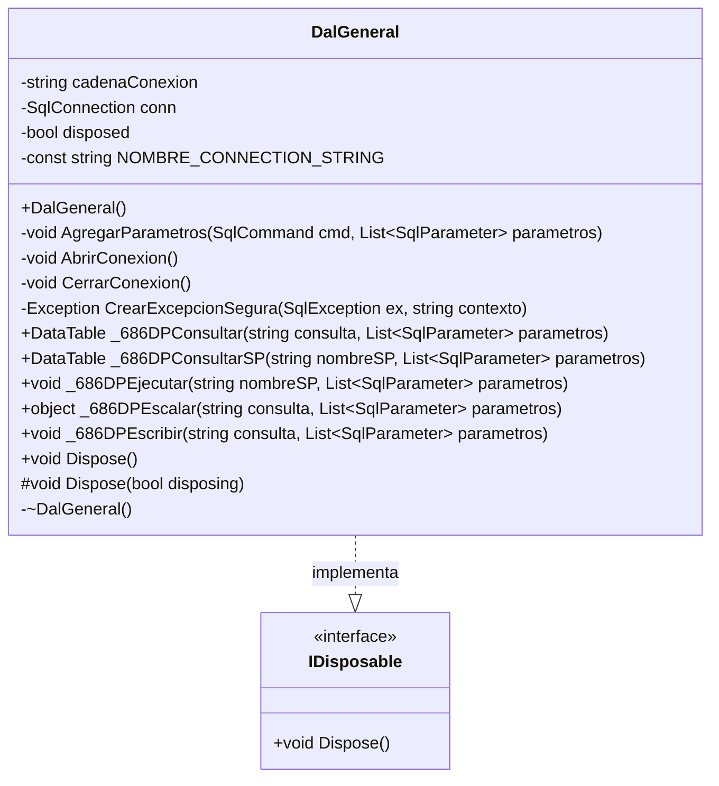

# Diagramas de clases por capas - gymAppV2

> Generado a partir del código fuente de `C:\Users\Danunu\Desktop\WEB-4to\gymAppV2`.
> Cada diagrama muestra las clases, propiedades y métodos principales de una capa del proyecto.

---

## 1. Capa Servicios (`SERVICIOS`)

```mermaid
classDiagram
    direction TB

    class CriptoManager {
        -string _aesKey
        -string _aesIVLegacy
        +CriptoManager()
        +string GenerarHashSHA256(string texto)
        +string EncriptarAES256(string textoPlano)
        +string DesencriptarAES256(string textoEncriptado)
        +bool EsFormatoNuevo(string textoEncriptado)
        +bool EsFormatoLegacy(string textoEncriptado)
        -bool IntentarDesencriptarFormatoNuevo(string, out string)
        -bool IntentarDesencriptarFormatoLegacy(string, out string)
        -static byte[] GenerarClave(string key)
        -static byte[] GenerarIVLegacy(string iv)
    }

    class DigitoVerificadorManager {
        -CriptoManager _criptoManager
        +DigitoVerificadorManager()
        +string CalcularDVH(Dictionary~string,object~ valores)
        +string CalcularDVV(Dictionary~string,object~ valores)
        +bool VerificarDVH(string dvhAlmacenado, Dictionary~string,object~ valores)
        +bool VerificarDVV(string dvvAlmacenado, Dictionary~string,object~ valores)
        +void CalcularAmbos(Dictionary~string,object~ valores, out string dvh, out string dvv)
        +string NormalizarValor(object valor)
        -bool EsColumnaDigitoVerificador(string nombreColumna)
    }

    class CriptoMigracion {
        -DalGeneral _dal
        -CriptoManager _criptoManager
        +CriptoMigracion()
        +List~ResultadoMigracion~ EncriptarTodo()
        +ResultadoMigracion EncriptarCampo(string tabla, string campo, bool encriptar, bool esFecha)
        -bool EsValorEncriptado(string valor)
        -bool TablaExiste(string tabla)
        -bool ColumnaExiste(string tabla, string columna)
        -string ObtenerClavePrimaria(string tabla)
    }

    class CriptoMigracion_ResultadoMigracion {
        +string Tabla
        +string Campo
        +int TotalFilas
        +int Encriptadas
        +int YaEncriptadas
        +int LegacyReencriptadas
        +int Errores
        +string MensajeError
    }

    CriptoMigracion ..> CriptoMigracion_ResultadoMigracion : contiene

    class AccesoDenegadoException {
        +string Modulo
        +AccesoDenegadoException()
        +AccesoDenegadoException(string modulo)
        +AccesoDenegadoException(string modulo, Exception inner)
    }

    class ExcepcionesLogIn {
        +ResultadosLogIn Result
        +ExcepcionesLogIn(ResultadosLogIn result)
    }

    class ResultadosLogIn {
        <<enumeration>>
        InvalidUsername
        InvalidPassword
        AccountLocked
        ValidUser
    }

    ExcepcionesLogIn ..> ResultadosLogIn : usa

    class SesionUsuario {
        -string SESSION_KEY
        +Usuario Usuario
        +void LogIn(Usuario usuario)
        +void LogOut()
        +bool IsLogged()
    }

    class Singleton {
        -string SESSION_KEY
        +static SesionUsuario Instancia
    }

    Singleton ..> SesionUsuario : provee
```

---

## 2. Capa Business Entities (`BE`)

```mermaid
classDiagram
    direction TB

    class Actividad {
        +int CodActividad
        +string Descripcion
        +int CantXSemana
        +decimal CostoInterno
        +decimal PrecioAlumno
        +bool Activo
        +string DVV
        +string DVH
        +Actividad()
        +Actividad(int, string, int, decimal, decimal, bool, string, string)
    }

    class Alumno {
        +int DNI
        +decimal? Peso
        +bool TieneRutinas
        +bool Activo
        +string DVV
        +string DVH
        +string Usuario
        +string Nombre
        +string Apellido
        +string Telefono
        +DateTime? FechaNacimiento
        +Alumno()
        +Alumno(int, decimal?, bool, bool, string, string)
        +Alumno(int, decimal?, bool, bool, string, string, string)
    }

    class Entrenador {
        +int DNI
        +int AlumnosCount
        +bool Activo
        +string DVV
        +string DVH
        +string Usuario
        +string Nombre
        +string Apellido
        +string Telefono
        +DateTime? FechaNacimiento
        +Entrenador()
        +Entrenador(int, int, bool, string, string)
        +Entrenador(int, int, bool, string, string, string)
    }

    class Evento {
        +int EVENTO_Id
        +string EVENTO_Tipo
        +string EVENTO_Usuario
        +string EVENTO_Accion
        +DateTime EVENTO_Timestamp
        +string EVENTO_DVV
        +string EVENTO_DVH
        +bool Expandido
        +int EVENTO_Criticidad
        +string EVENTO_Modulo
        +Evento()
        +Evento(int, string, string, string, DateTime, int, string)
    }

    class PrecioModalidad {
        +int Id
        +int DiasPorSemana
        +bool EsDiario
        +decimal Precio
        +bool Activo
        +DateTime FechaModificacion
        +string DVV
        +string DVH
        +PrecioModalidad()
        +PrecioModalidad(int, int, bool, decimal, bool, DateTime)
        +string ObtenerDescripcion()
    }

    class PreguntaSeguridad {
        +int Id
        +string Pregunta
        +string Respuesta
        +string Usuario
        +string DVV
        +string DVH
        +TipoPreguntaSeguridad Tipo
        +PreguntaSeguridad()
        +PreguntaSeguridad(int, string, string, string, string, string)
    }

    class TipoPreguntaSeguridad {
        <<enumeration>>
        FechaNacimiento = 1
        AlumnoAsociado = 2
    }

    PreguntaSeguridad ..> TipoPreguntaSeguridad : usa

    class Usuario {
        +string USUARIO_Usuario
        +string USUARIO_Contras
        +bool USUARIO_Activo
        +bool USUARIO_Bloqueado
        +int USUARIO_Intentos
        +int USUARIO_Rol
        +bool USUARIO_PrimerLogin
        +string USUARIO_Tipo
        +int USUARIO_DNI
        +string Nombre
        +string Apellido
        +string Telefono
        +string Email
        +DateTime? FechaNacimiento
        +string USUARIO_DVV
        +string USUARIO_DVH
        +Usuario()
        +Usuario(string, string, bool, bool, int, int, string, int, string, string, string, string, DateTime?, string, string, bool)
    }

    class UsuarioCrearDTO {
        +string Usuario
        +string Contrasena
        +int Rol
        +int? EntrenadorDNI
        +string EntrenadorNombre
        +string EntrenadorApellido
        +DateTime? EntrenadorFechaNacimiento
        +string EntrenadorTelefono
        +int? AlumnoDNI
        +string AlumnoNombre
        +string AlumnoApellido
        +DateTime? AlumnoFechaNacimiento
        +string AlumnoTelefono
        +string AlumnoEmail
        +UsuarioCrearDTO()
        +void Validar()
    }

    class UsuarioGestion {
        +string USUARIO_Usuario
        +string USUARIO_Contras
        +string USUARIO_Tipo
        +int USUARIO_Rol
        +bool USUARIO_Activo
        +bool USUARIO_Bloqueado
        +int USUARIO_Intentos
        +string USUARIO_DVV
        +string USUARIO_DVH
        +int? DNI
        +string Nombre
        +string Apellido
        +string Telefono
        +string Email
        +DateTime? FechaNacimiento
        +UsuarioGestion()
        +UsuarioGestion(string, string, string, bool, bool, int, string, string)
    }

    class PerfilesSistema {
        <<static>>
        +const int RolAdministrador
        +const int RolRecepcionista
        +const int RolEntrenador
        +const int RolCliente
        +const int RolWebMaster
        +const string WebMaster
        +const string Administrador
        +const string ABM
        +const string Bitacora
        +const string Usuario
        +const string Alumnos
        +const string Profesores
        +const string Backup
        +const string Restore
        +const string DV
        +const string ClienteDocente
        +static string ObtenerNombrePerfilPrincipal(int rol)
        +static IReadOnlyList~string~ ObtenerPerfiles(int rol)
    }

    class PermisosSistema {
        <<static>>
        +const string Dashboard
        +const string Perfil
        +const string GestionUsuarios
        +const string GestionAlumnos
        +const string GestionEntrenadores
        +const string Bitacora
        +const string ActividadesCalendario
        +const string GestionRutinas
        +const string Pagos
        +const string PreciosCuota
        +const string VerificacionDV
        +const string Backup
        +const string Restore
        +const string RecalcularDV
        +const string EncriptarDatos
        +static IReadOnlyList~string~ Todos
    }

    class ConstantesSeguridad {
        <<static>>
        +const int MAX_INTENTOS_LOGIN
        +const int CONTRASENA_MIN_LENGTH
        +const int CONTRASENA_MAX_LENGTH
        +const int USUARIO_MAX_LENGTH
        +const int MAX_HISTORIAL_CONTRASENAS
    }

    class EstadoControlDV {
        +string NombreTabla
        +bool TieneControl
        +int TotalFilas
        +int FilasDVHVacio
        +int FilasDVVVacio
        +DateTime? FechaCalculo
        +EstadoControlDV()
        +EstadoControlDV(string, bool, int, int, int, DateTime?)
    }

    class ResultadoVerificacionDV {
        +string NombreTabla
        +string ClaveFila
        +string Campo
        +bool EsValido
        +string Mensaje
        +string DVHAlmacenado
        +string DVHCalculado
        +string DVVAlmacenado
        +string DVVCalculado
        +ResultadoVerificacionDV()
        +ResultadoVerificacionDV(string, string, string, bool, string)
    }
```

---

## 3. Capa Business Logic Layer (`BLL`)

```mermaid
classDiagram
    direction TB

    class BLLActividad {
        -MPPActividad mppActividad
        +BLLActividad()
        +List~Actividad~ ListarActividades()
        +List~Actividad~ ListarActividadesPorCliente(string usuario)
    }

    class BLLAlumno {
        -MPPAlumno mppAlumno
        -BLLEvento bllEvento
        +BLLAlumno()
        +void ValidarDNI(string dniStr)
        +void ValidarNombreApellido(string valor, string campo)
        +void ValidarTelefono(string telefono)
        +void ValidarFechaNacimiento(DateTime fechaNacimiento)
        +void ValidarPeso(decimal? peso)
        -void RegistrarEvento(string tipo, string accion, int criticidad)
        +void CrearAlumno(Alumno alumno)
        +Alumno ObtenerAlumno(int dni)
        +void ActualizarAlumno(Alumno alumno)
        +bool AlumnoExiste(int dni)
        +List~Alumno~ ListarAlumnos()
        +void EliminarAlumno(int dni)
        +void AsociarUsuario(int dni, string usuario)
        +void DesasociarUsuario(int dni)
        +int CantidadAlumnosAsociados(string usuario)
        +List~Alumno~ ListarAlumnosSinUsuario()
    }

    class BLLEntrenador {
        -MPPEntrenador mppEntrenador
        -BLLEvento bllEvento
        +BLLEntrenador()
        -void RegistrarEvento(string tipo, string accion, int criticidad)
        +void CrearEntrenador(Entrenador entrenador)
        +Entrenador ObtenerEntrenador(int dni)
        +void ActualizarEntrenador(Entrenador entrenador)
        +void EliminarEntrenador(int dni)
        +List~Entrenador~ ListarEntrenadores()
        +Dictionary~string,int~ ObtenerEstadisticas()
    }

    class BLLEvento {
        -MPPEvento mppEvento
        +const string EVENTO_LOGIN
        +const string EVENTO_LOGOUT
        +const string EVENTO_ALTA_USUARIO
        +const string EVENTO_MODIFICACION_USUARIO
        +const string EVENTO_BAJA_USUARIO
        +const string EVENTO_CAMBIO_ROL
        +const string EVENTO_BLOQUEO_USUARIO
        +const string EVENTO_DESBLOQUEO_USUARIO
        +const string EVENTO_ACTIVAR_USUARIO
        +const string EVENTO_DESACTIVAR_USUARIO
        +const string EVENTO_CAMBIO_CONTRASENA
        +const string EVENTO_CHECKIN
        +const string EVENTO_PAGO
        +const string EVENTO_MODIFICACION_PRECIO
        +const string EVENTO_INSCRIPCION
        +const string EVENTO_RUTINA_ALTA
        +const string EVENTO_RUTINA_MODIFICACION
        +const string EVENTO_RUTINA_BAJA
        +const string EVENTO_ASOCIAR_USUARIO
        +const string EVENTO_DESASOCIAR_USUARIO
        +const string EVENTO_ALTA_ALUMNO
        +const string EVENTO_BAJA_ALUMNO
        +const string EVENTO_MODIFICACION_ALUMNO
        +const string EVENTO_ALTA_ENTRENADOR
        +const string EVENTO_BAJA_ENTRENADOR
        +const string EVENTO_MODIFICACION_ENTRENADOR
        +const string EVENTO_CAMBIO_DATOS_ALUMNO
        +const string EVENTO_CAMBIO_DATOS_USUARIO
        +const string EVENTO_ERROR
        +const string EVENTO_CAMBIO_IDIOMA
        +const string EVENTO_CONFIGURACION
        +const string EVENTO_BACKUP
        +const string EVENTO_RESTORE
        +const string EVENTO_EXPORT_BACPAC
        +const string EVENTO_IMPORT_BACPAC
        +const string EVENTO_ACTUALIZACION
        +const string EVENTO_NUEVO_USUARIO
        +BLLEvento()
        -bool PermiteUsuarioSistema(string tipo)
        +int RegistrarEvento(string tipo, string usuario, string accion, int criticidad, string modulo)
        +List~Evento~ ObtenerEventos(string filtro, string busqueda, int? filtroCriticidad, string filtroModulo)
        +List~string~ ObtenerModulos()
        +Dictionary~string,int~ ObtenerEstadisticas()
        +int RegistrarLogin(string usuario)
        +int RegistrarLogout(string usuario)
        +int RegistrarAltaUsuario(string usuario, int rol)
        +int RegistrarModificacionUsuario(string usuarioOriginal, string nuevoUsuario)
        +int RegistrarCambioRol(string usuario, int nuevoRol)
        +int RegistrarBloqueoUsuario(string usuario)
        +int RegistrarRespuestaSeguridadIncorrecta(string usuario)
        +int RegistrarDesbloqueoUsuario(string usuario)
        +int RegistrarActivarUsuario(string usuario)
        +int RegistrarDesactivarUsuario(string usuario)
        +int RegistrarCambioContrasena(string usuario)
        +int RegistrarCheckin(string usuario, int dniAlumno)
        +int RegistrarPago(string usuario, int dniAlumno, decimal monto, string medioPago)
        +int RegistrarModificacionPrecio(string usuario, string actividad, decimal precioAnterior, decimal precioNuevo)
        +int RegistrarInscripcion(string usuario, int dniAlumno, string actividad)
        +int RegistrarRutinaAlta(string usuario, int dniAlumno)
        +int RegistrarRutinaModificacion(string usuario, int dniAlumno)
        +int RegistrarRutinaBaja(string usuario, int dniAlumno)
        +int RegistrarAsociarUsuario(string usuario, int dniAlumno)
        +int RegistrarDesasociarUsuario(string usuario, int dniAlumno)
        +int RegistrarAltaAlumno(string usuario, int dniAlumno)
        +int RegistrarBajaAlumno(string usuario, int dniAlumno)
        +int RegistrarModificacionAlumno(string usuario, int dniAlumno)
        +int RegistrarAltaEntrenador(string usuario, int dniEntrenador)
        +int RegistrarBajaEntrenador(string usuario, int dniEntrenador)
        +int RegistrarModificacionEntrenador(string usuario, int dniEntrenador)
        +int RegistrarCambioDatosAlumno(string usuario, int dniAlumno, string campo)
        +int RegistrarCambioDatosUsuario(string usuario, string campo)
        +int RegistrarError(string usuario, string mensajeError)
        +int RegistrarCambioIdioma(string usuario, string idioma)
        +int RegistrarConfiguracion(string usuario, string configuracion)
        +int RegistrarBackup(string usuario)
        +int RegistrarRestore(string usuario)
        +int RegistrarExportarBacpac(string usuario)
        +int RegistrarImportarBacpac(string usuario)
        +int RegistrarActualizacion(string usuario, string accion)
    }

    class BLLPrecioModalidad {
        -MPPPrecioModalidad mppPrecioModalidad
        -BLLEvento bllEvento
        -BLLUsuario bllUsuario
        -static int[] DIAS_POR_SEMANA_VALIDOS
        -const int DIARIO_ID
        +BLLPrecioModalidad()
        +void ValidarModalidad(int diasPorSemana, bool esDiario)
        +void ValidarPrecio(decimal precio)
        +List~PrecioModalidad~ ListarModalidades()
        +PrecioModalidad ObtenerModalidad(int id)
        +void ModificarPrecio(int id, decimal nuevoPrecio, string usuarioModificador)
        -void NotificarCambioDePrecio(int id, decimal precioAnterior, decimal precioNuevo, string usuarioModificador)
        +decimal ObtenerPrecio(int diasPorSemana)
    }

    class BLLPreguntaSeguridad {
        -MPPPreguntaSeguridad mppPreguntaSeguridad
        -MPPUsuario mppUsuario
        -BLLAlumno bllAlumno
        +BLLPreguntaSeguridad()
        +PreguntaSeguridad ObtenerPreguntaPorUsuario(string usuario)
        +void GuardarPregunta(PreguntaSeguridad pregunta)
        +string ObtenerRespuestaPorUsuario(string usuario)
        +bool ValidarRespuesta(string usuario, string respuesta)
        +PreguntaSeguridad GenerarPreguntaSeguridad(string usuario)
        +string GenerarPreguntaSeguridad(string usuario, int anioNacimiento)
        +PreguntaSeguridad GenerarPreguntaSeguridadAlumno(string usuario)
        +void CrearPreguntaSeguridadPorDefecto(string usuario)
    }

    class BLLRol {
        -MPPRol mppRol
        -BLLEvento bllEvento
        +BLLRol()
        +int ObtenerRol(string usuario)
        +void ActualizarRol(string usuario, int rol)
        +bool TieneAccesoAModulo(int rol, string modulo)
        +bool UsuarioActualTieneAcceso(string modulo)
        +bool UsuarioActualEsAdmin()
        +bool UsuarioActualEsRecepcionista()
        +bool UsuarioActualEsEntrenador()
        +bool UsuarioActualEsCliente()
        +IReadOnlyList~string~ ObtenerPerfilesUsuarioActual()
        +string ObtenerNombrePerfilUsuarioActual()
    }

    class BLLUsuario {
        -MPPUsuario mppUsuario
        -CriptoManager criptoManager
        -BLLEntrenador bllEntrenador
        -BLLAlumno bllAlumno
        -BLLEvento bllEvento
        -BLLPreguntaSeguridad bllPreguntaSeguridad
        +BLLUsuario()
        -void RegistrarEvento(string tipo, string accion, int criticidad)
        +bool ValidarLogin(string usuario, string contrasena)
        +void RegistrarIntentoFallido(string usuario)
        +int ObtenerIntentosRestantes(string usuario)
        +void ReestablecerIntentos(string usuario)
        +DateTime? ObtenerFechaNacimiento(string usuario)
        +Usuario ObtenerUsuario(string usuario)
        +void LogearUsuario(Usuario usuario)
        +void DeslogearUsuario()
        +bool UsuarioEstaLogueado()
        +bool UsuarioExiste(string usuario)
        +void ValidarRequisitosContrasena(string contrasena)
        +void CambiarContrasena(string usuario, string nuevaContrasena)
        +void FinalizarPrimerLogin(string usuario)
        +bool RequierePreguntaSeguridad(string usuario)
        +List~UsuarioGestion~ ListarUsuarios()
        +void CrearUsuario(string usuario, string contrasena, int rol, string nombre, string apellido, string telefono, string email, DateTime? fechaNacimiento, Entrenador datosEntrenador, int? dniAlumno, string confirmarContrasena, bool activo)
        +void CrearUsuario(UsuarioCrearDTO dto)
        +string GenerarContrasenaSegura()
        -string GenerarContrasenaAutomatica(UsuarioCrearDTO dto)
        +List~UsuarioGestion~ ListarUsuariosClientesDisponibles()
        +void ActivarUsuario(string usuario)
        +void DesactivarUsuario(string usuario)
        +void BloquearUsuario(string usuario)
        +void DesbloquearUsuario(string usuario)
        +void BlanquearContrasena(string usuario)
        +void ModificarUsuario(string usuarioOriginal, string nuevoUsuario, string nombre, string apellido, string telefono, string email, DateTime? fechaNacimiento, int rol, bool activo, int nuevoDNI)
    }

    class BLLCriptoMigracion {
        -CriptoMigracion _migracion
        +BLLCriptoMigracion()
        +List~ResultadoMigracion~ EncriptarTodo()
        +ResultadoMigracion EncriptarCampo(string tabla, string campo, bool esFecha)
    }

    BLLAlumno ..> BLLEvento : usa
    BLLEntrenador ..> BLLEvento : usa
    BLLPrecioModalidad ..> BLLEvento : usa
    BLLPrecioModalidad ..> BLLUsuario : usa
    BLLRol ..> BLLEvento : usa
    BLLUsuario ..> BLLEvento : usa
    BLLUsuario ..> BLLEntrenador : usa
    BLLUsuario ..> BLLAlumno : usa
    BLLUsuario ..> BLLPreguntaSeguridad : usa
    BLLCriptoMigracion ..> CriptoMigracion : usa
```

---

## 4. Capa Mapeadores (`MPP`)

```mermaid
classDiagram
    direction TB

    class MPPActividad {
        -DalGeneral dal
        +MPPActividad()
        +List~Actividad~ ListarActividades()
        +List~Actividad~ ListarActividadesPorCliente(string usuario)
        -List~Actividad~ MapearActividades(DataTable dt)
    }

    class MPPAlumno {
        -DalGeneral dal
        -DigitoVerificadorManager dvManager
        +MPPAlumno()
        -void CalcularDigitosAlumno(Alumno alumno, out string dvh, out string dvv)
        -void RecalcularDigitosAlumno(int dni)
        +void CrearAlumno(Alumno alumno)
        +Alumno ObtenerAlumno(int dni)
        +void ActualizarAlumno(Alumno alumno)
        +bool AlumnoExiste(int dni)
        +List~Alumno~ ListarAlumnos()
        +void EliminarAlumno(int dni)
        +List~Alumno~ ListarAlumnosSinUsuario()
        +int CantidadAlumnosAsociados(string usuario)
        +void AsociarUsuario(int dni, string usuario)
    }

    class MPPEntrenador {
        -DalGeneral dal
        -DigitoVerificadorManager dvManager
        +MPPEntrenador()
        -void CalcularDigitosEntrenador(Entrenador entrenador, out string dvh, out string dvv)
        +List~Entrenador~ ListarEntrenadores()
        +void CrearEntrenador(Entrenador entrenador)
        +bool EntrenadorExiste(int dni)
        +Entrenador ObtenerEntrenador(int dni)
        +void ActualizarEntrenador(Entrenador entrenador)
        +void EliminarEntrenador(int dni)
        +Dictionary~string,int~ ObtenerEstadisticas()
    }

    class MPPEvento {
        -DalGeneral dal
        -CriptoManager criptoManager
        -DigitoVerificadorManager dvManager
        +MPPEvento()
        -DateTime TruncarFecha(DateTime fecha)
        -Dictionary~string,object~ ArmarValoresDV(Evento evento, int criticidad)
        -void CalcularDigitosEvento(Evento evento, int criticidad, out string dvh, out string dvv)
        +int RegistrarEvento(Evento evento, int criticidad)
        +List~ResultadoVerificacionDV~ VerificarIntegridadEventos()
        +void RecalcularDigitosTodosEventos()
        -void ActualizarDigitosEvento(int codEvento, string dvh, string dvv)
        +List~Evento~ ObtenerEventos(string filtro, string busqueda, int? filtroCriticidad, string filtroModulo)
        +Dictionary~string,int~ ObtenerEstadisticas()
        +List~string~ ObtenerModulos()
    }

    class MPPPrecioModalidad {
        -DalGeneral dal
        -DigitoVerificadorManager dvManager
        +MPPPrecioModalidad()
        -void CalcularDigitosPrecioModalidad(PrecioModalidad modalidad, out string dvh, out string dvv)
        +List~PrecioModalidad~ ListarModalidades()
        +PrecioModalidad ObtenerModalidad(int id)
        +void ActualizarPrecio(int id, decimal nuevoPrecio)
        +decimal ObtenerPrecioPorDias(int diasPorSemana)
    }

    class MPPPreguntaSeguridad {
        -DalGeneral dal
        -CriptoManager criptoManager
        -DigitoVerificadorManager dvManager
        +MPPPreguntaSeguridad()
        -void CalcularDigitosPregunta(PreguntaSeguridad pregunta, out string dvh, out string dvv)
        -string EncriptarCampo(string valor)
        -string DesencriptarCampo(string valor)
        +PreguntaSeguridad ObtenerPreguntaPorUsuario(string usuario)
        +void GuardarPregunta(PreguntaSeguridad pregunta)
        +string ObtenerRespuestaPorUsuario(string usuario)
        -string NormalizarRespuesta(string valor)
        +bool ValidarRespuesta(string usuario, string respuesta)
        +void RecalcularDigitosTodasPreguntas()
        +List~ResultadoVerificacionDV~ VerificarIntegridadPreguntas()
    }

    class MPPRol {
        -DalGeneral dal
        +MPPRol()
        +int ObtenerRol(string usuario)
        +void ActualizarRol(string usuario, int rol)
    }

    class MPPUsuario {
        -DalGeneral dal
        -CriptoManager criptoManager
        -DigitoVerificadorManager dvManager
        +MPPUsuario()
        -string EncriptarCampoPersonal(string valor)
        -string DesencriptarCampoPersonal(string valor)
        -DateTime? DesencriptarFechaPersonal(object valorBD)
        -void CalcularDigitosUsuario(Usuario usuario, out string dvh, out string dvv)
        -void RecalcularDigitosUsuario(string usuario)
        -void ActualizarDigitosUsuario(string usuario, string dvh, string dvv)
        +void RecalcularDigitosTodosUsuarios()
        +List~ResultadoVerificacionDV~ VerificarIntegridadUsuarios()
        +List~ResultadoVerificacionDV~ VerificarIntegridadHistorialContrasenas()
        +void RecalcularDigitosHistorialContrasenas()
        +Usuario ObtenerUsuario(string usuario)
        +int ObtenerIntentos(string usuario)
        +void AgregarIntento(string usuario)
        +void BloquearUsuario(string usuario)
        +void ReestablecerIntentos(string usuario)
        +bool UsuarioEstaBloqueado(string usuario)
        +bool UsuarioEstaActivo(string usuario)
        +string ObtenerContrasena(string usuario)
        +bool ContrasenaFueUtilizada(string usuario, string contrasenaHash)
        +void GuardarContrasenaEnHistorial(string usuario, string contrasenaHash)
        +void ActualizarContrasena(string usuario, string nuevaContrasenaHash)
        +void BlanquearContrasena(string usuario)
        +void FinalizarPrimerLogin(string usuario)
        +void CrearUsuario(Usuario usuario)
        +List~UsuarioGestion~ ListarUsuarios()
        +bool UsuarioExiste(string usuario)
        +List~UsuarioGestion~ ListarUsuariosClientesSinAlumno()
        +void ActualizarEstado(string usuario, bool activo)
        +DateTime? ObtenerFechaNacimiento(string usuario)
        +void ActualizarUsuario(Usuario usuario, string usuarioOriginal)
    }

    class MPPDigitoVerificador {
        -DalGeneral dal
        -DigitoVerificadorManager dvManager
        -CriptoManager criptoManager
        +MPPDigitoVerificador()
        +DataRow ObtenerControlPorTabla(string nombreTabla)
        +void GuardarControl(string nombreTabla, string dvhTabla, string dvvTabla)
        +List~ResultadoVerificacionDV~ VerificarIntegridadGlobal()
        +List~ResultadoVerificacionDV~ VerificarIntegridadTabla(string nombreTabla)
        -List~ResultadoVerificacionDV~ VerificarFilasTabla(string nombreTabla)
        +List~string~ ObtenerTablasConControl()
        +List~string~ ObtenerTablasSinControl()
        +List~EstadoControlDV~ ObtenerEstadoControl()
        +void RecalcularDigitosGlobal()
        +void RecalcularDigitosTabla(string nombreTabla, bool actualizarFilas)
        -void ActualizarDigitosFila(string nombreTabla, string claveFila, string dvh, string dvv)
        +void RealizarBackup(string rutaDestino)
        +void RestaurarBackup(string rutaBackup)
        +void ExportarBacpac(string rutaDestino)
        +void ImportarBacpac(string rutaBacpac)
        -static string BuscarSqlPackage()
        -static void EjecutarSqlPackage(string exe, string args)
        -string ObtenerCadenaConexionSqlPackage()
        -string ObtenerNombreBaseDatos()
        -string ObtenerCadenaConexionMaster()
        -void CalcularHashTabla(string nombreTabla, out string dvhTabla, out string dvvTabla)
        -DataTable ObtenerFilasParaVerificacion(string nombreTabla)
        -string[] ObtenerClavesPrimarias(string nombreTabla)
        -string ArmarClaveFila(DataRow row, string[] clavesPrimarias)
        -Dictionary~string,object~ ArmarDiccionarioValores(DataRow row, List~DataColumn~ columnasDatos)
    }

    MPPAlumno ..> DalGeneral : usa
    MPPEntrenador ..> DalGeneral : usa
    MPPEvento ..> DalGeneral : usa
    MPPPrecioModalidad ..> DalGeneral : usa
    MPPPreguntaSeguridad ..> DalGeneral : usa
    MPPRol ..> DalGeneral : usa
    MPPUsuario ..> DalGeneral : usa
    MPPDigitoVerificador ..> DalGeneral : usa
```

---

## 5. Capa Acceso a Datos (`DAL`)

---

## Notas

- Los diagramas muestran la API pública y los métodos/propiedades más relevantes de cada capa.
- Se omiten constructores por defecto vacíos y propiedades de ensamblado (`AssemblyInfo.cs`) para mantener la legibilidad.
- Las relaciones de **composición/uso** dentro de una misma capa se indican con líneas punteadas (`..>`). Las dependencias hacia otras capas no se muestran explícitamente en los diagramas individuales para mantener el enfoque por capa.
- En la capa `MPP`, todos los mapeadores comparten `DalGeneral` como punto único de acceso a SQL Server.
