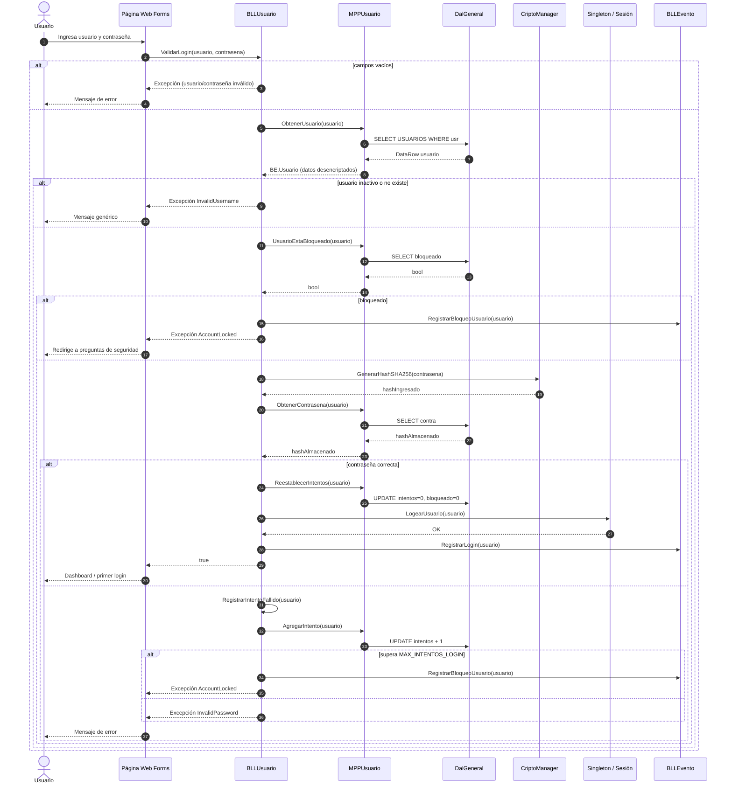
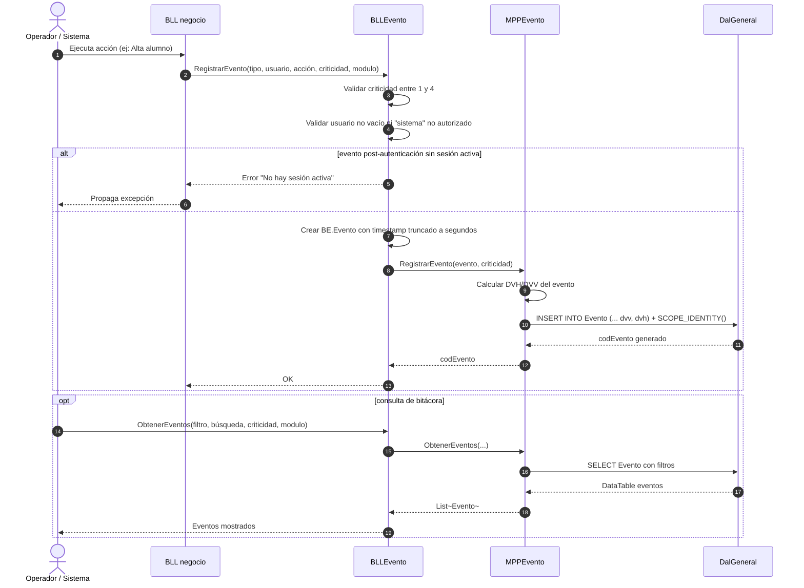
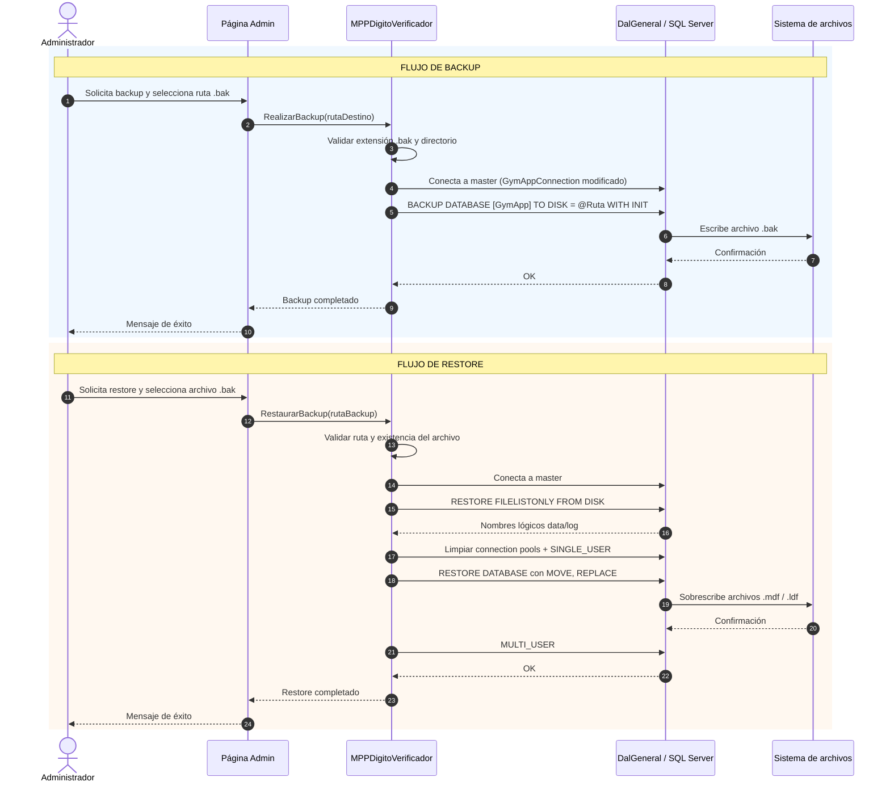
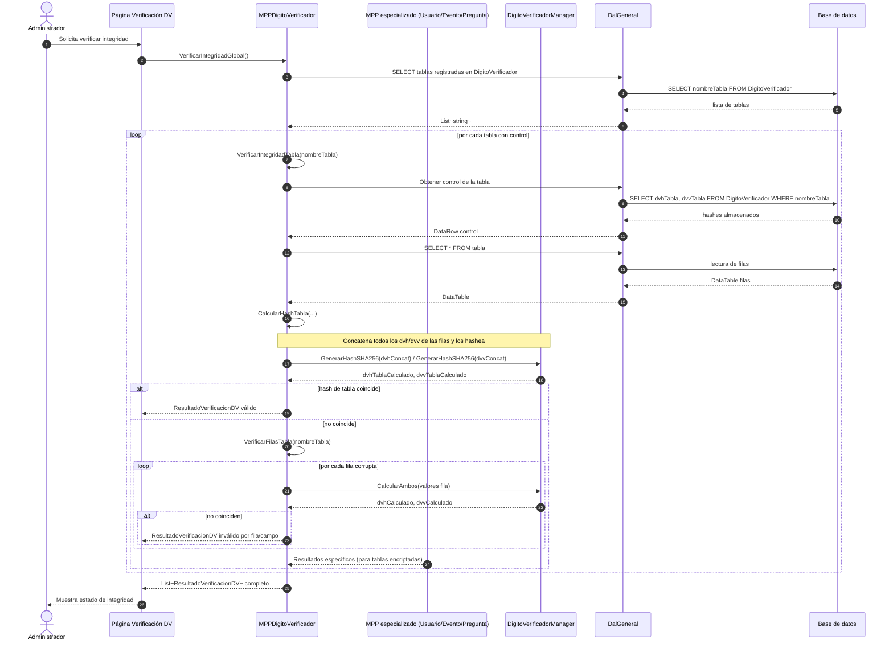
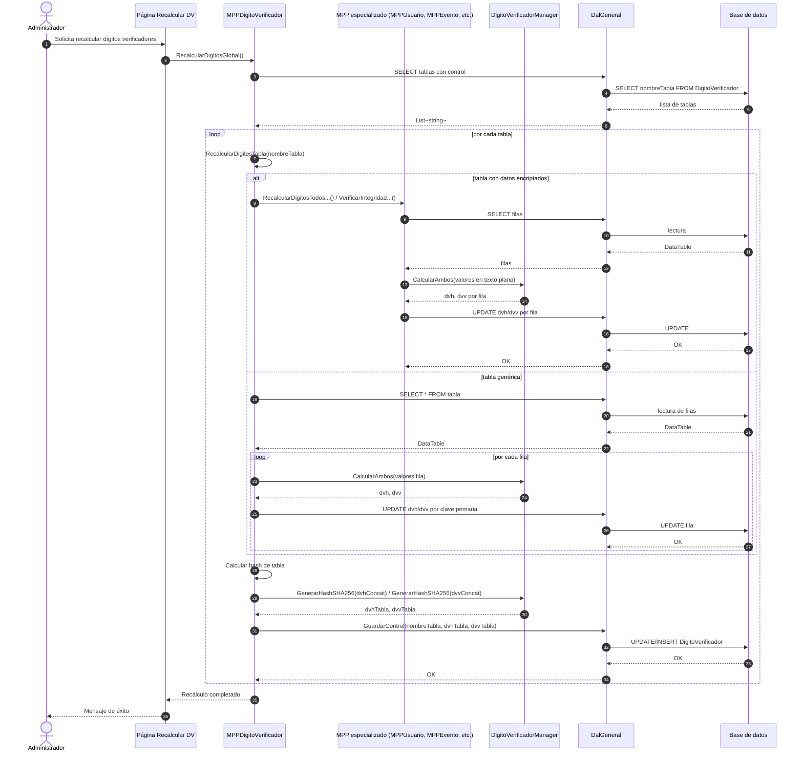

# Diagramas de secuencia - gymAppV2

> Generados a partir del código fuente de `C:\Users\Danunu\Desktop\WEB-4to\gymAppV2`.

---

## 1. Login de usuario

---

## 2. Registro en bitácora (general)

---

## 3. Backup y Restore (general)

---

## 4. Control de Dígitos Verificadores (DVH/DVV) - Verificación general

---

## 5. Control de Dígitos Verificadores (DVH/DVV) - Recálculo general

---

## Notas

- Los diagramas son **simples y generales**: se omiten detalles de excepciones secundarias, logging de fallback y casos extremos para facilitar la comprensión del flujo principal.
- En los diagramas de DVH/DVV se destaca que las tablas con datos encriptados (`USUARIOS`, `PreguntasSeguridad`, `Evento`) requieren que el MPP especializado desencripte los valores antes de calcular los dígitos verificadores.
- El flujo de login muestra el camino completo: validación, bloqueo, intentos fallidos, hash de contraseña y registro de sesión.
